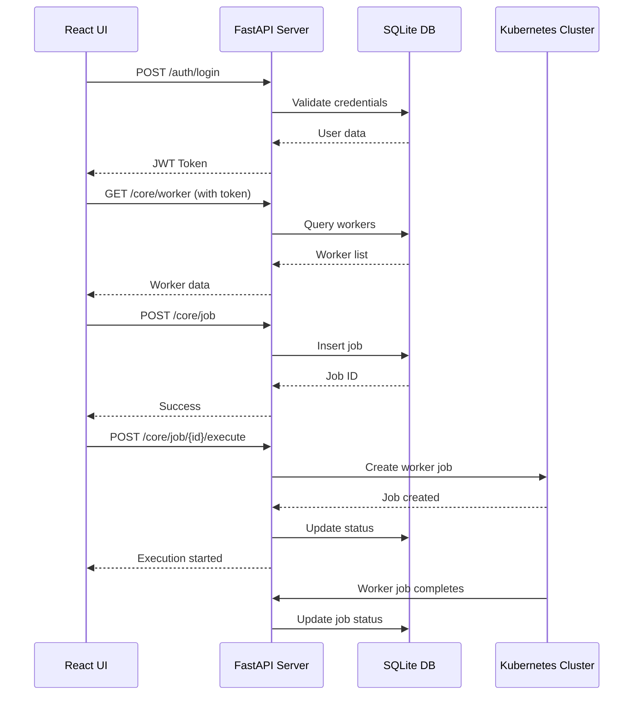

# 05. API Specification

The API server is built with FastAPI and provides RESTful endpoints for managing workers, jobs, and cluster operations. All endpoints require authentication via JWT tokens.

## 05.01 Base URL
`/api/v1`

## 05.02 Authentication
All endpoints except `/auth/login` and `/auth/register` require a Bearer token in the Authorization header.

## 05.03 Worker APIs

### GET /core/worker
Get list of all workers.

**Authorization:** All authenticated users (admin, operator, user)

**Response:**
```json
{
  "workers": [
    {
      "id": 1,
      "name": "helm-deployer",
      "image_url": "nginx:latest",
      "type": "helm",
      "status": "active",
      "created_at": "2023-01-01T00:00:00Z",
      "updated_at": "2023-01-01T00:00:00Z"
    }
  ]
}
```

### POST /core/worker
Create a new worker.

**Authorization:** Admin and Operator roles only

**Request Body:**
```json
{
  "name": "kubectl-deployer",
  "image_url": "alpine/k8s:1.0",
  "type": "kubectl"
}
```

### PATCH /core/worker/{id}
Update an existing worker.

**Authorization:** Admin and Operator roles only

**Request Body:**
```json
{
  "status": "inactive"
}
```
**Example (update worker 1) — JSON body, curl and PowerShell:**

JSON body:
```json
{
  "name": "helm-deployer",
  "image_url": "ghcr.io/myorg/helm-deployer:1.2.0",
  "type": "helm",
  "status": "inactive"
}
```

curl (include Bearer token):
```bash
curl -X PATCH "http://localhost:8000/api/v1/core/worker/1" \
  -H "Authorization: Bearer <ACCESS_TOKEN>" \
  -H "Content-Type: application/json" \
  -d '{"name":"helm-deployer","image_url":"ghcr.io/myorg/helm-deployer:1.2.0","type":"helm","status":"inactive"}'
```

PowerShell (Invoke-WebRequest with session):
```powershell
$body = @{ name = 'helm-deployer'; image_url = 'ghcr.io/myorg/helm-deployer:1.2.0'; type = 'helm'; status = 'inactive' } | ConvertTo-Json
Invoke-WebRequest -Uri http://localhost:8000/api/v1/core/worker/1 -Method PATCH -Headers @{ "Authorization" = "Bearer $token"; "Content-Type" = "application/json" } -Body $body -UseBasicParsing
```

### DELETE /core/worker/{id}
Delete a worker.

**Authorization:** Admin and Operator roles only

## 05.04 Job APIs

### GET /core/job
Get list of all jobs.

**Authorization:** All authenticated users (admin, operator, user)

**Response:**
```json
{
  "jobs": [
    {
      "id": 1,
      "name": "redis-deployment",
      "namespace": "default",
      "worker_id": 1,
      "arguments": {
        "chart": "bitnami/redis",
        "version": "17.0.0"
      },
      "created_time": "2023-01-01T00:00:00Z",
      "last_reconciled": null,
      "current_status": "pending",
      "updated_at": "2023-01-01T00:00:00Z"
    }
  ]
}
```

### POST /core/job
Create a new job.

**Authorization:** Admin and Operator roles only

**Request Body:**
```json
{
  "name": "postgres-deployment",
  "namespace": "database",
  "worker_id": 2,
  "arguments": {
    "manifests": [
      "apiVersion: apps/v1",
      "kind: Deployment",
      "..."
    ]
  }
}
```

### PATCH /core/job/{id}
Update an existing job.

**Authorization:** Admin and Operator roles only

**Request Body (example):**
```json
{
  "name": "redis-deployment-updated",
  "namespace": "default",
  "worker_id": 1,
  "arguments": { "chart": "bitnami/redis", "version": "18.0.0" },
  "current_status": "pending"
}
```

### DELETE /core/job/{id}
Delete a job.

**Authorization:** Admin and Operator roles only

### POST /core/job/{id}/execute
Execute a job by spinning up a worker pod.

**Authorization:** Admin and Operator roles only

**Response:**
```json
{
  "job_id": 1,
  "status": "running",
  "pod_name": "worker-job-1-abc123"
}
```

### POST /core/job/{id}/reconcile
Reconcile a job by checking deployment status and redeploying if necessary.

**Authorization:** Admin and Operator roles only

### POST /core/job/{id}/artifacts
Upload artifacts for a job (Helm values files, YAML manifests, etc.).

**Authorization:** Admin and Operator roles only

**Content-Type:** `multipart/form-data`

**Form Data:**
- `files`: Multiple file uploads

**Response:**
```json
{
  "uploaded": [
    {
      "id": 1,
      "filename": "values.yaml",
      "file_path": "/uploads/job_1/values.yaml",
      "file_size": 1024,
      "content_type": "application/x-yaml"
    }
  ]
}
```

### GET /core/job/{id}/artifacts
Get list of artifacts for a job.

**Authorization:** All authenticated users (admin, operator, user)

**Response:**
```json
{
  "artifacts": [
    {
      "id": 1,
      "filename": "values.yaml",
      "file_path": "/uploads/job_1/values.yaml",
      "file_size": 1024,
      "content_type": "application/x-yaml",
      "uploaded_at": "2023-01-01T00:00:00Z",
      "download_url": "/api/v1/files/job_1/values.yaml"
    }
  ]
}
```

### DELETE /core/job/{id}/artifacts/{artifact_id}
Delete a specific artifact.

**Authorization:** Admin and Operator roles only

### GET /files/{job_id}/{filename}
Download an artifact file.

**Authorization:** All authenticated users (admin, operator, user)

**Response:** File content with appropriate Content-Type header.

## 05.05 Cluster APIs

### GET /cluster/health
Get cluster health status.

**Authorization:** All authenticated users (admin, operator, user)

**Response:**
```json
{
  "status": "healthy",
  "nodes": 3,
  "pods": 45
}
```

### GET /cluster/deployments
List all deployments.

### GET /cluster/cronjobs
List all cronjobs.

### GET /cluster/pvcs
List all persistent volume claims.

### POST /cluster/namespace
Create a namespace.

**Authorization:** Admin and Operator roles only

**Request Body:**
```json
{
  "name": "new-namespace"
}
```

### DELETE /cluster/namespace/{name}
Delete a namespace.

**Authorization:** Admin and Operator roles only

### PATCH /cluster/cronjob/{name}/scale
Scale a cronjob (enable/disable).

**Authorization:** Admin and Operator roles only

**Request Body:**
```json
{
  "enabled": false
}
```

### PATCH /cluster/deployment/{name}/scale
Scale a deployment.

**Authorization:** Admin and Operator roles only

**Request Body:**
```json
{
  "replicas": 0
}
```

### POST /cluster/health/schedule
Schedule periodic health checks for deployed applications.

**Authorization:** Admin and Operator roles only

**Request Body:**
```json
{
  "job_id": 1,
  "interval_minutes": 30,
  "checks": [
    {
      "type": "http",
      "url": "http://myapp:8080/health",
      "expected_status": 200
    },
    {
      "type": "tcp",
      "host": "myapp",
      "port": 8080
    }
  ]
}
```

### GET /cluster/health/{job_id}/status
Get health check status for a specific job.

**Authorization:** All authenticated users (admin, operator, user)

**Response:**
```json
{
  "job_id": 1,
  "last_check": "2023-01-01T12:00:00Z",
  "status": "healthy",
  "checks": [
    {
      "type": "http",
      "url": "http://myapp:8080/health",
      "status": "pass",
      "response_time_ms": 150
    }
  ]
}
```

### GET /cluster/health/alerts
Get health check alerts and failures.

**Authorization:** All authenticated users (admin, operator, user)

**Response:**
```json
{
  "alerts": [
    {
      "job_id": 1,
      "check_type": "http",
      "message": "Health check failed",
      "timestamp": "2023-01-01T12:30:00Z",
      "consecutive_failures": 3
    }
  ]
}
```

## 05.06 API Flow Diagram



  ## 05.07 User Management APIs

  ### POST /auth/change-password
  Change the current user's password (authenticated).

  **Authorization:** Bearer token (any authenticated user)

  **Request Body:**
  ```json
  { "old_password": "current", "new_password": "newpass" }
  ```

  ### PATCH /auth/users/{user_id}/role
  Update another user's role. Admin-only.

  **Authorization:** Admin

  **Request Body:**
  ```json
  { "role": "operator" }
  ```

  ### POST /auth/refresh
  Renew the access token using the existing valid access token.

  **Authorization:** Provide current access token via `Authorization: Bearer <token>` header.

  **Response:**
  ```json
  {
    "access_token": "<new-token>",
    "token_type": "bearer",
    "expires_in": 3600
  }
  ```

  Notes:
  - The server stores a long-lived refresh token as an HttpOnly cookie named `refresh_token` on successful login. The `/auth/refresh` endpoint reads the cookie and returns a new access token. For production, set the cookie `secure` flag and implement server-side revocation if necessary.