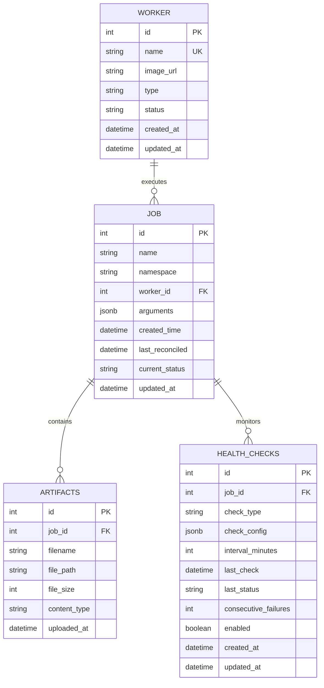

# 04. Database Schema

The application uses SQLite as the primary database, stored on a Persistent Volume Claim (PVC) for persistence in Kubernetes environments.

## 04.01 Tables

### 04.01.01 Worker Table

| Column | Type | Description | Constraints |
|--------|------|-------------|-------------|
| id | INTEGER | Primary key | AUTO_INCREMENT, PRIMARY KEY |
| name | VARCHAR(255) | Worker name | NOT NULL, UNIQUE |
| image_url | VARCHAR(500) | Docker image URL | NOT NULL |
| type | VARCHAR(50) | Deployment type (helm/kubectl) | NOT NULL, CHECK (type IN ('helm', 'kubectl')) |
| status | VARCHAR(50) | Current status | NOT NULL, DEFAULT 'active' |
| created_at | DATETIME | Creation timestamp | NOT NULL, DEFAULT CURRENT_TIMESTAMP |
| updated_at | DATETIME | Last update timestamp | NOT NULL, DEFAULT CURRENT_TIMESTAMP |

### 04.01.02 Job Table

| Column | Type | Description | Constraints |
|--------|------|-------------|-------------|
| id | INTEGER | Primary key | AUTO_INCREMENT, PRIMARY KEY |
| name | VARCHAR(255) | Job name | NOT NULL |
| namespace | VARCHAR(255) | Kubernetes namespace | NOT NULL |
| worker_id | INTEGER | Foreign key to Worker | NOT NULL, FOREIGN KEY REFERENCES worker(id) |
| arguments | JSONB | Job arguments (JSON) | NOT NULL |
| created_time | DATETIME | Creation timestamp | NOT NULL, DEFAULT CURRENT_TIMESTAMP |
| last_reconciled | DATETIME | Last reconciliation timestamp | NULL |
| current_status | VARCHAR(50) | Current job status | NOT NULL, DEFAULT 'pending' |
| updated_at | DATETIME | Last update timestamp | NOT NULL, DEFAULT CURRENT_TIMESTAMP |

### 04.01.03 Artifacts Table

| Column | Type | Description | Constraints |
|--------|------|-------------|-------------|
| id | INTEGER | Primary key | AUTO_INCREMENT, PRIMARY KEY |
| job_id | INTEGER | Foreign key to Job | NOT NULL, FOREIGN KEY REFERENCES job(id) |
| filename | VARCHAR(255) | Original filename | NOT NULL |
| file_path | VARCHAR(500) | Path to stored file | NOT NULL |
| file_size | INTEGER | File size in bytes | NOT NULL |
| content_type | VARCHAR(100) | MIME type | NOT NULL |
| uploaded_at | DATETIME | Upload timestamp | NOT NULL, DEFAULT CURRENT_TIMESTAMP |

### 04.01.04 Health Checks Table

| Column | Type | Description | Constraints |
|--------|------|-------------|-------------|
| id | INTEGER | Primary key | AUTO_INCREMENT, PRIMARY KEY |
| job_id | INTEGER | Foreign key to Job | NOT NULL, FOREIGN KEY REFERENCES job(id) |
| check_type | VARCHAR(50) | Type of health check (http, tcp) | NOT NULL |
| check_config | JSONB | Check configuration | NOT NULL |
| interval_minutes | INTEGER | Check interval in minutes | NOT NULL |
| last_check | DATETIME | Last check timestamp | NULL |
| last_status | VARCHAR(50) | Last check status | NULL |
| consecutive_failures | INTEGER | Number of consecutive failures | NOT NULL, DEFAULT 0 |
| enabled | BOOLEAN | Whether check is enabled | NOT NULL, DEFAULT TRUE |
| created_at | DATETIME | Creation timestamp | NOT NULL, DEFAULT CURRENT_TIMESTAMP |
| updated_at | DATETIME | Last update timestamp | NOT NULL, DEFAULT CURRENT_TIMESTAMP |

## 04.02 Status Values

### Worker Status
- `active`: Worker is available for use
- `inactive`: Worker is disabled
- `error`: Worker has configuration issues

### Job Status
- `pending`: Job created but not executed
- `running`: Job is currently executing
- `completed`: Job finished successfully
- `failed`: Job execution failed
- `reconciling`: Job is being reconciled

## 04.03 Indexes

- Worker: name (unique)
- Job: worker_id, current_status, created_time
- Artifacts: job_id, filename
- Health Checks: job_id, enabled, last_check

## 04.04 Relationships


```