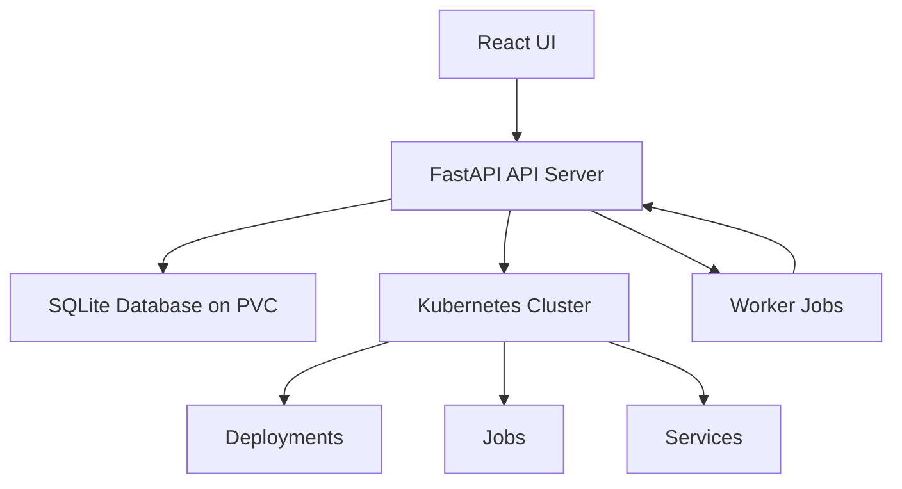

# KubeOps - Kubernetes Lifecycle Management Component

## 01. Overview

KubeOps is a modular component designed for Lifecycle Management (LCM) of microservices and platform services within Kubernetes clusters. It provides a RESTful API server built with Python FastAPI and a React-based UI for managing deployments, jobs, and cluster interactions. The component supports deploying services using Helm charts or kubectl commands, maintaining cluster health, performing reconciliation tasks, and uploading/downloading deployment artifacts such as configuration files and manifests. KubeOps can be deployed either inside the Kubernetes cluster or outside, using kubeconfig for external connections. The system also performs periodic health checks on deployed applications to ensure their availability and proper functioning. Role-based access control ensures that admins have full system access, operators can manage deployments, and users have read-only access to monitor status.

## 02. Architecture

The system consists of two main components:
- **API Server**: Python FastAPI application handling business logic, database interactions, and Kubernetes operations.
- **UI**: React application for user interaction, authentication, and visualization.

### High-Level Architecture Diagram

## 02.01 Deployment Options

KubeOps supports flexible deployment scenarios:

### 02.01.01 In-Cluster Deployment
- API server runs as a Kubernetes Deployment inside the cluster
- Uses service account authentication for direct API access
- Simplified networking and security

### 02.01.02 External Deployment  
- API server runs outside the Kubernetes cluster
- Uses kubeconfig files for cluster authentication
- Requires network connectivity to cluster endpoints

For detailed service account setup and RBAC configuration for both deployment modes, see [Service Account Requirements](worker.md#07.03-service-account-requirements).

## 04. Components

### 4.1 Worker Management
Manages worker definitions for deployment operations.

### 4.2 Job Management
Handles job creation, execution, and reconciliation.

### 4.3 Artifacts Management
Manages file uploads and downloads for job configurations and manifests.

### 4.4 Cluster Operations
Provides APIs for cluster resource management and health checks.

### 4.5 Authentication and Authorization
Implements role-based access control with Admin, Operator, and User roles for secure access management.

## 05. Database Schema

See [Database Schema](database.md) for detailed table structures.

## 06. API Specification

See [API Specification](apis.md) for complete endpoint documentation.

## 07. UI Design

See [UI Design](ui.md) for interface mockups and component descriptions.

## 08. Worker Implementation

See [Worker Implementation](worker.md) for job execution details.

## 09. Authentication Module

See [Authentication](auth.md) for security implementation.

## 10. Additional APIs

See [Additional APIs](additional.md) for user management and health checks.