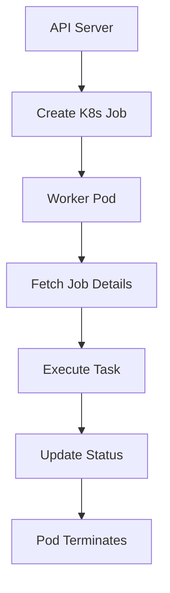

# 07. Worker Implementation

Workers are Kubernetes Jobs that execute deployment, reconciliation, and management tasks. They are spun up on-demand, perform their tasks, and terminate.

## 07.01 Worker Architecture



## 07.02 Deployment Modes

KubeOps supports two deployment modes:

### 07.02.01 In-Cluster Deployment
- API server runs as a Kubernetes Deployment inside the cluster
- Workers use in-cluster service account authentication
- Direct access to Kubernetes API without kubeconfig

### 07.02.02 External Deployment
- API server runs outside the Kubernetes cluster
- Uses kubeconfig file for cluster authentication
- Requires proper RBAC permissions and network access

## 07.03 Service Account Requirements

KubeOps requires different service account configurations depending on the deployment mode. This section provides comprehensive RBAC setup for both in-cluster and external deployments.

### 07.03.01 In-Cluster Deployment Service Accounts

When KubeOps is deployed inside the Kubernetes cluster, it uses service accounts for authentication and authorization.

#### API Server Service Account
The API server pod requires a service account with comprehensive cluster permissions:

```yaml
apiVersion: v1
kind: ServiceAccount
metadata:
  name: kubeops-api
  namespace: kubeops
---
apiVersion: rbac.authorization.k8s.io/v1
kind: ClusterRole
metadata:
  name: kubeops-api-role
rules:
# Core Kubernetes resources
- apiGroups: [""]
  resources: ["pods", "services", "endpoints", "persistentvolumeclaims", "events", "configmaps", "secrets", "namespaces"]
  verbs: ["get", "list", "watch", "create", "update", "patch", "delete"]
# Applications
- apiGroups: ["apps"]
  resources: ["deployments", "daemonsets", "replicasets", "statefulsets"]
  verbs: ["get", "list", "watch", "create", "update", "patch", "delete"]
# Batch jobs
- apiGroups: ["batch"]
  resources: ["jobs", "cronjobs"]
  verbs: ["get", "list", "watch", "create", "update", "patch", "delete"]
# Networking
- apiGroups: ["networking.k8s.io"]
  resources: ["networkpolicies", "ingresses"]
  verbs: ["get", "list", "watch", "create", "update", "patch", "delete"]
# RBAC (for managing worker service accounts)
- apiGroups: ["rbac.authorization.k8s.io"]
  resources: ["clusterroles", "clusterrolebindings", "roles", "rolebindings"]
  verbs: ["get", "list", "create", "update", "delete"]
---
apiVersion: rbac.authorization.k8s.io/v1
kind: ClusterRoleBinding
metadata:
  name: kubeops-api-binding
roleRef:
  apiGroup: rbac.authorization.k8s.io
  kind: ClusterRole
  name: kubeops-api-role
subjects:
- kind: ServiceAccount
  name: kubeops-api
  namespace: kubeops
```

#### Worker Service Account
Worker pods require a dedicated service account for executing deployment operations:

```yaml
apiVersion: v1
kind: ServiceAccount
metadata:
  name: kubeops-worker
  namespace: kubeops
---
apiVersion: rbac.authorization.k8s.io/v1
kind: ClusterRole
metadata:
  name: kubeops-worker-role
rules:
# Basic pod and service access
- apiGroups: [""]
  resources: ["pods", "services", "configmaps", "secrets"]
  verbs: ["get", "list", "create", "update", "delete", "watch"]
# Job management
- apiGroups: ["batch"]
  resources: ["jobs"]
  verbs: ["get", "list", "create", "delete", "watch"]
# Allow workers to check their own status
- apiGroups: [""]
  resources: ["pods/status"]
  verbs: ["get", "patch"]
---
apiVersion: rbac.authorization.k8s.io/v1
kind: ClusterRoleBinding
metadata:
  name: kubeops-worker-binding
roleRef:
  apiGroup: rbac.authorization.k8s.io
  kind: ClusterRole
  name: kubeops-worker-role
subjects:
- kind: ServiceAccount
  name: kubeops-worker
  namespace: kubeops
```

### 07.03.02 External Deployment Service Accounts

When KubeOps is deployed outside the cluster, it uses kubeconfig files for authentication. However, worker pods still run inside the cluster and require service accounts.

#### External API Server Authentication
For external deployment, the API server uses a kubeconfig file that should contain:
- Cluster endpoint and certificate authority data
- Client certificate or token for authentication
- Appropriate RBAC permissions for the external user/service account

#### Worker Service Account (External Mode)
Worker pods still require the same service account as in-cluster mode:

```yaml
# Same worker service account as in-cluster deployment
apiVersion: v1
kind: ServiceAccount
metadata:
  name: kubeops-worker
  namespace: kubeops
---
apiVersion: rbac.authorization.k8s.io/v1
kind: ClusterRole
metadata:
  name: kubeops-worker-role
rules:
- apiGroups: [""]
  resources: ["pods", "services", "configmaps", "secrets"]
  verbs: ["get", "list", "create", "update", "delete", "watch"]
- apiGroups: ["batch"]
  resources: ["jobs"]
  verbs: ["get", "list", "create", "delete", "watch"]
- apiGroups: [""]
  resources: ["pods/status"]
  verbs: ["get", "patch"]
---
apiVersion: rbac.authorization.k8s.io/v1
kind: ClusterRoleBinding
metadata:
  name: kubeops-worker-binding
roleRef:
  apiGroup: rbac.authorization.k8s.io
  kind: ClusterRole
  name: kubeops-worker-role
subjects:
- kind: ServiceAccount
  name: kubeops-worker
  namespace: kubeops
```

### 07.03.03 Kubeconfig Setup for External Deployment

For external deployment, create a kubeconfig file with appropriate permissions:

```bash
# Create service account for external access
kubectl create serviceaccount kubeops-external -n kubeops

# Create cluster role binding
kubectl create clusterrolebinding kubeops-external-binding \
  --clusterrole=kubeops-api-role \
  --serviceaccount=kubeops:kubeops-external

# Get service account token
TOKEN=$(kubectl get secret $(kubectl get serviceaccount kubeops-external -n kubeops -o jsonpath='{.secrets[0].name}') -n kubeops -o jsonpath='{.data.token}' | base64 -d)

# Get cluster CA certificate
CA_CERT=$(kubectl get secret $(kubectl get serviceaccount kubeops-external -n kubeops -o jsonpath='{.secrets[0].name}') -n kubeops -o jsonpath='{.data.ca\.crt}')

# Get cluster endpoint
CLUSTER_ENDPOINT=$(kubectl config view --minify -o jsonpath='{.clusters[0].cluster.server}')

# Create kubeconfig file
kubectl config set-cluster kubeops-cluster \
  --server=$CLUSTER_ENDPOINT \
  --certificate-authority-data=$CA_CERT \
  --kubeconfig=kubeops-config

kubectl config set-credentials kubeops-user \
  --token=$TOKEN \
  --kubeconfig=kubeops-config

kubectl config set-context kubeops-context \
  --cluster=kubeops-cluster \
  --user=kubeops-user \
  --kubeconfig=kubeops-config

kubectl config use-context kubeops-context --kubeconfig=kubeops-config
```

### 07.03.04 Namespace Creation

Create the dedicated namespace for KubeOps:

```yaml
apiVersion: v1
kind: Namespace
metadata:
  name: kubeops
  labels:
    name: kubeops
    app: kubeops-system
```

### 07.03.05 Security Considerations

- **Principle of Least Privilege**: Service accounts have minimal required permissions
- **Namespace Isolation**: All KubeOps resources are contained within the `kubeops` namespace
- **RBAC Auditing**: Regularly audit service account permissions
- **Token Rotation**: Rotate service account tokens periodically for external access
- **Network Policies**: Implement network policies to restrict service account access

### 07.03.06 Troubleshooting Service Accounts

Common issues and solutions:

1. **Permission Denied Errors**:
   - Verify ClusterRole bindings are correct
   - Check namespace permissions
   - Ensure service account is properly mounted in pods

2. **Kubeconfig Issues (External Deployment)**:
   - Verify token is not expired
   - Check cluster endpoint accessibility
   - Validate certificate authority

3. **Worker Pod Failures**:
   - Check service account token mounting
   - Verify RBAC permissions for job creation
   - Review pod logs for authentication errors

## 07.04 Worker Types

### 07.04.01 Helm Worker
- Uses Helm CLI to install/upgrade/delete charts
- Supports chart repositories and local charts
- Handles value overrides and secrets

### 07.04.02 Kubectl Worker
- Uses kubectl to apply/delete manifests
- Supports YAML/JSON manifests
- Handles resource dependencies

## 07.05 Job Execution Flow

1. **Job Creation**: API creates database entry with arguments
2. **Pod Spawning**: Kubernetes Job created with worker image
3. **Initialization**: Worker fetches job details via API call
4. **Task Execution**: Worker performs install/uninstall/reconcile
5. **Status Update**: Worker updates job status via API
6. **Cleanup**: Pod terminates after completion

## 07.06 Worker Pod Configuration

### 07.06.01 Helm Worker Pod
```yaml
apiVersion: batch/v1
kind: Job
metadata:
  name: helm-worker-{job_id}
  namespace: {job_namespace}
spec:
  template:
    spec:
      containers:
      - name: helm
        image: {worker_image}
        env:
        - name: JOB_ID
          value: "{job_id}"
        - name: API_URL
          value: "http://api-server:8000"
        - name: API_TOKEN
          valueFrom:
            secretKeyRef:
              name: worker-secrets
              key: token
        command: ["python", "worker.py"]
        volumeMounts:
        - name: helm-cache
          mountPath: /root/.cache/helm
        - name: kubeconfig
          mountPath: /root/.kube
      volumes:
      - name: helm-cache
        emptyDir: {}
      - name: kubeconfig
        secret:
          secretName: kubeconfig-secret
      restartPolicy: Never
```

### 07.06.02 Kubectl Worker Pod
Similar structure but with kubectl image and different command.

## 07.07 Worker Script Logic

```python
import os
import requests
import subprocess
import json

def main():
    job_id = os.environ['JOB_ID']
    api_url = os.environ['API_URL']
    token = os.environ['API_TOKEN']
    
    headers = {'Authorization': f'Bearer {token}'}
    
    # Fetch job details
    response = requests.get(f'{api_url}/api/v1/core/job/{job_id}', headers=headers)
    job = response.json()
    
    # Fetch artifacts
    artifacts_response = requests.get(f'{api_url}/api/v1/core/job/{job_id}/artifacts', headers=headers)
    artifacts = artifacts_response.json()
    
    # Execute based on type
    if job['worker']['type'] == 'helm':
        execute_helm_job(job, artifacts, api_url, headers)
    elif job['worker']['type'] == 'kubectl':
        execute_kubectl_job(job, artifacts, api_url, headers)
    
    # Update status
    requests.patch(f'{api_url}/api/v1/core/job/{job_id}', 
                   json={'current_status': 'completed'}, 
                   headers=headers)

def execute_helm_job(job):
    args = job['arguments']
    
    # Download artifacts if any
    artifacts = requests.get(f'{api_url}/api/v1/core/job/{job_id}/artifacts', headers=headers).json()
    artifact_files = {}
    for artifact in artifacts['artifacts']:
        filename = artifact['filename']
        download_url = artifact['download_url']
        response = requests.get(f'{api_url}{download_url}', headers=headers)
        with open(f'/tmp/{filename}', 'wb') as f:
            f.write(response.content)
        artifact_files[filename] = f'/tmp/{filename}'
    
    if 'install' in args:
        cmd = ['helm', 'install', args['release'], args['chart']]
        if 'values' in args:
            cmd.extend(['--set', json.dumps(args['values'])])
        # Use uploaded values file if specified
        if 'values_file' in args and args['values_file'] in artifact_files:
            cmd.extend(['-f', artifact_files[args['values_file']]])
    elif 'uninstall' in args:
        cmd = ['helm', 'uninstall', args['release']]
    # Execute command
    subprocess.run(cmd, check=True)

def execute_kubectl_job(job, artifacts, api_url, headers):
    args = job['arguments']
    
    # Download artifacts if any
    artifact_files = {}
    for artifact in artifacts['artifacts']:
        filename = artifact['filename']
        download_url = artifact['download_url']
        response = requests.get(f'{api_url}{download_url}', headers=headers)
        with open(f'/tmp/{filename}', 'wb') as f:
            f.write(response.content)
        artifact_files[filename] = f'/tmp/{filename}'
    
    if 'apply' in args:
        for manifest in args['manifests']:
            cmd = ['kubectl', 'apply', '-f', '-']
            subprocess.run(cmd, input=manifest, text=True, check=True)
        # Apply uploaded manifest files
        for filename, filepath in artifact_files.items():
            if filename.endswith(('.yaml', '.yml')):
                cmd = ['kubectl', 'apply', '-f', filepath]
                subprocess.run(cmd, check=True)
    elif 'delete' in args:
        for manifest in args['manifests']:
            cmd = ['kubectl', 'delete', '-f', '-']
            subprocess.run(cmd, input=manifest, text=True, check=True)
        # Delete uploaded manifest files
        for filename, filepath in artifact_files.items():
            if filename.endswith(('.yaml', '.yml')):
                cmd = ['kubectl', 'delete', '-f', filepath]
                subprocess.run(cmd, check=True)
```

## 07.08 Status Management

Workers update job status through API calls:
- `running`: When execution starts
- `completed`: On successful completion
- `failed`: On error

Status secrets are stored externally and mounted as volumes to persist across job lifecycles.

## 07.09 Error Handling

- Retry logic for transient failures
- Detailed error logging
- Status updates on failures
- Cleanup on partial failures

## 07.10 Security Considerations

- API tokens for authentication
- RBAC for Kubernetes operations
- Secret management for sensitive data
- Network policies for pod communication