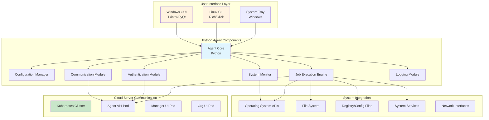
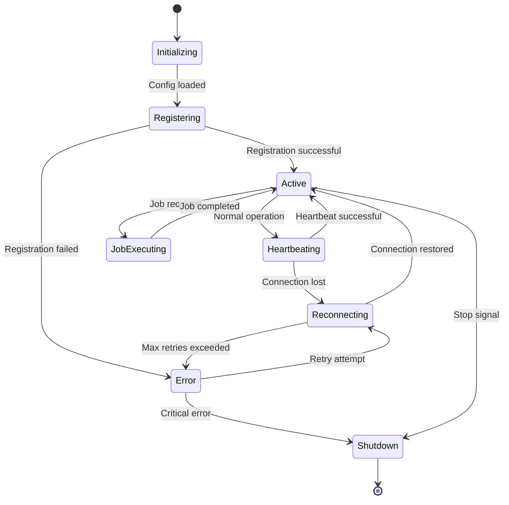

# Agent Architecture

The remote monitoring agents are lightweight, cross-platform applications that run on monitored devices. They maintain communication with the central server, execute jobs, and collect system information while ensuring minimal impact on system performance.

## Agent Overview



### Technology Stack
- **Core Language**: Python 3.9+
- **Windows GUI**: Tkinter (built-in) or PyQt5/6
- **Linux CLI**: Rich (for beautiful CLI) + Click (for commands)
- **System Monitoring**: psutil, wmi (Windows), platform
- **HTTP Client**: aiohttp for async communication
- **Configuration**: JSON/YAML with validation
- **Logging**: Python logging with structured output
- **Packaging**: PyInstaller for standalone executables

### Platform-Specific Interfaces

#### Windows Agent GUI
```python
# Windows GUI implementation using Tkinter
import tkinter as tk
from tkinter import ttk, messagebox
import threading
from agent_core import RMASAgent

class WindowsAgentGUI:
    def __init__(self):
        self.root = tk.Tk()
        self.root.title("RMAS Agent")
        self.root.geometry("600x400")
        self.root.resizable(False, False)
        
        # System tray support
        self.setup_system_tray()
        
        # Agent instance
        self.agent = RMASAgent()
        
        # Setup UI
        self.create_widgets()
        self.setup_menu()
        
    def create_widgets(self):
        # Main notebook for tabs
        self.notebook = ttk.Notebook(self.root)
        self.notebook.pack(fill='both', expand=True, padx=10, pady=10)
        
        # Status Tab
        self.status_frame = ttk.Frame(self.notebook)
        self.notebook.add(self.status_frame, text="Status")
        self.create_status_tab()
        
        # Registration Tab
        self.reg_frame = ttk.Frame(self.notebook)
        self.notebook.add(self.reg_frame, text="Registration")
        self.create_registration_tab()
        
        # Settings Tab
        self.settings_frame = ttk.Frame(self.notebook)
        self.notebook.add(self.settings_frame, text="Settings")
        self.create_settings_tab()
        
        # Logs Tab
        self.logs_frame = ttk.Frame(self.notebook)
        self.notebook.add(self.logs_frame, text="Logs")
        self.create_logs_tab()
```

#### Linux CLI Interface
```python
# Linux CLI implementation using Rich and Click
import click
from rich.console import Console
from rich.table import Table
from rich.live import Live
from rich.panel import Panel
import time

console = Console()

@click.group()
def cli():
    """RMAS Agent Command Line Interface"""
    pass

@cli.command()
def status():
    """Show agent status"""
    agent = RMASAgent()
    
    table = Table(title="RMAS Agent Status")
    table.add_column("Property", style="cyan")
    table.add_column("Value", style="green")
    
    table.add_row("Status", agent.get_status())
    table.add_row("Device ID", agent.get_device_id())
    table.add_row("Organization", agent.get_organization())
    table.add_row("Last Heartbeat", agent.get_last_heartbeat())
    table.add_row("Agent Version", agent.get_version())
    
    console.print(table)

@cli.command()
@click.option('--token', prompt='Registration token', help='Device registration token')
@click.option('--server', prompt='Server URL', help='Server URL')
def register(token, server):
    """Register agent with server"""
    with console.status("[bold green]Registering agent...") as status:
        agent = RMASAgent()
        success = agent.register(token, server)
        
        if success:
            console.print("[bold green]✓[/bold green] Registration successful!")
        else:
            console.print("[bold red]✗[/bold red] Registration failed!")

@cli.command()
def monitor():
    """Monitor agent in real-time"""
    def generate_status():
        agent = RMASAgent()
        while True:
            yield Panel(
                f"Status: {agent.get_status()}\n"
                f"CPU: {agent.get_cpu_usage()}%\n"
                f"Memory: {agent.get_memory_usage()}%\n"
                f"Last Heartbeat: {agent.get_last_heartbeat()}",
                title="RMAS Agent Monitor"
            )
            time.sleep(5)
    
    with Live(generate_status(), refresh_per_second=0.2) as live:
        try:
            while True:
                time.sleep(1)
        except KeyboardInterrupt:
            console.print("\n[yellow]Monitoring stopped[/yellow]")
```

## Agent Core Architecture

### Main Components
- **Purpose**: Central coordinator and lifecycle manager
- **Responsibilities**:
  - Initialize all modules
  - Coordinate communication between modules
  - Handle graceful shutdown
  - Manage agent state and configuration

#### 2. Configuration Manager
- **Purpose**: Handle agent configuration and settings
- **Features**:
  - Local configuration file management
  - Server-provided configuration synchronization
  - Environment-specific settings
  - Configuration validation

#### 3. Authentication Module
- **Purpose**: Manage authentication tokens and security
- **Features**:
  - Token storage and validation
  - Automatic token refresh
  - Secure communication setup

#### 4. Communication Module
- **Purpose**: Handle all server communication
- **Features**:
  - HTTP/HTTPS client with retry logic
  - Connection pooling and keep-alive
  - Compression and efficient data transfer
  - Network error handling and resilience

#### 5. Job Execution Engine
- **Purpose**: Execute jobs received from server
- **Features**:
  - Multi-threaded job execution
  - Job validation and sandboxing
  - Progress reporting
  - Error handling and recovery

#### 6. System Monitor
- **Purpose**: Collect system metrics and information
- **Features**:
  - Real-time metric collection
  - System information gathering
  - Performance monitoring
  - Resource usage tracking

#### 7. Logging Module
- **Purpose**: Comprehensive logging and debugging
- **Features**:
  - Structured logging
  - Log rotation and retention
  - Remote log shipping
  - Performance metrics logging

## Agent Configuration

### Configuration Structure
```json
{
    "agent": {
        "version": "1.2.3",
        "name": "RMAS Agent",
        "log_level": "INFO",
        "data_directory": "./data",
        "temp_directory": "./temp"
    },
    "server": {
        "base_url": "https://api.rmas.com",
        "endpoints": {
            "register": "/agent/register",
            "heartbeat": "/agent/heartbeat",
            "jobs": "/agent/jobs",
            "system_info": "/agent/system-info",
            "files": "/agent/files"
        },
        "timeout_seconds": 30,
        "retry_attempts": 3,
        "retry_delay": 5
    },
    "communication": {
        "heartbeat_interval": 60,
        "system_info_interval": 3600,
        "job_check_interval": 30,
        "max_concurrent_connections": 5,
        "compression_enabled": true,
        "keep_alive": true
    },
    "jobs": {
        "max_concurrent": 3,
        "timeout_seconds": 3600,
        "working_directory": "./jobs",
        "allowed_shells": ["powershell", "cmd", "bash", "sh"],
        "sandbox_mode": false
    },
    "monitoring": {
        "collect_cpu": true,
        "collect_memory": true,
        "collect_disk": true,
        "collect_network": true,
        "collect_processes": false,
        "collect_services": true,
        "metric_history_size": 100
    },
    "security": {
        "token_file": "./data/agent.token",
        "verify_ssl": true,
        "allowed_commands": ["*"],
        "restricted_paths": [
            "/etc/passwd",
            "/etc/shadow",
            "C:\\Windows\\System32\\config"
        ]
    },
    "logging": {
        "level": "INFO",
        "file": "./logs/agent.log",
        "max_size_mb": 10,
        "max_files": 5,
        "remote_logging": false
    }
}
```

### Configuration Management Implementation
```python
import json
import os
from pathlib import Path
from typing import Dict, Any

class ConfigurationManager:
    def __init__(self, config_path: str = "./config/agent.json"):
        self.config_path = Path(config_path)
        self.config = {}
        self.load_configuration()
    
    def load_configuration(self):
        """Load configuration from file with defaults"""
        default_config = self._get_default_config()
        
        if self.config_path.exists():
            try:
                with open(self.config_path, 'r') as f:
                    file_config = json.load(f)
                self.config = self._merge_configs(default_config, file_config)
            except Exception as e:
                print(f"Error loading config: {e}")
                self.config = default_config
        else:
            self.config = default_config
            self.save_configuration()
    
    def save_configuration(self):
        """Save current configuration to file"""
        self.config_path.parent.mkdir(parents=True, exist_ok=True)
        
        with open(self.config_path, 'w') as f:
            json.dump(self.config, f, indent=2)
    
    def update_from_server(self, server_config: Dict[str, Any]):
        """Update configuration with server-provided settings"""
        merged_config = self._merge_configs(self.config, server_config)
        
        if merged_config != self.config:
            self.config = merged_config
            self.save_configuration()
            return True
        return False
    
    def get(self, key: str, default=None):
        """Get configuration value by dot notation (e.g., 'server.timeout_seconds')"""
        keys = key.split('.')
        value = self.config
        
        for k in keys:
            if isinstance(value, dict) and k in value:
                value = value[k]
            else:
                return default
        
        return value
    
    def _merge_configs(self, base: Dict, override: Dict) -> Dict:
        """Recursively merge configuration dictionaries"""
        result = base.copy()
        
        for key, value in override.items():
            if key in result and isinstance(result[key], dict) and isinstance(value, dict):
                result[key] = self._merge_configs(result[key], value)
            else:
                result[key] = value
        
        return result
```

## Cross-Platform Implementation

### Platform Abstraction Layer
```python
import platform
import abc
from typing import Dict, List, Any

class PlatformInterface(abc.ABC):
    """Abstract interface for platform-specific operations"""
    
    @abc.abstractmethod
    def get_system_info(self) -> Dict[str, Any]:
        """Get detailed system information"""
        pass
    
    @abc.abstractmethod
    def get_metrics(self) -> Dict[str, Any]:
        """Get current system metrics"""
        pass
    
    @abc.abstractmethod
    def execute_command(self, command: str, shell: str = None) -> Dict[str, Any]:
        """Execute system command"""
        pass
    
    @abc.abstractmethod
    def get_installed_software(self) -> List[Dict[str, Any]]:
        """Get list of installed software"""
        pass
    
    @abc.abstractmethod
    def get_running_services(self) -> List[Dict[str, Any]]:
        """Get list of running services"""
        pass

class WindowsPlatform(PlatformInterface):
    def get_system_info(self) -> Dict[str, Any]:
        import wmi
        
        c = wmi.WMI()
        
        # Get OS information
        os_info = c.Win32_OperatingSystem()[0]
        
        # Get CPU information
        cpu_info = c.Win32_Processor()[0]
        
        # Get memory information
        memory_info = c.Win32_PhysicalMemory()
        
        return {
            "operating_system": {
                "name": os_info.Caption,
                "version": os_info.Version,
                "build": os_info.BuildNumber,
                "architecture": os_info.OSArchitecture,
                "install_date": str(os_info.InstallDate),
                "last_boot": str(os_info.LastBootUpTime)
            },
            "hardware": {
                "cpu": {
                    "name": cpu_info.Name,
                    "manufacturer": cpu_info.Manufacturer,
                    "architecture": cpu_info.Architecture,
                    "cores": cpu_info.NumberOfCores,
                    "logical_processors": cpu_info.NumberOfLogicalProcessors,
                    "max_speed_mhz": cpu_info.MaxClockSpeed
                },
                "memory": {
                    "total_bytes": sum(int(mem.Capacity) for mem in memory_info),
                    "modules": [
                        {
                            "size_bytes": int(mem.Capacity),
                            "speed_mhz": mem.Speed,
                            "type": mem.MemoryType,
                            "manufacturer": mem.Manufacturer
                        }
                        for mem in memory_info
                    ]
                }
            }
        }

class LinuxPlatform(PlatformInterface):
    def get_system_info(self) -> Dict[str, Any]:
        import psutil
        import distro
        
        return {
            "operating_system": {
                "name": distro.name(),
                "version": distro.version(),
                "codename": distro.codename(),
                "architecture": platform.machine(),
                "kernel": platform.release()
            },
            "hardware": {
                "cpu": {
                    "name": self._get_cpu_name(),
                    "cores": psutil.cpu_count(logical=False),
                    "logical_processors": psutil.cpu_count(logical=True),
                    "architecture": platform.machine()
                },
                "memory": {
                    "total_bytes": psutil.virtual_memory().total
                }
            }
        }

class PlatformFactory:
    @staticmethod
    def create_platform() -> PlatformInterface:
        system = platform.system().lower()
        
        if system == "windows":
            return WindowsPlatform()
        elif system in ["linux", "darwin"]:
            return LinuxPlatform()
        else:
            raise NotImplementedError(f"Platform {system} not supported")
```

### System Monitoring Implementation
```python
import psutil
import time
import threading
from typing import Dict, List, Any
from collections import deque

class SystemMonitor:
    def __init__(self, config_manager: ConfigurationManager):
        self.config = config_manager
        self.metrics_history = deque(maxlen=config_manager.get('monitoring.metric_history_size', 100))
        self.monitoring_thread = None
        self.stop_event = threading.Event()
        self.platform = PlatformFactory.create_platform()
    
    def start_monitoring(self):
        """Start background monitoring thread"""
        if self.monitoring_thread is None or not self.monitoring_thread.is_alive():
            self.stop_event.clear()
            self.monitoring_thread = threading.Thread(target=self._monitoring_loop)
            self.monitoring_thread.daemon = True
            self.monitoring_thread.start()
    
    def stop_monitoring(self):
        """Stop background monitoring"""
        self.stop_event.set()
        if self.monitoring_thread:
            self.monitoring_thread.join(timeout=5)
    
    def get_current_metrics(self) -> Dict[str, Any]:
        """Get current system metrics"""
        metrics = {
            "timestamp": time.time(),
            "cpu": self._get_cpu_metrics() if self.config.get('monitoring.collect_cpu') else None,
            "memory": self._get_memory_metrics() if self.config.get('monitoring.collect_memory') else None,
            "disk": self._get_disk_metrics() if self.config.get('monitoring.collect_disk') else None,
            "network": self._get_network_metrics() if self.config.get('monitoring.collect_network') else None,
            "processes": self._get_process_metrics() if self.config.get('monitoring.collect_processes') else None
        }
        
        # Remove None values
        return {k: v for k, v in metrics.items() if v is not None}
    
    def _get_cpu_metrics(self) -> Dict[str, Any]:
        """Get CPU metrics"""
        return {
            "usage_percent": psutil.cpu_percent(interval=1),
            "load_average": list(psutil.getloadavg()) if hasattr(psutil, 'getloadavg') else None,
            "core_count": psutil.cpu_count(logical=False),
            "logical_count": psutil.cpu_count(logical=True),
            "frequency": {
                "current": psutil.cpu_freq().current if psutil.cpu_freq() else None,
                "min": psutil.cpu_freq().min if psutil.cpu_freq() else None,
                "max": psutil.cpu_freq().max if psutil.cpu_freq() else None
            }
        }
    
    def _get_memory_metrics(self) -> Dict[str, Any]:
        """Get memory metrics"""
        memory = psutil.virtual_memory()
        swap = psutil.swap_memory()
        
        return {
            "virtual": {
                "total_bytes": memory.total,
                "available_bytes": memory.available,
                "used_bytes": memory.used,
                "usage_percent": memory.percent,
                "free_bytes": memory.free
            },
            "swap": {
                "total_bytes": swap.total,
                "used_bytes": swap.used,
                "free_bytes": swap.free,
                "usage_percent": swap.percent
            }
        }
    
    def _get_disk_metrics(self) -> Dict[str, Any]:
        """Get disk metrics"""
        disks = []
        
        for partition in psutil.disk_partitions():
            try:
                usage = psutil.disk_usage(partition.mountpoint)
                disks.append({
                    "device": partition.device,
                    "mountpoint": partition.mountpoint,
                    "filesystem": partition.fstype,
                    "total_bytes": usage.total,
                    "used_bytes": usage.used,
                    "free_bytes": usage.free,
                    "usage_percent": (usage.used / usage.total) * 100 if usage.total > 0 else 0
                })
            except PermissionError:
                # Skip inaccessible disks
                continue
        
        return {
            "disks": disks,
            "io_stats": dict(psutil.disk_io_counters(nowrap=True)._asdict()) if psutil.disk_io_counters() else None
        }
    
    def _get_network_metrics(self) -> Dict[str, Any]:
        """Get network metrics"""
        interfaces = []
        net_io = psutil.net_io_counters(pernic=True)
        
        for interface_name, stats in net_io.items():
            interfaces.append({
                "name": interface_name,
                "bytes_sent": stats.bytes_sent,
                "bytes_received": stats.bytes_recv,
                "packets_sent": stats.packets_sent,
                "packets_received": stats.packets_recv,
                "errors_in": stats.errin,
                "errors_out": stats.errout,
                "drops_in": stats.dropin,
                "drops_out": stats.dropout
            })
        
        return {
            "interfaces": interfaces,
            "connections": len(psutil.net_connections())
        }
    
    def _monitoring_loop(self):
        """Background monitoring loop"""
        while not self.stop_event.is_set():
            try:
                metrics = self.get_current_metrics()
                self.metrics_history.append(metrics)
            except Exception as e:
                print(f"Error collecting metrics: {e}")
            
            # Wait for next collection interval
            self.stop_event.wait(timeout=60)  # Collect every minute
```

## Agent Lifecycle Management

### Agent State Machine


### Agent Main Class
```python
import asyncio
import signal
import sys
from enum import Enum
from typing import Optional

class AgentState(Enum):
    INITIALIZING = "initializing"
    REGISTERING = "registering"
    ACTIVE = "active"
    HEARTBEATING = "heartbeating"
    JOB_EXECUTING = "job_executing"
    RECONNECTING = "reconnecting"
    ERROR = "error"
    SHUTDOWN = "shutdown"

class RMASAgent:
    def __init__(self, config_path: str = "./config/agent.json"):
        self.state = AgentState.INITIALIZING
        self.config_manager = ConfigurationManager(config_path)
        self.auth_module = AuthenticationModule(self.config_manager)
        self.comm_module = CommunicationModule(self.config_manager, self.auth_module)
        self.job_engine = JobExecutionEngine(self.config_manager)
        self.system_monitor = SystemMonitor(self.config_manager)
        self.logger = LoggingModule(self.config_manager)
        
        self.running = False
        self.shutdown_event = asyncio.Event()
    
    async def start(self):
        """Start the agent"""
        try:
            self.logger.info("Starting RMAS Agent")
            self.running = True
            
            # Initialize modules
            await self._initialize_modules()
            
            # Register signal handlers
            self._setup_signal_handlers()
            
            # Start main loop
            await self._main_loop()
            
        except Exception as e:
            self.logger.error(f"Agent startup failed: {e}")
            self.state = AgentState.ERROR
        finally:
            await self._cleanup()
    
    async def stop(self):
        """Stop the agent gracefully"""
        self.logger.info("Stopping RMAS Agent")
        self.running = False
        self.state = AgentState.SHUTDOWN
        self.shutdown_event.set()
    
    async def _initialize_modules(self):
        """Initialize all agent modules"""
        self.state = AgentState.INITIALIZING
        
        # Initialize logging
        await self.logger.initialize()
        
        # Initialize authentication
        await self.auth_module.initialize()
        
        # Initialize communication
        await self.comm_module.initialize()
        
        # Initialize job engine
        await self.job_engine.initialize()
        
        # Start system monitoring
        self.system_monitor.start_monitoring()
        
        self.logger.info("All modules initialized successfully")
    
    async def _main_loop(self):
        """Main agent loop"""
        while self.running:
            try:
                if self.state == AgentState.INITIALIZING:
                    await self._handle_registration()
                elif self.state == AgentState.ACTIVE:
                    await self._handle_heartbeat()
                elif self.state == AgentState.RECONNECTING:
                    await self._handle_reconnection()
                elif self.state == AgentState.ERROR:
                    await self._handle_error_recovery()
                
                # Check for pending jobs
                if self.state == AgentState.ACTIVE:
                    await self._check_pending_jobs()
                
                # Wait before next iteration
                try:
                    await asyncio.wait_for(
                        self.shutdown_event.wait(),
                        timeout=self.config_manager.get('communication.heartbeat_interval', 60)
                    )
                    break  # Shutdown event was set
                except asyncio.TimeoutError:
                    continue  # Normal timeout, continue loop
                
            except Exception as e:
                self.logger.error(f"Error in main loop: {e}")
                self.state = AgentState.ERROR
                await asyncio.sleep(5)  # Brief pause before retry
    
    async def _handle_registration(self):
        """Handle agent registration"""
        self.state = AgentState.REGISTERING
        self.logger.info("Attempting agent registration")
        
        try:
            if await self.auth_module.is_registered():
                self.state = AgentState.ACTIVE
                self.logger.info("Agent already registered")
            else:
                success = await self.comm_module.register_agent()
                if success:
                    self.state = AgentState.ACTIVE
                    self.logger.info("Agent registration successful")
                else:
                    self.state = AgentState.ERROR
                    self.logger.error("Agent registration failed")
        except Exception as e:
            self.logger.error(f"Registration error: {e}")
            self.state = AgentState.ERROR
    
    async def _handle_heartbeat(self):
        """Handle periodic heartbeat"""
        self.state = AgentState.HEARTBEATING
        
        try:
            # Get current metrics
            metrics = self.system_monitor.get_current_metrics()
            
            # Send heartbeat
            response = await self.comm_module.send_heartbeat(metrics)
            
            if response:
                self.state = AgentState.ACTIVE
                
                # Process server response
                await self._process_heartbeat_response(response)
            else:
                self.state = AgentState.RECONNECTING
                self.logger.warning("Heartbeat failed, entering reconnection mode")
                
        except Exception as e:
            self.logger.error(f"Heartbeat error: {e}")
            self.state = AgentState.RECONNECTING
    
    async def _process_heartbeat_response(self, response: dict):
        """Process server response from heartbeat"""
        data = response.get('data', {})
        
        # Check for configuration updates
        if 'configuration_update' in data and data['configuration_update']:
            self.logger.info("Received configuration update from server")
            if self.config_manager.update_from_server(data['configuration_update']):
                self.logger.info("Configuration updated successfully")
        
        # Check for pending jobs
        pending_jobs = data.get('pending_jobs', [])
        if pending_jobs:
            self.logger.info(f"Received {len(pending_jobs)} pending jobs")
            for job in pending_jobs:
                await self.job_engine.queue_job(job)
    
    def _setup_signal_handlers(self):
        """Setup signal handlers for graceful shutdown"""
        def signal_handler(signum, frame):
            self.logger.info(f"Received signal {signum}, initiating shutdown")
            asyncio.create_task(self.stop())
        
        signal.signal(signal.SIGINT, signal_handler)
        signal.signal(signal.SIGTERM, signal_handler)
        
        if sys.platform == "win32":
            signal.signal(signal.SIGBREAK, signal_handler)
    
    async def _cleanup(self):
        """Cleanup resources before shutdown"""
        self.logger.info("Cleaning up agent resources")
        
        # Stop monitoring
        self.system_monitor.stop_monitoring()
        
        # Stop job engine
        await self.job_engine.shutdown()
        
        # Close communication
        await self.comm_module.close()
        
        # Final log
        self.logger.info("Agent shutdown complete")

# Entry point
async def main():
    agent = RMASAgent()
    await agent.start()

if __name__ == "__main__":
    asyncio.run(main())
```

## Agent Deployment

### Installation Script (Windows)
```powershell
# install-agent.ps1
param(
    [Parameter(Mandatory=$true)]
    [string]$ServerUrl,
    
    [Parameter(Mandatory=$true)]
    [string]$RegistrationToken,
    
    [string]$InstallPath = "C:\Program Files\RMAS Agent",
    [string]$ServiceName = "RMASAgent"
)

# Check if running as administrator
if (-NOT ([Security.Principal.WindowsPrincipal] [Security.Principal.WindowsIdentity]::GetCurrent()).IsInRole([Security.Principal.WindowsBuiltInRole] "Administrator")) {
    Write-Error "This script requires administrator privileges"
    exit 1
}

# Create installation directory
New-Item -ItemType Directory -Force -Path $InstallPath

# Download agent files
$AgentUrl = "$ServerUrl/downloads/agent/windows/rmas-agent.zip"
$AgentZip = "$env:TEMP\rmas-agent.zip"

Invoke-WebRequest -Uri $AgentUrl -OutFile $AgentZip
Expand-Archive -Path $AgentZip -DestinationPath $InstallPath -Force
Remove-Item $AgentZip

# Create configuration file
$ConfigPath = "$InstallPath\config\agent.json"
$Config = @{
    server = @{
        base_url = $ServerUrl
    }
    security = @{
        registration_token = $RegistrationToken
    }
} | ConvertTo-Json -Depth 3

New-Item -ItemType Directory -Force -Path (Split-Path $ConfigPath)
Set-Content -Path $ConfigPath -Value $Config

# Install as Windows service
$ServicePath = "$InstallPath\rmas-agent.exe"
New-Service -Name $ServiceName -BinaryPathName $ServicePath -DisplayName "RMAS Agent" -StartupType Automatic

# Start the service
Start-Service -Name $ServiceName

Write-Host "RMAS Agent installed and started successfully"
```

### Installation Script (Linux)
```bash
#!/bin/bash
# install-agent.sh

set -e

SERVER_URL=""
REGISTRATION_TOKEN=""
INSTALL_PATH="/opt/rmas-agent"
SERVICE_NAME="rmas-agent"

# Parse command line arguments
while [[ $# -gt 0 ]]; do
    case $1 in
        --server-url)
            SERVER_URL="$2"
            shift 2
            ;;
        --token)
            REGISTRATION_TOKEN="$2"
            shift 2
            ;;
        --install-path)
            INSTALL_PATH="$2"
            shift 2
            ;;
        *)
            echo "Unknown option $1"
            exit 1
            ;;
    esac
done

# Check if running as root
if [[ $EUID -ne 0 ]]; then
   echo "This script must be run as root"
   exit 1
fi

# Validate required parameters
if [[ -z "$SERVER_URL" || -z "$REGISTRATION_TOKEN" ]]; then
    echo "Usage: $0 --server-url <url> --token <token>"
    exit 1
fi

# Create installation directory
mkdir -p "$INSTALL_PATH"
cd "$INSTALL_PATH"

# Download and extract agent
AGENT_URL="$SERVER_URL/downloads/agent/linux/rmas-agent.tar.gz"
curl -L "$AGENT_URL" | tar -xz

# Make agent executable
chmod +x rmas-agent

# Create configuration
mkdir -p config
cat > config/agent.json << EOF
{
    "server": {
        "base_url": "$SERVER_URL"
    },
    "security": {
        "registration_token": "$REGISTRATION_TOKEN"
    }
}
EOF

# Create systemd service file
cat > /etc/systemd/system/$SERVICE_NAME.service << EOF
[Unit]
Description=RMAS Agent
After=network.target

[Service]
Type=simple
User=root
WorkingDirectory=$INSTALL_PATH
ExecStart=$INSTALL_PATH/rmas-agent
Restart=always
RestartSec=10

[Install]
WantedBy=multi-user.target
EOF

# Enable and start service
systemctl daemon-reload
systemctl enable $SERVICE_NAME
systemctl start $SERVICE_NAME

echo "RMAS Agent installed and started successfully"
```

## Performance Considerations

### Resource Management
- **Memory Usage**: Target < 50MB RAM usage
- **CPU Usage**: < 5% CPU during normal operation
- **Disk I/O**: Minimal disk operations, efficient logging
- **Network Usage**: Compressed communication, connection pooling

### Optimization Strategies
- **Lazy Loading**: Load modules only when needed
- **Connection Pooling**: Reuse HTTP connections
- **Data Compression**: Compress large data transfers
- **Efficient Serialization**: Use efficient data formats (JSON, MessagePack)
- **Background Processing**: Non-blocking operations where possible
