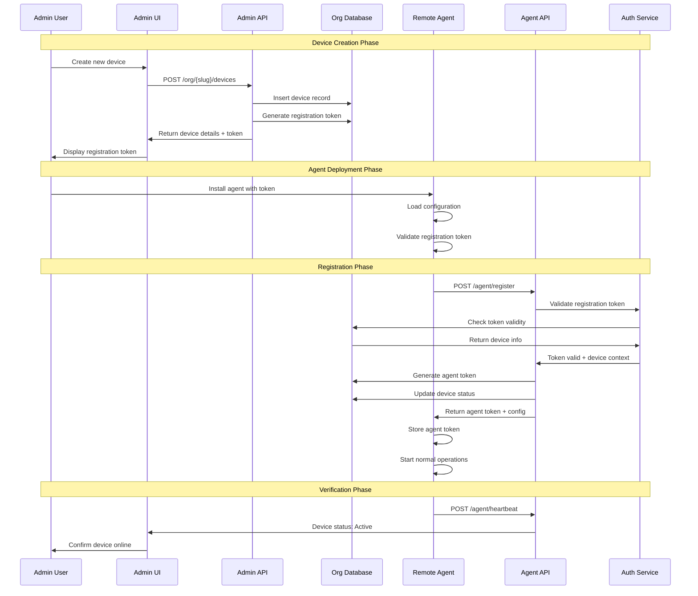
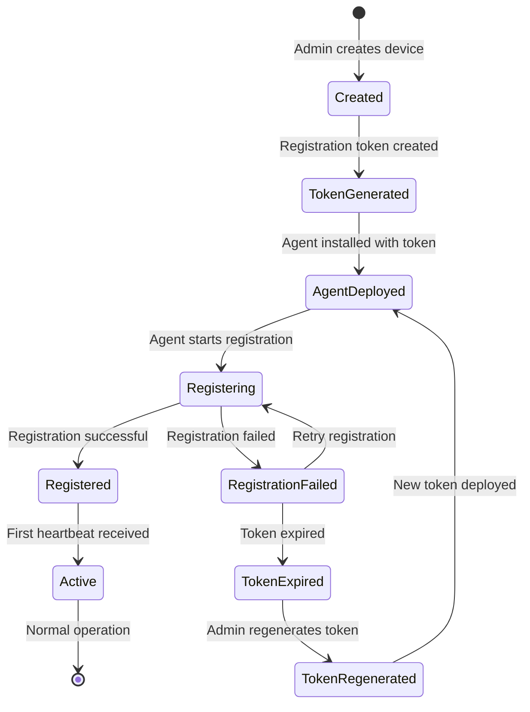

# Agent Registration Flow

This document details the complete agent registration process, from initial deployment to successful enrollment in the monitoring system. The registration process ensures secure device authentication and proper system integration.

## Registration Overview



## Registration States

### Device States During Registration



## Detailed Registration Process

### Phase 1: Device Creation

#### Admin Interface Flow
```typescript
// Device creation component
class DeviceCreationForm {
    async createDevice(deviceData: DeviceCreateRequest): Promise<DeviceResponse> {
        const response = await fetch(`/api/org/${orgSlug}/devices`, {
            method: 'POST',
            headers: {
                'Authorization': `Bearer ${authToken}`,
                'Content-Type': 'application/json'
            },
            body: JSON.stringify(deviceData)
        });
        
        if (!response.ok) {
            throw new Error('Failed to create device');
        }
        
        const result: DeviceResponse = await response.json();
        
        // Display registration instructions
        this.showRegistrationInstructions(result.data);
        
        return result;
    }
    
    showRegistrationInstructions(deviceData: any) {
        const instructions = `
Device created successfully!

Device ID: ${deviceData.device.id}
Device Name: ${deviceData.device.name}
Registration Token: ${deviceData.registration_token}
Token Expires: ${deviceData.token_expires_at}

To register the agent on this device:

Windows:
powershell -ExecutionPolicy Bypass -File install-agent.ps1 
    -ServerUrl "${window.location.origin}" 
    -RegistrationToken "${deviceData.registration_token}"

Linux:
sudo bash install-agent.sh 
    --server-url "${window.location.origin}" 
    --token "${deviceData.registration_token}"
        `;
        
        this.displayModal('Device Registration', instructions);
    }
}
```

#### Server-Side Device Creation
```php
// Device creation in Laravel
class DeviceController extends Controller
{
    public function store(CreateDeviceRequest $request, string $orgSlug)
    {
        // Validate organization context
        $organization = $this->getOrganization($orgSlug);
        
        // Switch to organization database
        $this->switchToOrgDatabase($organization);
        
        DB::beginTransaction();
        
        try {
            // Create device record
            $device = Device::create([
                'name' => $request->name,
                'asset_code' => $request->asset_code,
                'serial_number' => $request->serial_number,
                'mac_address' => $request->mac_address,
                'device_group_id' => $request->device_group_id,
                'properties' => $request->properties ?? [],
                'status' => 'pending'
            ]);
            
            // Generate registration token
            $registrationToken = $this->generateRegistrationToken($device, $organization);
            
            // Store token in database
            DeviceToken::create([
                'device_id' => $device->id,
                'token' => $registrationToken,
                'type' => 'registration',
                'expires_at' => now()->addDays(7),
                'is_active' => true
            ]);
            
            DB::commit();
            
            // Log device creation
            $this->logAuditEvent('device_created', $device);
            
            return response()->json([
                'success' => true,
                'data' => [
                    'device' => $device,
                    'registration_token' => $registrationToken,
                    'token_expires_at' => now()->addDays(7)->toISOString()
                ],
                'message' => 'Device created successfully'
            ]);
            
        } catch (Exception $e) {
            DB::rollBack();
            
            return response()->json([
                'success' => false,
                'message' => 'Failed to create device',
                'errors' => ['general' => [$e->getMessage()]]
            ], 500);
        }
    }
    
    private function generateRegistrationToken(Device $device, Organization $organization): string
    {
        $payload = [
            'type' => 'registration',
            'device_id' => $device->id,
            'organization_id' => $organization->id,
            'device_name' => $device->name,
            'issued_at' => time(),
            'expires_at' => time() + (7 * 24 * 60 * 60), // 7 days
            'single_use' => true
        ];
        
        return JWT::encode($payload, config('app.jwt_secret'), 'HS256');
    }
}
```

### Phase 2: Agent Deployment

#### Agent Installation Detection
```python
# Agent bootstrap process
class AgentBootstrap:
    def __init__(self, config_path: str = None):
        self.config_path = config_path or self._find_config_file()
        self.config = None
        self.registration_token = None
    
    def initialize(self) -> bool:
        """Initialize agent and check registration status"""
        try:
            # Load configuration
            self.config = self._load_configuration()
            
            # Check if already registered
            if self._is_already_registered():
                return True
            
            # Check for registration token
            self.registration_token = self._get_registration_token()
            
            if not self.registration_token:
                raise Exception("No registration token found. Please provide registration token.")
            
            return self._validate_registration_token()
            
        except Exception as e:
            print(f"Agent initialization failed: {e}")
            return False
    
    def _is_already_registered(self) -> bool:
        """Check if agent is already registered"""
        agent_token_file = self.config.get('security.token_file', './data/agent.token')
        
        if not os.path.exists(agent_token_file):
            return False
        
        try:
            with open(agent_token_file, 'r') as f:
                token = f.read().strip()
            
            # Validate existing token
            return self._validate_agent_token(token)
            
        except Exception:
            return False
    
    def _get_registration_token(self) -> Optional[str]:
        """Get registration token from various sources"""
        # 1. Check command line arguments
        token = self._get_token_from_args()
        if token:
            return token
        
        # 2. Check environment variable
        token = os.getenv('RMAS_REGISTRATION_TOKEN')
        if token:
            return token
        
        # 3. Check configuration file
        token = self.config.get('security.registration_token')
        if token:
            return token
        
        # 4. Check token file
        token_file = './data/registration.token'
        if os.path.exists(token_file):
            with open(token_file, 'r') as f:
                return f.read().strip()
        
        return None
    
    def _validate_registration_token(self) -> bool:
        """Validate registration token format and expiration"""
        try:
            # Decode token (without verification to check format)
            header = jwt.get_unverified_header(self.registration_token)
            payload = jwt.decode(
                self.registration_token, 
                options={"verify_signature": False}
            )
            
            # Check token type
            if payload.get('type') != 'registration':
                raise Exception("Invalid token type")
            
            # Check expiration
            if payload.get('expires_at', 0) < time.time():
                raise Exception("Registration token has expired")
            
            # Check required fields
            required_fields = ['device_id', 'organization_id', 'device_name']
            for field in required_fields:
                if field not in payload:
                    raise Exception(f"Missing required field: {field}")
            
            return True
            
        except Exception as e:
            print(f"Registration token validation failed: {e}")
            return False
```

### Phase 3: Agent Registration

#### Agent Registration Implementation
```python
# Agent registration process
class AgentRegistration:
    def __init__(self, config_manager: ConfigurationManager):
        self.config = config_manager
        self.http_client = None
        self.platform = PlatformFactory.create_platform()
    
    async def register(self, registration_token: str) -> bool:
        """Perform agent registration with server"""
        try:
            # Prepare registration data
            registration_data = await self._prepare_registration_data()
            
            # Make registration request
            response = await self._send_registration_request(
                registration_token, 
                registration_data
            )
            
            if response and response.get('success'):
                # Save agent token and configuration
                await self._save_registration_response(response['data'])
                return True
            else:
                print(f"Registration failed: {response.get('message', 'Unknown error')}")
                return False
                
        except Exception as e:
            print(f"Registration error: {e}")
            return False
    
    async def _prepare_registration_data(self) -> dict:
        """Prepare system information for registration"""
        system_info = self.platform.get_system_info()
        
        return {
            "agent_version": self.config.get('agent.version', '1.0.0'),
            "platform": platform.system().lower(),
            "architecture": platform.machine(),
            "hostname": platform.node(),
            "system_info": system_info,
            "capabilities": [
                "heartbeat",
                "system_info",
                "job_execution",
                "file_transfer",
                "remote_command"
            ],
            "registration_time": datetime.utcnow().isoformat()
        }
    
    async def _send_registration_request(self, token: str, data: dict) -> Optional[dict]:
        """Send registration request to server"""
        url = f"{self.config.get('server.base_url')}/agent/register"
        headers = {
            'Authorization': f'Bearer {token}',
            'Content-Type': 'application/json',
            'User-Agent': f"RMAS-Agent/{self.config.get('agent.version')}"
        }
        
        timeout = aiohttp.ClientTimeout(total=30)
        
        async with aiohttp.ClientSession(timeout=timeout) as session:
            try:
                async with session.post(url, json=data, headers=headers) as response:
                    if response.status == 200:
                        return await response.json()
                    else:
                        error_text = await response.text()
                        print(f"Registration failed with status {response.status}: {error_text}")
                        return None
                        
            except aiohttp.ClientError as e:
                print(f"Network error during registration: {e}")
                return None
            except asyncio.TimeoutError:
                print("Registration request timed out")
                return None
    
    async def _save_registration_response(self, response_data: dict) -> None:
        """Save registration response data"""
        # Save agent token
        agent_token = response_data['agent_token']
        token_file = self.config.get('security.token_file', './data/agent.token')
        
        os.makedirs(os.path.dirname(token_file), exist_ok=True)
        with open(token_file, 'w') as f:
            f.write(agent_token)
        
        # Update configuration with server settings
        server_config = response_data.get('configuration', {})
        if server_config:
            self.config.update_from_server(server_config)
        
        # Save device information
        device_info = response_data.get('device_info', {})
        if device_info:
            device_file = './data/device_info.json'
            with open(device_file, 'w') as f:
                json.dump(device_info, f, indent=2)
        
        print(f"Registration successful. Device ID: {response_data.get('device_id')}")
        print(f"Organization: {device_info.get('group', 'Unknown')}")
```

#### Server-Side Registration Handler
```python
# FastAPI registration endpoint
from fastapi import HTTPException, Depends
from fastapi.security import HTTPBearer

security = HTTPBearer()

@app.post("/agent/register")
async def register_agent(
    registration_data: AgentRegistrationRequest,
    token: str = Depends(security)
):
    try:
        # Validate registration token
        token_payload = validate_registration_token(token.credentials)
        
        # Get device and organization context
        device_id = token_payload['device_id']
        org_id = token_payload['organization_id']
        
        # Switch to organization database
        db = get_organization_database(org_id)
        
        # Verify device exists and is in pending state
        device = await get_device_by_id(db, device_id)
        if not device:
            raise HTTPException(status_code=404, detail="Device not found")
        
        if device.status != 'pending':
            raise HTTPException(status_code=409, detail="Device already registered")
        
        # Validate registration token is still valid and unused
        token_record = await get_device_token(db, device_id, 'registration')
        if not token_record or not token_record.is_active:
            raise HTTPException(status_code=401, detail="Invalid registration token")
        
        # Generate agent token
        agent_token = generate_agent_token(device_id, org_id)
        
        # Update device status and information
        await update_device_registration(
            db, 
            device_id, 
            registration_data, 
            agent_token
        )
        
        # Deactivate registration token
        await deactivate_registration_token(db, token_record.id)
        
        # Get organization settings for agent configuration
        org_settings = await get_organization_settings(db)
        
        # Prepare response
        response_data = {
            "agent_token": agent_token,
            "device_id": device_id,
            "organization_id": org_id,
            "configuration": {
                "heartbeat_interval": org_settings.get('agent.heartbeat_interval', 60),
                "system_info_interval": org_settings.get('agent.system_info_interval', 3600),
                "job_check_interval": org_settings.get('agent.job_check_interval', 30),
                "max_concurrent_jobs": org_settings.get('agent.max_concurrent_jobs', 3),
                "log_level": org_settings.get('agent.log_level', 'INFO')
            },
            "device_info": {
                "name": device.name,
                "group": device.device_group.name,
                "type": device.device_group.device_type.name
            }
        }
        
        # Log successful registration
        await log_audit_event(
            db, 
            'agent_registered', 
            device_id, 
            registration_data.dict()
        )
        
        return {
            "success": True,
            "data": response_data,
            "message": "Agent registered successfully"
        }
        
    except HTTPException:
        raise
    except Exception as e:
        print(f"Registration error: {e}")
        raise HTTPException(status_code=500, detail="Registration failed")

async def update_device_registration(
    db: Database, 
    device_id: str, 
    registration_data: AgentRegistrationRequest,
    agent_token: str
) -> None:
    """Update device with registration information"""
    
    # Update device record
    await db.execute("""
        UPDATE devices SET
            status = 'active',
            ip_address = :ip_address,
            properties = :properties,
            last_seen = NOW()
        WHERE id = :device_id
    """, {
        'device_id': device_id,
        'ip_address': registration_data.system_info.get('network', {}).get('ip_addresses', [None])[0],
        'properties': json.dumps({
            **registration_data.system_info,
            'agent_version': registration_data.agent_version,
            'registration_time': registration_data.registration_time
        })
    })
    
    # Store agent token
    await db.execute("""
        INSERT INTO device_tokens (device_id, token, type, expires_at, is_active)
        VALUES (:device_id, :token, 'agent', :expires_at, true)
    """, {
        'device_id': device_id,
        'token': agent_token,
        'expires_at': datetime.utcnow() + timedelta(days=30)
    })
    
    # Store initial system information
    await db.execute("""
        INSERT INTO device_system_info (device_id, system_data, agent_version, collected_at)
        VALUES (:device_id, :system_data, :agent_version, NOW())
    """, {
        'device_id': device_id,
        'system_data': json.dumps(registration_data.system_info),
        'agent_version': registration_data.agent_version
    })
```

### Phase 4: Registration Verification

#### Post-Registration Validation
```python
# Agent post-registration validation
class RegistrationValidator:
    def __init__(self, config_manager: ConfigurationManager):
        self.config = config_manager
        self.comm_module = None
    
    async def validate_registration(self) -> bool:
        """Validate successful registration by sending test heartbeat"""
        try:
            # Initialize communication module
            self.comm_module = CommunicationModule(self.config)
            await self.comm_module.initialize()
            
            # Send test heartbeat
            test_metrics = {
                "status": "registration_test",
                "agent_version": self.config.get('agent.version'),
                "test_timestamp": time.time()
            }
            
            response = await self.comm_module.send_heartbeat(test_metrics)
            
            if response and response.get('success'):
                print("Registration validation successful")
                return True
            else:
                print(f"Registration validation failed: {response}")
                return False
                
        except Exception as e:
            print(f"Registration validation error: {e}")
            return False
    
    async def cleanup_registration_artifacts(self):
        """Clean up temporary registration files"""
        try:
            # Remove registration token file if it exists
            reg_token_file = './data/registration.token'
            if os.path.exists(reg_token_file):
                os.remove(reg_token_file)
            
            # Clear registration token from configuration
            if self.config.get('security.registration_token'):
                config_data = self.config.config.copy()
                if 'security' in config_data and 'registration_token' in config_data['security']:
                    del config_data['security']['registration_token']
                    self.config.config = config_data
                    self.config.save_configuration()
            
            print("Registration artifacts cleaned up")
            
        except Exception as e:
            print(f"Cleanup error: {e}")
```

## Error Handling and Recovery

### Common Registration Errors

#### Token Expiration Handling
```python
class RegistrationErrorHandler:
    @staticmethod
    async def handle_expired_token(device_id: str, org_id: str) -> bool:
        """Handle expired registration token"""
        print("Registration token has expired")
        print("Please contact your administrator to regenerate the registration token")
        print(f"Device ID: {device_id}")
        print(f"Organization ID: {org_id}")
        
        # Log the issue
        logging.error(f"Registration failed for device {device_id}: Token expired")
        
        return False
    
    @staticmethod
    async def handle_network_error(error: Exception) -> bool:
        """Handle network connectivity issues"""
        print(f"Network error during registration: {error}")
        print("Please check network connectivity and server URL")
        print("Registration will be retried automatically")
        
        return True  # Indicate retry should be attempted
    
    @staticmethod
    async def handle_server_error(status_code: int, response_text: str) -> bool:
        """Handle server-side errors"""
        if status_code == 404:
            print("Device not found on server")
            print("Please verify the registration token and try again")
            return False
        elif status_code == 409:
            print("Device is already registered")
            print("If this is unexpected, please contact your administrator")
            return False
        elif status_code >= 500:
            print(f"Server error ({status_code}): {response_text}")
            print("Registration will be retried automatically")
            return True
        else:
            print(f"Unexpected error ({status_code}): {response_text}")
            return False
```

### Registration Retry Logic
```python
class RegistrationRetryManager:
    def __init__(self, max_retries: int = 5, base_delay: int = 30):
        self.max_retries = max_retries
        self.base_delay = base_delay
        self.retry_count = 0
    
    async def attempt_registration(self, registration_func, *args, **kwargs) -> bool:
        """Attempt registration with exponential backoff retry"""
        
        while self.retry_count < self.max_retries:
            try:
                success = await registration_func(*args, **kwargs)
                
                if success:
                    print("Registration successful")
                    return True
                else:
                    self.retry_count += 1
                    if self.retry_count < self.max_retries:
                        delay = self.base_delay * (2 ** (self.retry_count - 1))
                        print(f"Registration failed, retrying in {delay} seconds...")
                        await asyncio.sleep(delay)
                    
            except Exception as e:
                self.retry_count += 1
                print(f"Registration attempt {self.retry_count} failed: {e}")
                
                if self.retry_count < self.max_retries:
                    delay = self.base_delay * (2 ** (self.retry_count - 1))
                    print(f"Retrying in {delay} seconds...")
                    await asyncio.sleep(delay)
        
        print("Registration failed after maximum retry attempts")
        return False
```

## Registration Monitoring

### Admin Interface Registration Status
```typescript
// Real-time registration monitoring
class DeviceRegistrationMonitor {
    private eventSource: EventSource;
    private deviceId: string;
    
    constructor(deviceId: string) {
        this.deviceId = deviceId;
    }
    
    startMonitoring(): void {
        // Server-sent events for real-time updates
        this.eventSource = new EventSource(`/api/devices/${this.deviceId}/registration-status`);
        
        this.eventSource.onmessage = (event) => {
            const data = JSON.parse(event.data);
            this.handleRegistrationUpdate(data);
        };
        
        this.eventSource.onerror = (error) => {
            console.error('Registration monitoring error:', error);
            this.stopMonitoring();
        };
    }
    
    stopMonitoring(): void {
        if (this.eventSource) {
            this.eventSource.close();
        }
    }
    
    private handleRegistrationUpdate(data: any): void {
        const statusElement = document.getElementById(`device-${this.deviceId}-status`);
        
        switch (data.status) {
            case 'pending':
                statusElement.className = 'status-pending';
                statusElement.textContent = 'Waiting for agent registration...';
                break;
            case 'registering':
                statusElement.className = 'status-progress';
                statusElement.textContent = 'Agent registration in progress...';
                break;
            case 'active':
                statusElement.className = 'status-success';
                statusElement.textContent = 'Device registered and active';
                this.stopMonitoring();
                break;
            case 'registration_failed':
                statusElement.className = 'status-error';
                statusElement.textContent = 'Registration failed - check agent logs';
                break;
        }
    }
}
```

This comprehensive registration flow ensures secure and reliable agent enrollment while providing clear feedback to administrators and robust error handling for various failure scenarios.
