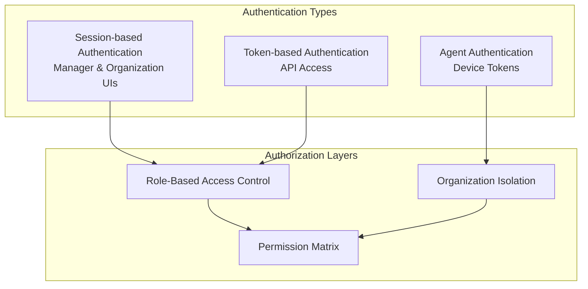
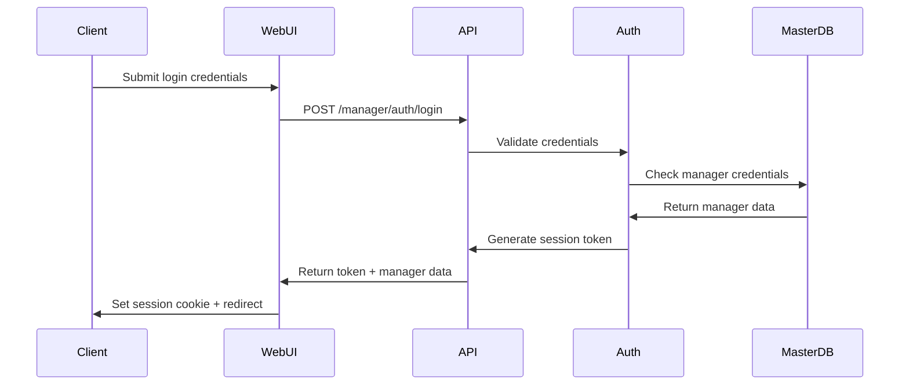
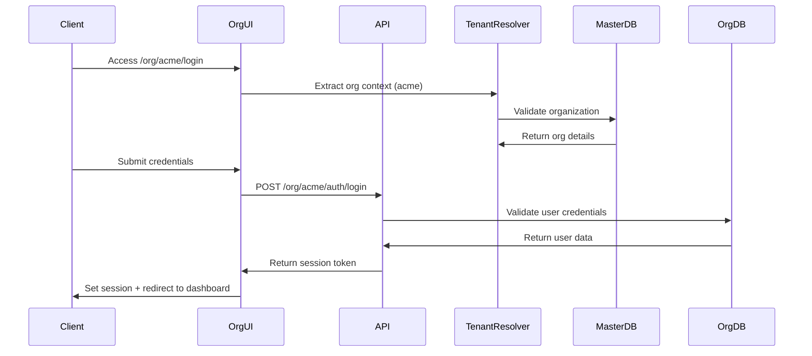
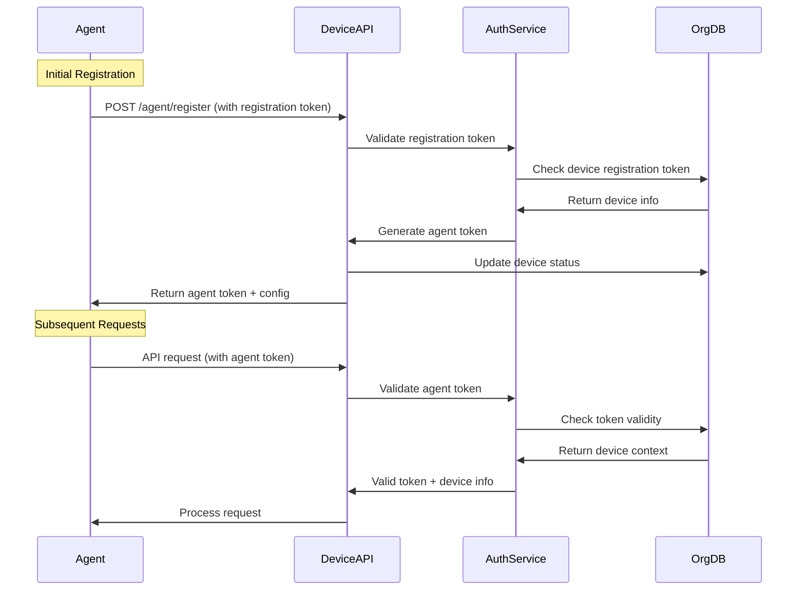

# Authentication and Authorization

This document outlines the authentication and authorization mechanisms for the multi-tenant agent-based monitoring system. The system implements different authentication strategies for different components while maintaining security and performance.

## Authentication Overview



## Manager Authentication

### Session-Based Authentication
Managers use session-based authentication for the web interface with Laravel Sanctum.

#### Login Flow


#### Implementation
```php
// Manager Authentication Controller
class ManagerAuthController extends Controller
{
    public function login(Request $request)
    {
        $credentials = $request->validate([
            'username' => 'required|string',
            'password' => 'required|string',
            'remember' => 'boolean'
        ]);
        
        $manager = Manager::where('username', $credentials['username'])->first();
        
        if (!$manager || !Hash::check($credentials['password'], $manager->password_hash)) {
            return response()->json([
                'success' => false,
                'message' => 'Invalid credentials'
            ], 401);
        }
        
        if (!$manager->is_active) {
            return response()->json([
                'success' => false,
                'message' => 'Account is inactive'
            ], 403);
        }
        
        // Create Sanctum token
        $token = $manager->createToken('manager-session', ['manager:*']);
        
        return response()->json([
            'success' => true,
            'data' => [
                'token' => $token->plainTextToken,
                'manager' => $manager->makeHidden(['password_hash']),
                'expires_at' => $token->accessToken->expires_at
            ]
        ]);
    }
    
    public function logout(Request $request)
    {
        $request->user()->currentAccessToken()->delete();
        
        return response()->json([
            'success' => true,
            'message' => 'Logged out successfully'
        ]);
    }
}
```

### Manager Permissions

#### Permission Structure
```json
{
    "organizations": {
        "create": true,
        "read": true,
        "update": true,
        "delete": false,
        "manage_users": true
    },
    "device_types": {
        "create": true,
        "read": true,
        "update": true,
        "delete": true,
        "sync": true
    },
    "managers": {
        "create": true,
        "read": true,
        "update": true,
        "delete": false,
        "manage_permissions": true
    },
    "system": {
        "view_analytics": true,
        "manage_settings": true,
        "view_audit_logs": true,
        "backup_restore": false
    }
}
```

#### Role-Based Access Control
```php
// Manager Role Middleware
class ManagerRoleMiddleware
{
    public function handle(Request $request, Closure $next, string $permission)
    {
        $manager = $request->user();
        
        if (!$manager) {
            return response()->json(['error' => 'Unauthorized'], 401);
        }
        
        // Super admin has all permissions
        if ($manager->is_super_admin) {
            return $next($request);
        }
        
        // Check specific permission
        if (!$this->hasPermission($manager, $permission)) {
            return response()->json(['error' => 'Insufficient permissions'], 403);
        }
        
        return $next($request);
    }
    
    private function hasPermission(Manager $manager, string $permission): bool
    {
        $permissions = $manager->permissions ?? [];
        
        // Parse permission string (e.g., "organizations.create")
        $parts = explode('.', $permission);
        $resource = $parts[0];
        $action = $parts[1] ?? 'read';
        
        return $permissions[$resource][$action] ?? false;
    }
}
```

## Organization Authentication

### Multi-Tenant Session Management
Organization users authenticate through organization-specific interfaces with tenant context.

#### Organization Login Flow


#### Implementation
```php
// Organization Authentication Controller
class OrganizationAuthController extends Controller
{
    public function login(Request $request, string $orgSlug)
    {
        // Tenant context is set by middleware
        $organization = app(TenantManager::class)->getCurrentOrganization();
        
        $credentials = $request->validate([
            'username' => 'required|string',
            'password' => 'required|string',
            'remember' => 'boolean'
        ]);
        
        // Switch to organization database
        $this->switchToOrgDatabase($organization);
        
        $user = User::where('username', $credentials['username'])
                   ->where('is_active', true)
                   ->first();
        
        if (!$user || !Hash::check($credentials['password'], $user->password_hash)) {
            return response()->json([
                'success' => false,
                'message' => 'Invalid credentials'
            ], 401);
        }
        
        // Create scoped token
        $token = $user->createToken('org-session', ["org:{$organization->slug}:*"]);
        
        // Update last login
        $user->update(['last_login' => now()]);
        
        return response()->json([
            'success' => true,
            'data' => [
                'token' => $token->plainTextToken,
                'user' => $user->makeHidden(['password_hash']),
                'organization' => $organization,
                'permissions' => $user->permissions
            ]
        ]);
    }
}
```

### Organization User Roles

#### Built-in Roles
```php
// User Role Definitions
const USER_ROLES = [
    'admin' => [
        'name' => 'Administrator',
        'description' => 'Full access to organization',
        'permissions' => [
            'devices' => ['create', 'read', 'update', 'delete'],
            'device_groups' => ['create', 'read', 'update', 'delete'],
            'jobs' => ['create', 'read', 'update', 'delete', 'execute'],
            'users' => ['create', 'read', 'update', 'delete'],
            'reports' => ['read', 'export'],
            'settings' => ['read', 'update']
        ]
    ],
    'manager' => [
        'name' => 'Manager',
        'description' => 'Device and job management',
        'permissions' => [
            'devices' => ['create', 'read', 'update'],
            'device_groups' => ['create', 'read', 'update'],
            'jobs' => ['create', 'read', 'update', 'execute'],
            'users' => ['read'],
            'reports' => ['read', 'export']
        ]
    ],
    'operator' => [
        'name' => 'Operator',
        'description' => 'Device monitoring and basic operations',
        'permissions' => [
            'devices' => ['read', 'update'],
            'device_groups' => ['read'],
            'jobs' => ['read', 'execute'],
            'reports' => ['read']
        ]
    ],
    'viewer' => [
        'name' => 'Viewer',
        'description' => 'Read-only access',
        'permissions' => [
            'devices' => ['read'],
            'device_groups' => ['read'],
            'jobs' => ['read'],
            'reports' => ['read']
        ]
    ]
];
```

#### Permission Middleware
```php
class OrganizationPermissionMiddleware
{
    public function handle(Request $request, Closure $next, string $permission)
    {
        $user = $request->user();
        $organization = app(TenantManager::class)->getCurrentOrganization();
        
        if (!$user || !$organization) {
            return response()->json(['error' => 'Unauthorized'], 401);
        }
        
        // Check if user belongs to this organization
        if (!$this->userBelongsToOrganization($user, $organization)) {
            return response()->json(['error' => 'Access denied'], 403);
        }
        
        // Check specific permission
        if (!$this->userHasPermission($user, $permission)) {
            return response()->json(['error' => 'Insufficient permissions'], 403);
        }
        
        return $next($request);
    }
    
    private function userHasPermission(User $user, string $permission): bool
    {
        // Get role permissions
        $rolePermissions = USER_ROLES[$user->role]['permissions'] ?? [];
        
        // Get custom permissions
        $customPermissions = $user->permissions ?? [];
        
        // Merge permissions (custom overrides role)
        $allPermissions = array_merge_recursive($rolePermissions, $customPermissions);
        
        // Parse permission (e.g., "devices.create")
        $parts = explode('.', $permission);
        $resource = $parts[0];
        $action = $parts[1] ?? 'read';
        
        return in_array($action, $allPermissions[$resource] ?? []);
    }
}
```

## Agent Authentication

### Device Token-Based Authentication
Agents use JWT tokens for authentication, with different token types for different stages.

#### Agent Authentication Flow


#### Token Types

##### 1. Registration Token
- **Purpose**: Initial device registration
- **Lifetime**: 7 days
- **Scope**: Single-use for device registration
- **Generated**: When device is created in admin interface

```json
{
    "type": "registration",
    "device_id": "550e8400-e29b-41d4-a716-446655440030",
    "organization_id": "550e8400-e29b-41d4-a716-446655440001",
    "expires_at": "2025-01-23T12:00:00Z",
    "single_use": true
}
```

##### 2. Agent Token
- **Purpose**: Long-term agent authentication
- **Lifetime**: 30 days (auto-renewal)
- **Scope**: All agent operations for specific device
- **Generated**: During successful registration

```json
{
    "type": "agent",
    "device_id": "550e8400-e29b-41d4-a716-446655440030",
    "organization_id": "550e8400-e29b-41d4-a716-446655440001",
    "capabilities": ["heartbeat", "jobs", "system_info", "file_transfer"],
    "issued_at": "2025-01-16T12:00:00Z",
    "expires_at": "2025-02-15T12:00:00Z",
    "refresh_after": "2025-02-01T12:00:00Z"
}
```

#### Token Management Implementation

```python
# FastAPI Agent Authentication
from fastapi import HTTPException, Depends
from fastapi.security import HTTPBearer
import jwt
from datetime import datetime, timedelta

security = HTTPBearer()

class AgentAuthService:
    def __init__(self):
        self.secret_key = settings.JWT_SECRET_KEY
        self.algorithm = "HS256"
    
    def create_registration_token(self, device_id: str, org_id: str) -> str:
        payload = {
            "type": "registration",
            "device_id": device_id,
            "organization_id": org_id,
            "iat": datetime.utcnow(),
            "exp": datetime.utcnow() + timedelta(days=7),
            "single_use": True
        }
        return jwt.encode(payload, self.secret_key, algorithm=self.algorithm)
    
    def create_agent_token(self, device_id: str, org_id: str) -> str:
        payload = {
            "type": "agent",
            "device_id": device_id,
            "organization_id": org_id,
            "capabilities": ["heartbeat", "jobs", "system_info", "file_transfer"],
            "iat": datetime.utcnow(),
            "exp": datetime.utcnow() + timedelta(days=30),
            "refresh_after": datetime.utcnow() + timedelta(days=15)
        }
        return jwt.encode(payload, self.secret_key, algorithm=self.algorithm)
    
    def validate_token(self, token: str) -> dict:
        try:
            payload = jwt.decode(token, self.secret_key, algorithms=[self.algorithm])
            
            # Check if token is expired
            if datetime.utcnow() > datetime.fromtimestamp(payload['exp']):
                raise HTTPException(
                    status_code=401,
                    detail="Token has expired"
                )
            
            return payload
        
        except jwt.InvalidTokenError:
            raise HTTPException(
                status_code=401,
                detail="Invalid token"
            )

# Dependency for agent authentication
async def get_current_device(token: str = Depends(security)) -> dict:
    auth_service = AgentAuthService()
    payload = auth_service.validate_token(token.credentials)
    
    # Validate device exists and is active
    device = await get_device_by_id(payload['device_id'])
    if not device or device.status == 'decommissioned':
        raise HTTPException(
            status_code=401,
            detail="Device not found or inactive"
        )
    
    return {
        'device_id': payload['device_id'],
        'organization_id': payload['organization_id'],
        'token_type': payload['type'],
        'capabilities': payload.get('capabilities', [])
    }
```

### Token Refresh Mechanism
```python
@app.post("/agent/auth/refresh")
async def refresh_agent_token(current_device: dict = Depends(get_current_device)):
    # Check if token needs refresh
    if current_device['token_type'] != 'agent':
        raise HTTPException(status_code=400, detail="Only agent tokens can be refreshed")
    
    auth_service = AgentAuthService()
    new_token = auth_service.create_agent_token(
        current_device['device_id'],
        current_device['organization_id']
    )
    
    # Optionally revoke old token
    await revoke_old_token(current_device['device_id'])
    
    return {
        "success": True,
        "data": {
            "token": new_token,
            "expires_at": datetime.utcnow() + timedelta(days=30)
        }
    }
```

## Cross-Tenant Security

### Organization Isolation Middleware
```php
class TenantIsolationMiddleware
{
    public function handle(Request $request, Closure $next)
    {
        $user = $request->user();
        $organization = app(TenantManager::class)->getCurrentOrganization();
        
        if (!$organization) {
            return response()->json(['error' => 'Organization context required'], 400);
        }
        
        // Validate user access to organization
        if ($user instanceof User) {
            // Organization user - ensure they belong to this org
            if (!$this->validateOrgUser($user, $organization)) {
                return response()->json(['error' => 'Access denied'], 403);
            }
        } elseif ($user instanceof Manager) {
            // Manager user - check organization access
            if (!$this->validateManagerAccess($user, $organization)) {
                return response()->json(['error' => 'Access denied'], 403);
            }
        }
        
        // Set database connection for this organization
        $this->setOrganizationDatabase($organization);
        
        return $next($request);
    }
    
    private function validateOrgUser(User $user, Organization $organization): bool
    {
        // User's database connection should match organization
        return $user->getConnectionName() === $organization->database_name;
    }
    
    private function validateManagerAccess(Manager $manager, Organization $organization): bool
    {
        if ($manager->is_super_admin) {
            return true;
        }
        
        return $manager->organizationAccess()
                      ->where('organization_id', $organization->id)
                      ->exists();
    }
}
```

## Security Best Practices

### Password Policies
```php
// Password validation rules
class PasswordRules
{
    public static function rules(): array
    {
        return [
            'required',
            'string',
            'min:8',                    // Minimum 8 characters
            'max:128',                  // Maximum 128 characters
            'regex:/[a-z]/',           // At least one lowercase letter
            'regex:/[A-Z]/',           // At least one uppercase letter
            'regex:/[0-9]/',           // At least one number
            'regex:/[@$!%*?&]/',       // At least one special character
            'confirmed'                 // Password confirmation required
        ];
    }
}
```

### Session Security
```php
// Session configuration
return [
    'lifetime' => 120,              // 2 hours
    'expire_on_close' => true,      // Expire when browser closes
    'encrypt' => true,              // Encrypt session data
    'files' => storage_path('framework/sessions'),
    'connection' => 'redis',        // Use Redis for session storage
    'table' => 'sessions',
    'store' => null,
    'lottery' => [2, 100],         // Garbage collection
    'cookie' => 'rmas_session',
    'path' => '/',
    'domain' => env('SESSION_DOMAIN'),
    'secure' => env('SESSION_SECURE_COOKIE', true),
    'http_only' => true,
    'same_site' => 'strict',
];
```

### Rate Limiting
```php
// Custom rate limiter for API endpoints
class CustomRateLimiter
{
    public function handle(Request $request, Closure $next, int $maxAttempts = 60, int $decayMinutes = 1)
    {
        $key = $this->resolveRequestSignature($request);
        
        if (RateLimiter::tooManyAttempts($key, $maxAttempts)) {
            $seconds = RateLimiter::availableIn($key);
            
            return response()->json([
                'error' => 'Too many requests',
                'retry_after' => $seconds
            ], 429)->header('Retry-After', $seconds);
        }
        
        RateLimiter::hit($key, $decayMinutes * 60);
        
        $response = $next($request);
        
        return $response->header(
            'X-RateLimit-Remaining',
            $maxAttempts - RateLimiter::attempts($key)
        );
    }
    
    protected function resolveRequestSignature(Request $request): string
    {
        $user = $request->user();
        
        if ($user) {
            return 'user:' . $user->id . ':' . $request->ip();
        }
        
        return 'ip:' . $request->ip();
    }
}
```

### Audit Logging
```php
class SecurityAuditLogger
{
    public static function logAuthentication(string $type, string $identifier, bool $success, string $ip): void
    {
        AuditLog::create([
            'action' => $success ? 'login_success' : 'login_failed',
            'entity_type' => $type,
            'entity_id' => $identifier,
            'ip_address' => $ip,
            'user_agent' => request()->userAgent(),
            'details' => [
                'timestamp' => now(),
                'success' => $success
            ]
        ]);
    }
    
    public static function logTokenGeneration(string $deviceId, string $tokenType): void
    {
        AuditLog::create([
            'action' => 'token_generated',
            'entity_type' => 'device',
            'entity_id' => $deviceId,
            'details' => [
                'token_type' => $tokenType,
                'generated_at' => now()
            ]
        ]);
    }
}
```
