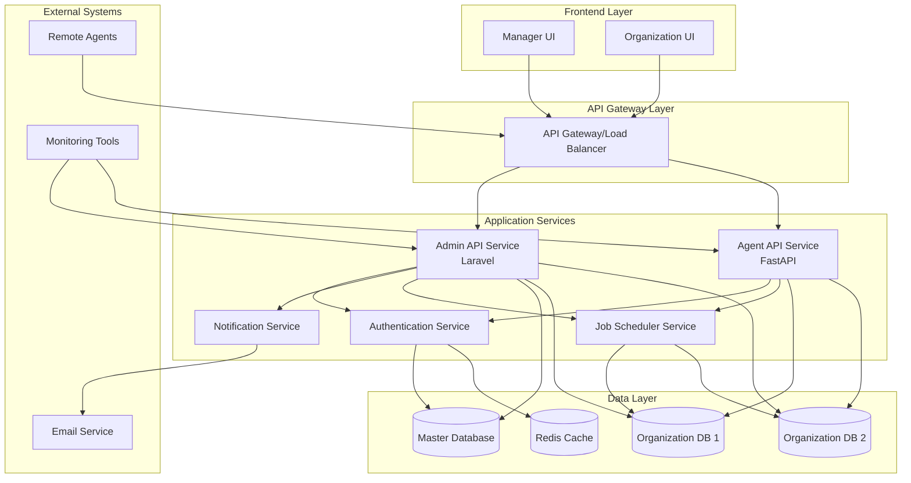
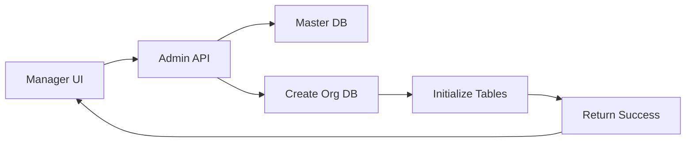
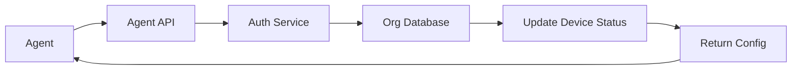
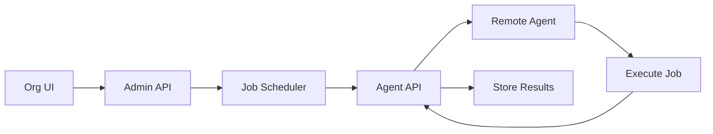

# Component Diagram

## System Components Relationship



## Component Details

### Frontend Components

#### Manager UI
- **Technology**: Laravel Blade with Vue.js components
- **Responsibilities**:
  - Organization management interface
  - Global device type management
  - Manager user administration
  - System-wide reporting and analytics
- **Routes**: `/manager/*`

#### Organization UI
- **Technology**: Laravel Blade with Vue.js components
- **Responsibilities**:
  - Device inventory management
  - Device group management
  - Job template creation and management
  - Organization-specific dashboards
- **Routes**: `/org/{org_id}/*`

### API Services

#### Admin API Service (Laravel)
```php
// Core Modules
├── AuthModule          // Authentication & Authorization
├── OrganizationModule  // Organization Management
├── UserModule          // User Management
├── DeviceModule        // Device Management
├── DeviceGroupModule   // Device Group Management
├── DeviceTypeModule    // Device Type Templates
├── JobModule           // Job Template Management
└── ReportingModule     // Analytics & Reporting
```

#### Agent API Service (FastAPI)
```python
# Core Modules
├── agent_auth         # Agent Authentication
├── heartbeat         # Heartbeat Processing
├── job_distribution  # Job Distribution
├── system_info       # System Information Collection
├── file_transfer     # File Transfer Operations
└── monitoring        # Real-time Monitoring
```

#### Authentication Service
- **Technology**: Shared service between Laravel and FastAPI
- **Features**:
  - JWT token management
  - Role-based access control
  - Multi-tenant session handling
  - Device token validation

#### Job Scheduler Service
- **Technology**: Background service (Laravel Queues + FastAPI Tasks)
- **Responsibilities**:
  - Job scheduling and distribution
  - Heartbeat timeout monitoring
  - Automated task execution
  - Result aggregation

#### Notification Service
- **Technology**: Event-driven service
- **Features**:
  - Email notifications
  - System alerts
  - Device status notifications
  - Job completion alerts

### Data Components

#### Master Database
- **Tables**: Organizations, Managers, Device Types, Global Settings
- **Purpose**: Global system data and organization metadata

#### Organization Databases
- **Tables**: Users, Devices, Device Groups, Jobs, System Info, Audit Logs
- **Purpose**: Organization-specific operational data

#### Redis Cache
- **Usage**: Session storage, API rate limiting, temporary data caching

## Inter-Component Communication

### Synchronous Communication
- **Frontend ↔ API**: HTTP/REST API calls
- **API ↔ Database**: Direct database connections
- **Agent ↔ API**: HTTP/REST API calls

### Asynchronous Communication
- **Job Scheduling**: Queue-based job distribution
- **Notifications**: Event-driven notification system
- **Monitoring**: Periodic health checks and reporting

### Data Flow Patterns

#### Organization Creation Flow


#### Agent Registration Flow


#### Job Execution Flow


## Deployment Architecture

### Development Environment
```yaml
services:
  - admin-api (Laravel)
  - agent-api (FastAPI)
  - master-db (PostgreSQL)
  - org-db-template (PostgreSQL)
  - redis (Redis)
  - nginx (Reverse Proxy)
```

### Production Environment
```yaml
services:
  - load-balancer (Nginx/HAProxy)
  - admin-api-cluster (Multiple Laravel instances)
  - agent-api-cluster (Multiple FastAPI instances)
  - database-cluster (PostgreSQL with replication)
  - redis-cluster (Redis with clustering)
  - monitoring (Prometheus + Grafana)
```
