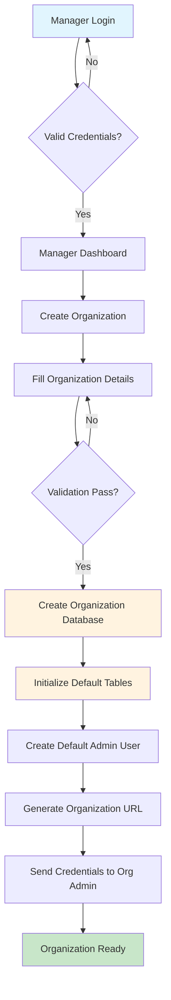
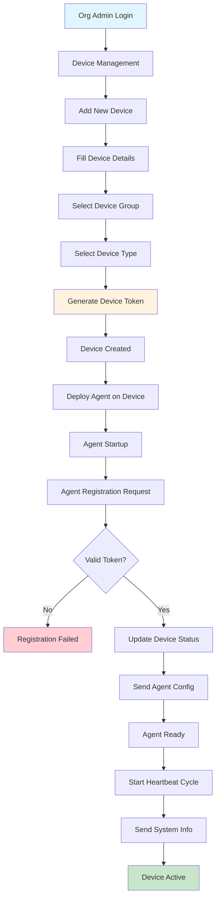
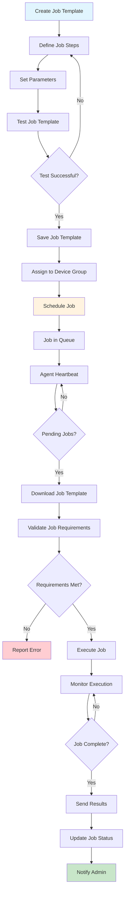
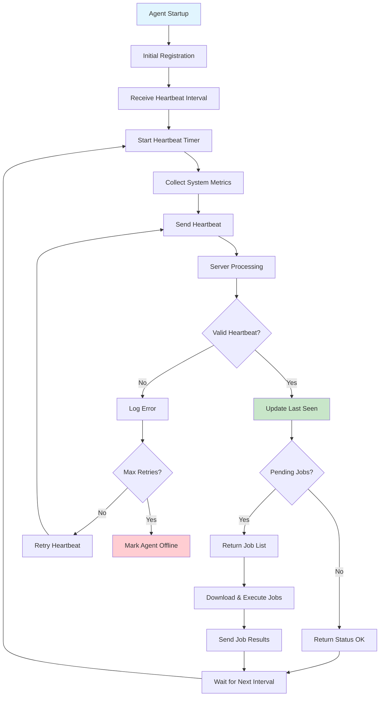
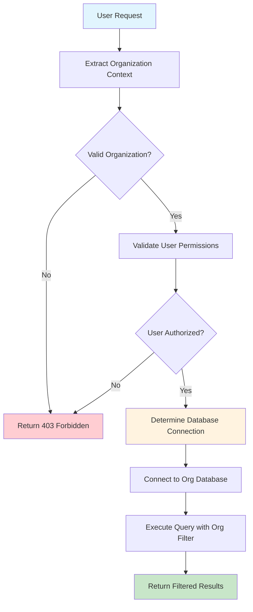
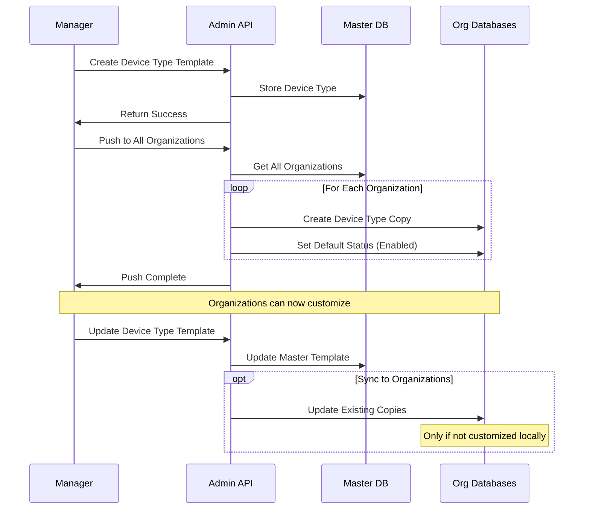
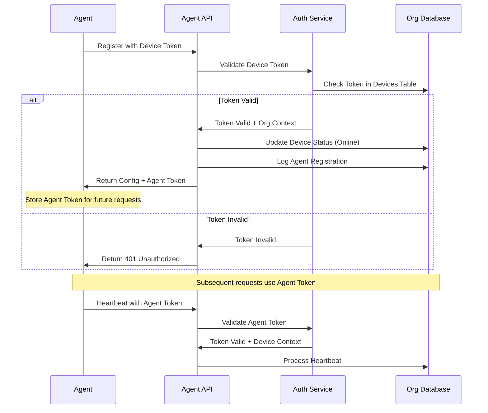
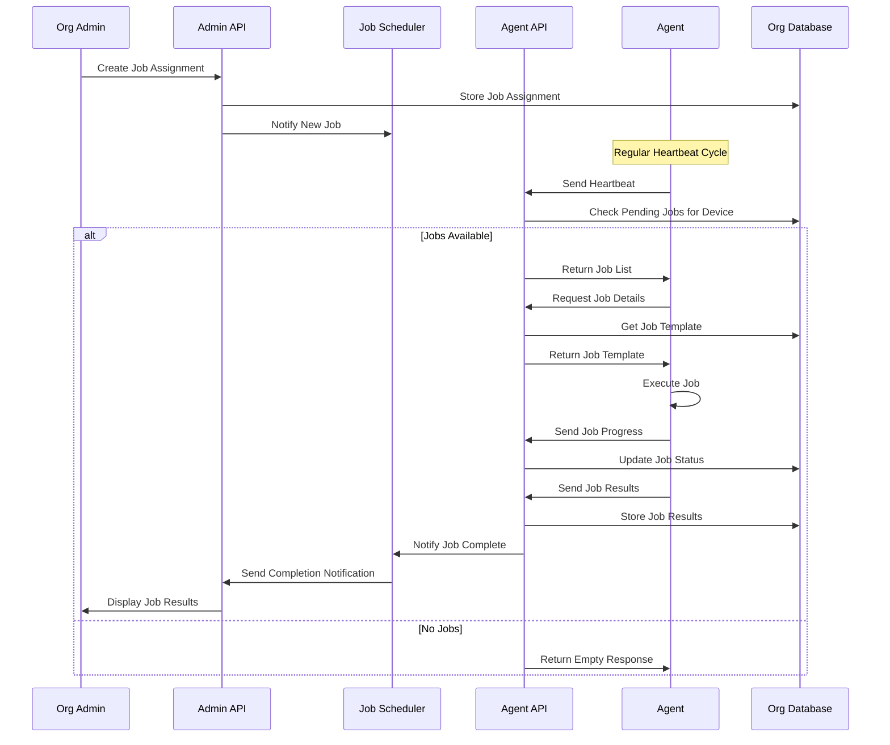
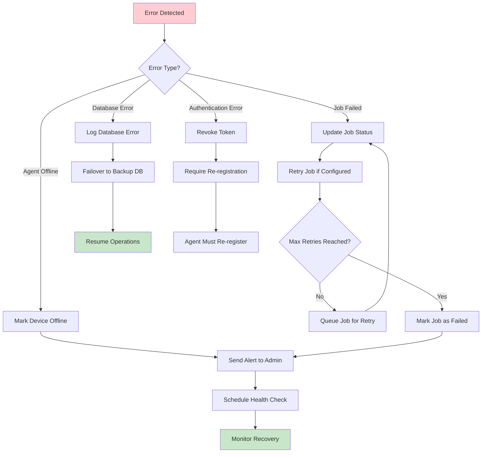

# Flow Diagrams

## Core Business Process Flows

### 1. Organization Setup Flow

### 2. Device Registration Flow

### 3. Job Template Creation and Execution Flow

### 4. Agent Heartbeat and Monitoring Flow

### 5. Multi-Tenant Data Access Flow

## Detailed Process Flows

### Device Type Management Flow

### Agent Authentication Flow

### Job Distribution and Execution Flow

### Error Handling and Recovery Flow

