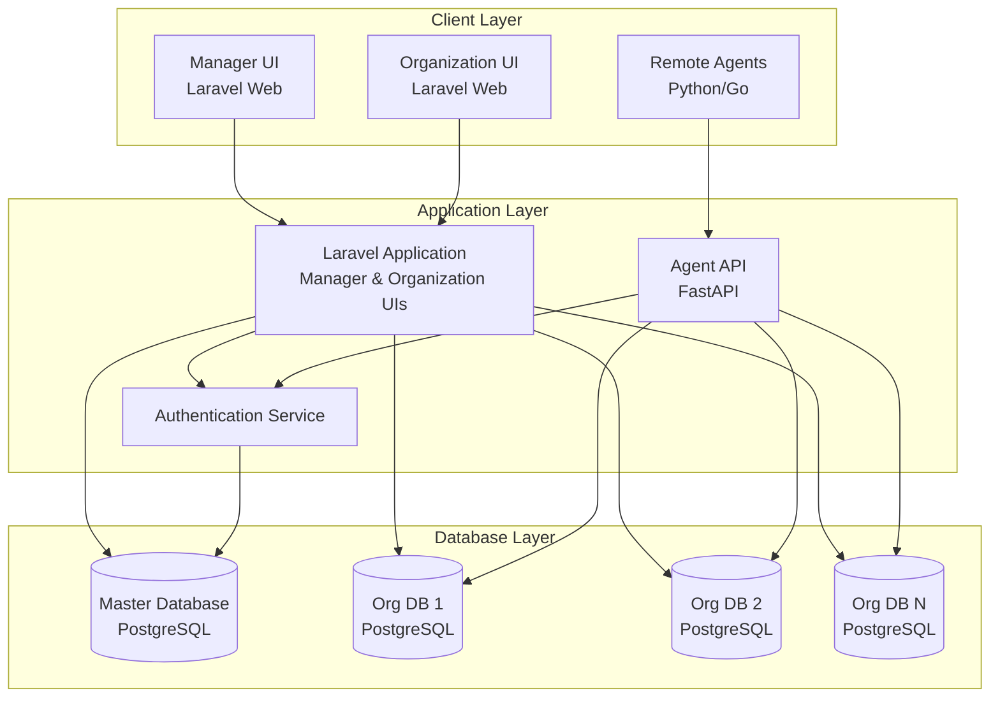
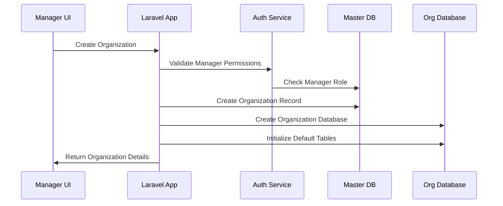
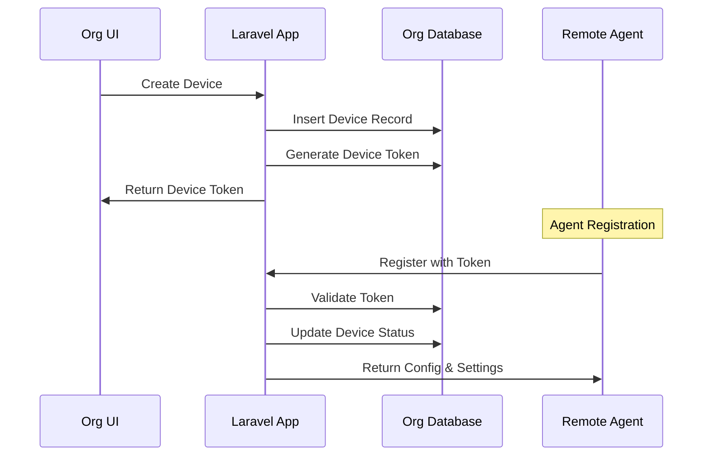
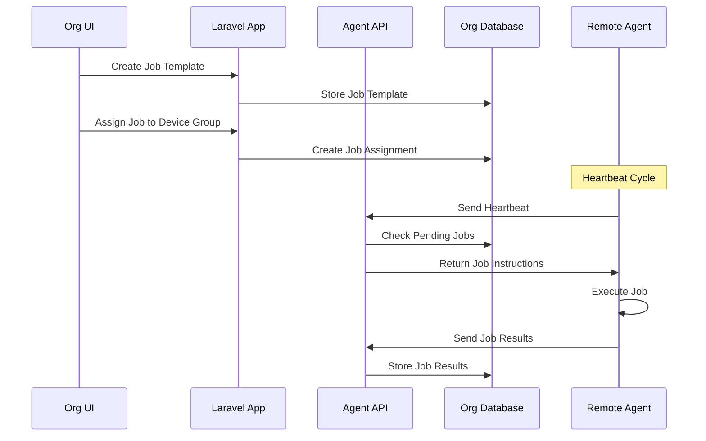

# System Architecture

## High-Level Architecture

## Component Overview

### 1. Manager UI (Laravel)
- **Purpose**: Super admin web interface for managing organizations and global settings
- **URL**: `/manager/*`
- **Users**: System managers and super administrators
- **Features**:
  - Organization management (create, update, delete)
  - Manager user management
  - Device type templates
  - Global configurations
  - System monitoring dashboard

### 2. Organization UI (Laravel)
- **Purpose**: Organization-specific web interface for device management
- **URL**: `/org/{org_slug}/*`
- **Users**: Organization administrators and users
- **Features**:
  - Device inventory management
  - Device group management
  - Job template creation
  - Agent monitoring
  - Organization-specific reporting

### 3. Agent API (FastAPI)
- **Purpose**: High-performance API for agent communications
- **Technology**: FastAPI with async processing
- **Responsibilities**:
  - Agent registration and authentication
  - Heartbeat processing with job instructions
  - Job distribution and result collection
  - System information collection

### 4. Authentication Service
- **Purpose**: Centralized authentication and authorization
- **Features**:
  - Multi-tenant authentication
  - Token-based agent authentication
  - Role-based access control (RBAC)
  - Session management

## Data Flow Architecture

### Manager Operations Flow

### Device Management Flow

### Job Execution Flow

## Scalability Considerations

### Horizontal Scaling
- **Database Sharding**: Each organization has its own database
- **API Load Balancing**: Multiple instances of both Laravel and FastAPI
- **Stateless Design**: All services are stateless for easy scaling

### Performance Optimization
- **Caching**: Redis for session and frequently accessed data
- **Database Indexing**: Optimized indexes for query performance
- **Async Processing**: FastAPI for handling high-volume agent requests
- **Connection Pooling**: Database connection optimization

## Security Architecture

### Authentication Layers
1. **Manager Authentication**: Laravel Sanctum with session-based auth
2. **Organization Authentication**: Multi-tenant session management
3. **Agent Authentication**: Token-based authentication with device binding

### Data Isolation
- **Database Level**: Separate databases per organization
- **Application Level**: Organization context validation
- **API Level**: Route-based organization filtering

### Security Measures
- **Token Rotation**: Regular device token rotation
- **Audit Logging**: Comprehensive audit trail
- **Rate Limiting**: API rate limiting per organization
- **Encryption**: TLS for all communications
