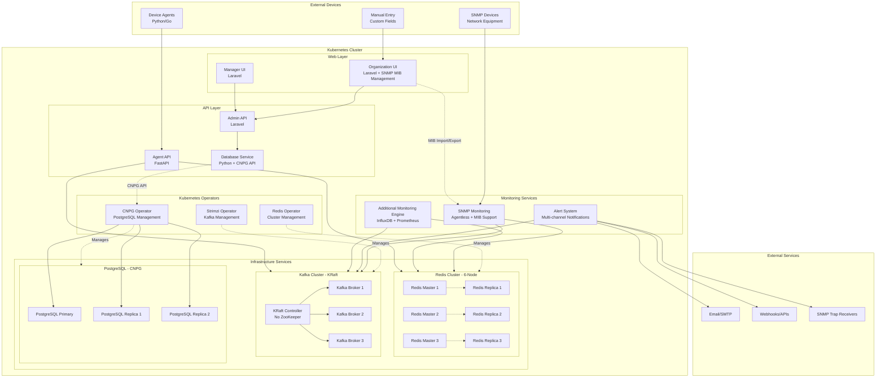
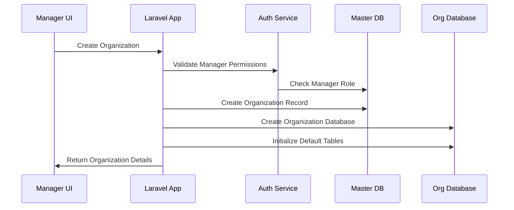
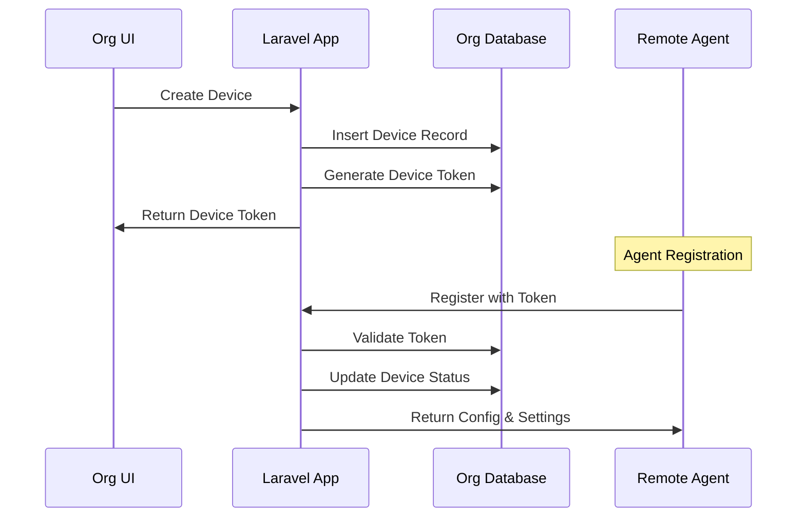
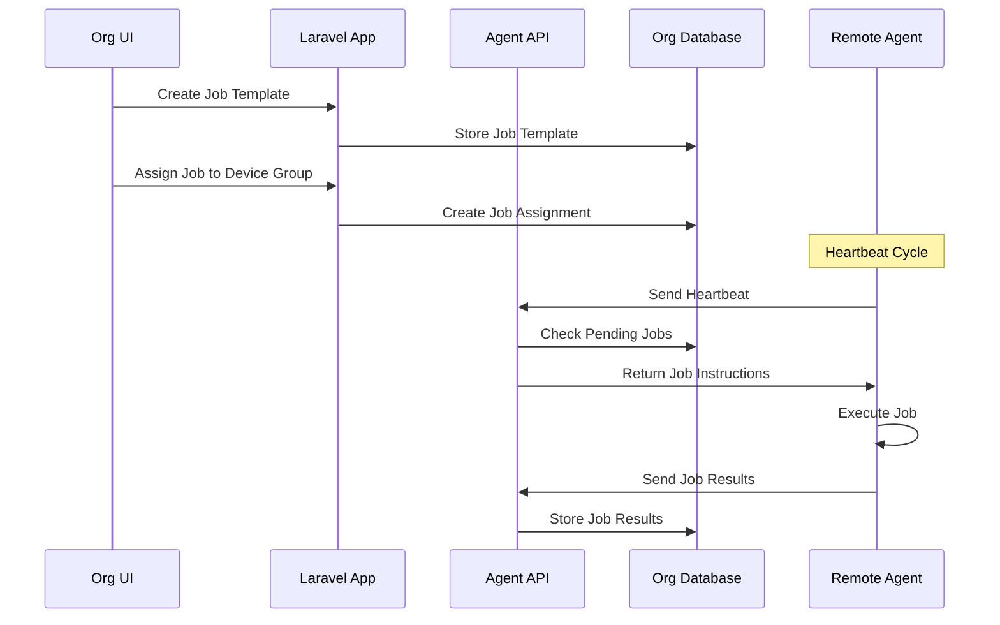

# System Architecture

## Cloud-Native Architecture Overview

RMAS is built as a cloud-native system deployed on Kubernetes with operator-managed data services for high availability and scalability.

## Component Overview

### 1. Manager UI (Laravel)
- **Purpose**: Super admin web interface for managing organizations and global settings
- **URL**: `/manager/*`
- **Users**: System managers and super administrators
- **Features**:
  - Organization management (create, update, delete)
  - Manager user management
  - Device type templates with custom fields
  - Global configurations
  - System monitoring dashboard
  - Global alert rule management
  - SNMP configuration templates
  - Monitoring infrastructure overview

### 2. Organization UI (Laravel)
- **Purpose**: Organization-specific web interface for device management
- **URL**: `/org/{org_slug}/*`
- **Users**: Organization administrators and users
- **Features**:
  - Device inventory management with custom fields
  - Device group management
  - Job template creation
  - Agent monitoring
  - Organization-specific reporting
  - Real-time monitoring dashboards
  - Alert management and notification settings
  - SNMP device discovery and monitoring
  - Custom device type configuration

### 3. Agent API (FastAPI)
- **Purpose**: High-performance API for agent communications
- **Technology**: FastAPI with async processing
- **Responsibilities**:
  - Agent registration and authentication
  - Heartbeat processing with job instructions
  - Job distribution and result collection
  - System information collection
  - Monitoring data streaming to Kafka
  - Custom metrics collection

### 4. Authentication Service
- **Purpose**: Centralized authentication and authorization
- **Features**:
  - Multi-tenant authentication
  - Token-based agent authentication
  - Role-based access control (RBAC)
  - Session management via Redis
  - JWT token management

### 5. Redis Cache Layer
- **Purpose**: High-performance caching and session management
- **Usage**:
  - Device name lists and active status
  - User session storage
  - Configuration caching
  - Real-time device metrics
  - Alert rule caching
  - SNMP device discovery cache

### 6. Kafka Message Broker
- **Purpose**: Reliable message streaming and event processing
- **Topics**:
  - `agent-responses`: Agent heartbeat and system information
  - `monitoring-data`: Device metrics and custom measurements
  - `audit-logs`: System audit events
  - `alert-events`: Alert triggers and notifications
  - `snmp-data`: SNMP polling results and traps

### 7. Monitoring Engine
- **Purpose**: Process monitoring data and maintain device health
- **Technology**: Python/Go microservice
- **Responsibilities**:
  - Consume monitoring data from Kafka
  - Parse custom device metrics
  - Store time-series data in InfluxDB
  - Update Prometheus metrics
  - Trigger alert conditions
  - Generate monitoring reports

### 8. Alert Engine
- **Purpose**: Process alerts and send notifications
- **Technology**: Python microservice
- **Responsibilities**:
  - Monitor alert conditions
  - Send SNMP traps
  - Execute webhook calls
  - Send email notifications
  - Manage notification escalation
  - Track alert acknowledgments

### 9. SNMP Collector
- **Purpose**: Agentless monitoring via SNMP
- **Technology**: Python service with SNMP libraries
- **Responsibilities**:
  - Active SNMP polling
  - SNMP trap receiving
  - Device discovery via SNMP
  - MIB parsing and custom OID monitoring
  - Network device health monitoring

### 10. Time-Series Databases
- **InfluxDB**: Primary time-series database for monitoring data
- **Prometheus**: Metrics collection and alerting
- **Grafana**: Visualization and dashboard platform

## Data Flow Architecture

### Manager Operations Flow

### Device Management Flow

### Job Execution Flow

## Scalability Considerations

### Horizontal Scaling
- **Database Sharding**: Each organization has its own database
- **API Load Balancing**: Multiple instances of both Laravel and FastAPI
- **Stateless Design**: All services are stateless for easy scaling
- **Message Broker Partitioning**: Kafka topic partitioning for parallel processing
- **Microservice Architecture**: Independent scaling of monitoring and alert engines

### Performance Optimization
- **Redis Caching**: Session storage, device lists, and configuration caching
- **Database Indexing**: Optimized indexes for query performance
- **Async Processing**: FastAPI for handling high-volume agent requests
- **Connection Pooling**: Database connection optimization
- **Message Streaming**: Kafka for decoupled, high-throughput data processing
- **Time-Series Optimization**: InfluxDB for efficient monitoring data storage

### Monitoring Data Pipeline
- **Real-time Processing**: Kafka Streams for live monitoring data
- **Batch Processing**: Scheduled aggregation of historical data
- **Data Retention**: Configurable retention policies for time-series data
- **Compression**: Efficient storage compression for large monitoring datasets

## Security Architecture

### Authentication Layers
1. **Manager Authentication**: Laravel Sanctum with Redis session storage
2. **Organization Authentication**: Multi-tenant session management via Redis
3. **Agent Authentication**: JWT tokens with device binding and Redis validation
4. **SNMP Authentication**: Community strings and SNMPv3 authentication

### Data Isolation
- **Database Level**: Separate databases per organization
- **Application Level**: Organization context validation
- **API Level**: Route-based organization filtering
- **Cache Level**: Redis namespace isolation per organization
- **Message Level**: Kafka topic access control per organization

### Security Measures
- **Token Rotation**: Regular device token rotation
- **Audit Logging**: Comprehensive audit trail via Kafka
- **Rate Limiting**: API rate limiting per organization
- **Encryption**: TLS for all communications and encrypted message payloads
- **SNMP Security**: SNMPv3 encryption and authentication support
- **Monitoring Security**: Encrypted monitoring data transmission
