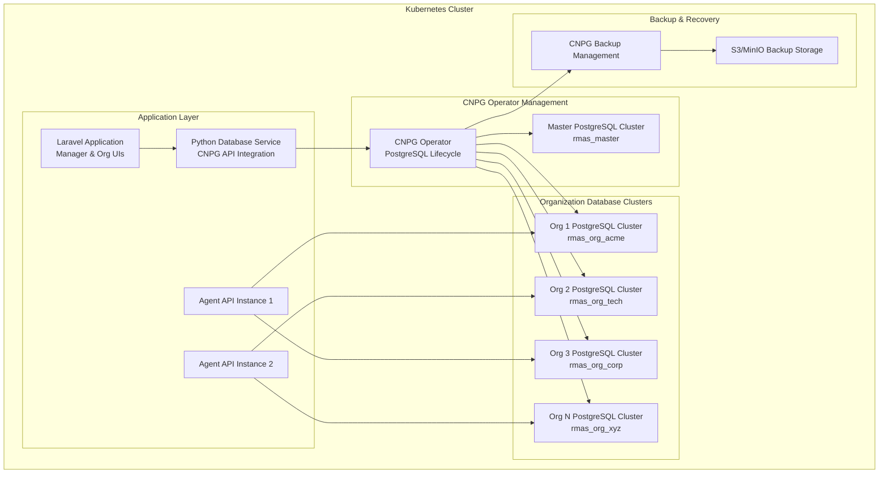
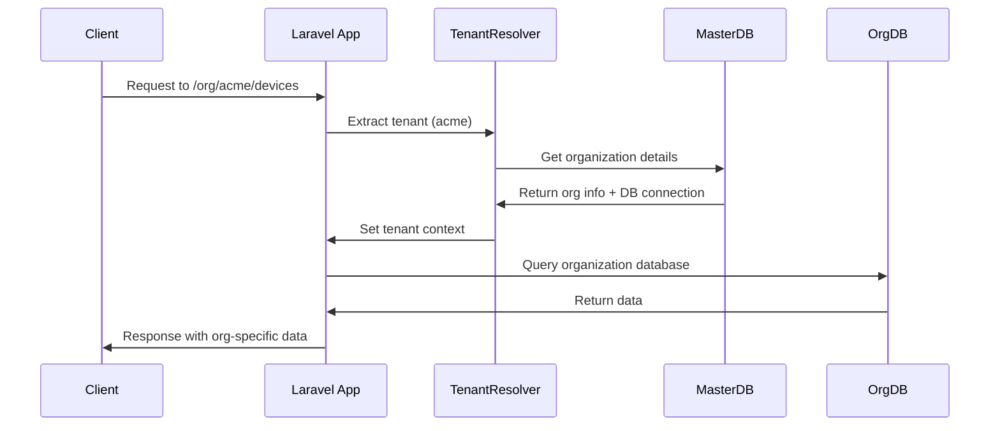
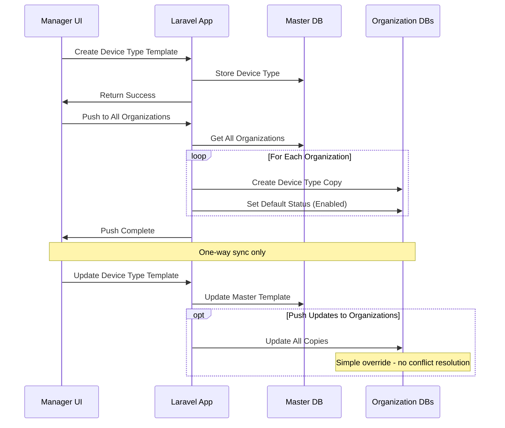

# Multi-Tenancy Strategy with CNPG Operator

This document outlines the cloud-native multi-tenant architecture strategy for RMAS using the Cloud Native PostgreSQL (CNPG) operator and a Python Database Service to manage multi-tenant databases on Kubernetes.

## Cloud-Native Multi-Tenancy Architecture



## Python Database Service Architecture

Since there's no official PHP library for CNPG operator management, we implement a Python microservice to handle database operations on behalf of Laravel.

### Python Database Service Implementation
```python
from fastapi import FastAPI, HTTPException
from kubernetes import client, config
from datetime import datetime
import yaml
import logging

class CNPGDatabaseService:
    def __init__(self):
        config.load_incluster_config()  # Load Kubernetes config
        self.custom_api = client.CustomObjectsApi()
        self.apps_v1 = client.AppsV1Api()
        self.cnpg_group = "postgresql.cnpg.io"
        self.cnpg_version = "v1"
        self.cnpg_plural = "clusters"
        
    async def create_organization_database(self, org_slug: str, org_config: dict) -> dict:
        """Create a new PostgreSQL cluster for an organization"""
        
        cluster_name = f"rmas-org-{org_slug}"
        namespace = "rmas-system"
        
        # CNPG Cluster definition
        cluster_spec = {
            "apiVersion": f"{self.cnpg_group}/{self.cnpg_version}",
            "kind": "Cluster",
            "metadata": {
                "name": cluster_name,
                "namespace": namespace,
                "labels": {
                    "app": "rmas",
                    "component": "database",
                    "organization": org_slug,
                    "managed-by": "rmas-db-service"
                }
            },
            "spec": {
                "instances": org_config.get("db_instances", 3),
                "primaryUpdateStrategy": "unsupervised",
                "postgresql": {
                    "parameters": {
                        "max_connections": "200",
                        "shared_buffers": "256MB",
                        "effective_cache_size": "1GB",
                        "maintenance_work_mem": "64MB",
                        "checkpoint_completion_target": "0.9",
                        "wal_buffers": "16MB",
                        "default_statistics_target": "100",
                        "random_page_cost": "1.1",
                        "effective_io_concurrency": "200"
                    }
                },
                "bootstrap": {
                    "initdb": {
                        "database": f"rmas_org_{org_slug}",
                        "owner": f"rmas_org_{org_slug}_user",
                        "secret": {
                            "name": f"{cluster_name}-credentials"
                        }
                    }
                },
                "storage": {
                    "size": org_config.get("storage_size", "50Gi"),
                    "storageClass": org_config.get("storage_class", "fast-ssd")
                },
                "resources": {
                    "requests": {
                        "memory": org_config.get("memory_request", "1Gi"),
                        "cpu": org_config.get("cpu_request", "500m")
                    },
                    "limits": {
                        "memory": org_config.get("memory_limit", "2Gi"),
                        "cpu": org_config.get("cpu_limit", "1000m")
                    }
                },
                "monitoring": {
                    "enabled": True,
                    "prometheusRule": {
                        "enabled": True
                    }
                },
                "backup": {
                    "retentionPolicy": "30d",
                    "target": "prefer-standby",
                    "schedule": "0 2 * * *",  # Daily at 2 AM
                    "s3": {
                        "bucket": org_config.get("backup_bucket", "rmas-backups"),
                        "path": f"/organizations/{org_slug}",
                        "accessKeyId": {
                            "name": "backup-credentials",
                            "key": "ACCESS_KEY_ID"
                        },
                        "secretAccessKey": {
                            "name": "backup-credentials", 
                            "key": "SECRET_ACCESS_KEY"
                        },
                        "endpoint": org_config.get("s3_endpoint", "s3.amazonaws.com"),
                        "region": org_config.get("s3_region", "us-east-1")
                    }
                }
            }
        }
        
        try:
            # Create the CNPG cluster
            response = self.custom_api.create_namespaced_custom_object(
                group=self.cnpg_group,
                version=self.cnpg_version,
                namespace=namespace,
                plural=self.cnpg_plural,
                body=cluster_spec
            )
            
            # Wait for cluster to be ready
            await self.wait_for_cluster_ready(cluster_name, namespace)
            
            # Get connection details
            connection_info = await self.get_cluster_connection_info(cluster_name, namespace)
            
            return {
                "status": "success",
                "cluster_name": cluster_name,
                "database_name": f"rmas_org_{org_slug}",
                "connection_info": connection_info,
                "created_at": datetime.utcnow().isoformat()
            }
            
        except Exception as e:
            logging.error(f"Failed to create organization database: {str(e)}")
            raise HTTPException(status_code=500, detail=f"Database creation failed: {str(e)}")
    
    async def get_cluster_connection_info(self, cluster_name: str, namespace: str) -> dict:
        """Get connection information for a CNPG cluster"""
        
        try:
            # Get cluster status
            cluster = self.custom_api.get_namespaced_custom_object(
                group=self.cnpg_group,
                version=self.cnpg_version,
                namespace=namespace,
                plural=self.cnpg_plural,
                name=cluster_name
            )
            
            # Extract connection details from cluster status
            status = cluster.get("status", {})
            
            return {
                "host": f"{cluster_name}-rw.{namespace}.svc.cluster.local",
                "port": 5432,
                "readonly_host": f"{cluster_name}-ro.{namespace}.svc.cluster.local",
                "database": status.get("currentPrimary", ""),
                "secret_name": f"{cluster_name}-app",
                "instances": status.get("instances", 0),
                "ready_instances": status.get("readyInstances", 0),
                "phase": status.get("phase", "unknown")
            }
            
        except Exception as e:
            logging.error(f"Failed to get cluster connection info: {str(e)}")
            raise HTTPException(status_code=500, detail=f"Connection info retrieval failed: {str(e)}")
    
    async def scale_organization_database(self, org_slug: str, new_instance_count: int) -> dict:
        """Scale an organization's database cluster"""
        
        cluster_name = f"rmas-org-{org_slug}"
        namespace = "rmas-system"
        
        try:
            # Get current cluster
            cluster = self.custom_api.get_namespaced_custom_object(
                group=self.cnpg_group,
                version=self.cnpg_version,
                namespace=namespace,
                plural=self.cnpg_plural,
                name=cluster_name
            )
            
            # Update instance count
            cluster["spec"]["instances"] = new_instance_count
            
            # Apply the update
            response = self.custom_api.patch_namespaced_custom_object(
                group=self.cnpg_group,
                version=self.cnpg_version,
                namespace=namespace,
                plural=self.cnpg_plural,
                name=cluster_name,
                body=cluster
            )
            
            return {
                "status": "success",
                "cluster_name": cluster_name,
                "old_instances": cluster["spec"].get("instances", 0),
                "new_instances": new_instance_count,
                "scaled_at": datetime.utcnow().isoformat()
            }
            
        except Exception as e:
            logging.error(f"Failed to scale organization database: {str(e)}")
            raise HTTPException(status_code=500, detail=f"Database scaling failed: {str(e)}")
```

## Multi-Tenancy Models Comparison

| Aspect | Shared Database | Database per Tenant (Our Choice) | Schema per Tenant |
|--------|----------------|-----------------------------------|-------------------|
| **Data Isolation** | Low | High ✓ | Medium |
| **Security** | Application-level | Database-level ✓ | Schema-level |
| **Scalability** | Limited | High ✓ | Medium |
| **Customization** | Limited | High ✓ | Medium |
| **Maintenance** | Easy | Complex (CNPG Managed) ✓ | Medium |
| **Cost per Tenant** | Low | Medium | Low |
| **Backup/Recovery** | Shared | Individual ✓ | Individual |
| **Kubernetes Native** | No | Yes ✓ | Partial |

## Implementation Strategy

### 1. Database-per-Tenant Model

#### Benefits
- **Complete Data Isolation**: Each organization has its own PostgreSQL database
- **Enhanced Security**: No risk of cross-tenant data leaks
- **Custom Schema**: Organizations can have custom fields and tables
- **Independent Scaling**: Each database can be scaled independently
- **Isolated Backups**: Organization-specific backup and recovery
- **Compliance**: Easier to meet data residency requirements

#### Challenges and Mitigation
- **Connection Management**: Mitigated with connection pooling
- **Schema Migrations**: Automated migration scripts across all databases
- **Monitoring**: Database-specific monitoring and alerting
- **Backup Complexity**: Automated backup scheduling per organization

### 2. Tenant Identification Strategy

#### URL-based Tenant Identification
```
Manager Interface:
https://app.rmas.com/manager/

Organization Interface:
https://app.rmas.com/org/{org_slug}/

Agent API:
https://api.rmas.com/agent/
```

#### Request Flow


### 3. Database Connection Management

#### Connection Pool Strategy
```php
// Laravel Database Configuration
'connections' => [
    'master' => [
        'driver' => 'pgsql',
        'host' => env('DB_MASTER_HOST'),
        'database' => env('DB_MASTER_DATABASE'),
        'username' => env('DB_MASTER_USERNAME'),
        'password' => env('DB_MASTER_PASSWORD'),
    ],
    
    // Dynamic organization connections
    'organization_template' => [
        'driver' => 'pgsql',
        'host' => env('DB_ORG_HOST'),
        'username' => env('DB_ORG_USERNAME'),
        'password' => env('DB_ORG_PASSWORD'),
    ]
];
```

#### Dynamic Connection Resolution
```php
class TenantDatabaseManager
{
    public function connection(string $organizationSlug): Connection
    {
        $organization = $this->getOrganization($organizationSlug);
        
        if (!isset($this->connections[$organizationSlug])) {
            $config = config('database.connections.organization_template');
            $config['database'] = $organization->database_name;
            
            $this->connections[$organizationSlug] = $this->createConnection($config);
        }
        
        return $this->connections[$organizationSlug];
    }
}
```

#### FastAPI Connection Management
```python
class TenantDatabaseManager:
    def __init__(self):
        self.connections = {}
        self.master_engine = create_engine(MASTER_DATABASE_URL)
    
    async def get_org_connection(self, org_id: str):
        if org_id not in self.connections:
            org_info = await self.get_organization_info(org_id)
            engine = create_engine(org_info.database_url)
            self.connections[org_id] = engine
        
        return self.connections[org_id]
```

### 4. Tenant Context Management

#### Middleware Implementation
```php
class TenantContextMiddleware
{
    public function handle(Request $request, Closure $next)
    {
        // Extract tenant from URL or header
        $tenantSlug = $this->extractTenant($request);
        
        if ($tenantSlug) {
            // Set tenant context
            app(TenantManager::class)->setCurrentTenant($tenantSlug);
            
            // Switch database connection
            DB::setDefaultConnection('tenant');
            config(['database.default' => 'tenant']);
        }
        
        return $next($request);
    }
}
```

#### Agent API Tenant Resolution
```python
@app.middleware("http")
async def tenant_middleware(request: Request, call_next):
    # Extract organization from agent token
    auth_header = request.headers.get("Authorization")
    if auth_header:
        token = auth_header.replace("Bearer ", "")
        org_id = await extract_org_from_token(token)
        request.state.org_id = org_id
    
    response = await call_next(request)
    return response
```

### 5. Schema Management and Migrations

#### Master Database Migrations
```sql
-- Master database schema migrations
-- Run once for the entire system
migrations/
├── master/
│   ├── 001_create_managers_table.sql
│   ├── 002_create_organizations_table.sql
│   └── 003_create_device_types_table.sql
```

#### Organization Database Template
```sql
-- Organization database template
-- Applied to each new organization database
migrations/
├── organization/
│   ├── 001_create_users_table.sql
│   ├── 002_create_devices_table.sql
│   ├── 003_create_device_groups_table.sql
│   └── 004_create_job_templates_table.sql
```

#### Migration Management
```php
class TenantMigrationCommand extends Command
{
    public function handle()
    {
        $organizations = Organization::all();
        
        foreach ($organizations as $org) {
            $this->migrateOrganization($org);
        }
    }
    
    private function migrateOrganization(Organization $org)
    {
        // Switch to organization database
        DB::setDefaultConnection($org->database_name);
        
        // Run migrations
        Artisan::call('migrate', [
            '--path' => 'database/migrations/organization',
            '--database' => $org->database_name
        ]);
    }
}
```

### 6. Data Synchronization Strategy

#### Device Type Synchronization


#### Sync Implementation
```php
class DeviceTypeSyncService
{
    public function syncToOrganizations(DeviceType $masterDeviceType)
    {
        $organizations = Organization::where('is_active', true)->get();
        
        foreach ($organizations as $org) {
            $this->syncToOrganization($masterDeviceType, $org);
        }
    }
    
    private function syncToOrganization(DeviceType $master, Organization $org)
    {
        $orgConnection = $this->getOrgConnection($org);
        
        $existing = $orgConnection->table('device_types')
            ->where('master_device_type_id', $master->id)
            ->first();
        
        if (!$existing) {
            // Create new device type
            $this->createDeviceType($orgConnection, $master);
        } else {
            // Update existing device type (simple override)
            $this->updateDeviceType($orgConnection, $existing, $master);
        }
    }
}
```

### 7. Backup and Recovery Strategy

#### Organization-Specific Backups
```bash
#!/bin/bash
# Organization backup script

# Get list of organization databases
ORG_DATABASES=$(psql -h $DB_HOST -U $DB_USER -d rmas_master -t -c "
    SELECT database_name FROM organization_databases 
    WHERE status = 'active'
")

# Backup each organization database
for db in $ORG_DATABASES; do
    echo "Backing up $db..."
    pg_dump -h $DB_HOST -U $DB_USER $db > "backups/${db}_$(date +%Y%m%d_%H%M%S).sql"
    
    # Upload to cloud storage
    aws s3 cp "backups/${db}_$(date +%Y%m%d_%H%M%S).sql" \
        "s3://rmas-backups/organizations/$db/"
done
```

#### Automated Backup Scheduling
```yaml
# Kubernetes CronJob for organization backups
apiVersion: batch/v1
kind: CronJob
metadata:
  name: org-database-backup
spec:
  schedule: "0 2 * * *"  # Daily at 2 AM
  jobTemplate:
    spec:
      template:
        spec:
          containers:
          - name: backup
            image: postgres:14
            command: ["/scripts/backup-organizations.sh"]
            env:
            - name: DB_HOST
              value: "postgres-master"
            - name: DB_USER
              valueFrom:
                secretKeyRef:
                  name: postgres-credentials
                  key: username
```

### 8. Monitoring and Observability

#### Per-Tenant Metrics
```python
# Prometheus metrics per organization
from prometheus_client import Counter, Histogram, Gauge

# Request metrics per organization
REQUEST_COUNT = Counter(
    'rmas_requests_total',
    'Total requests',
    ['organization', 'method', 'endpoint']
)

# Database connection metrics
DB_CONNECTIONS = Gauge(
    'rmas_db_connections',
    'Active database connections',
    ['organization', 'database']
)

# Job execution metrics
JOB_EXECUTION_TIME = Histogram(
    'rmas_job_execution_seconds',
    'Job execution time',
    ['organization', 'job_type']
)
```

#### Health Check Implementation
Organization health checks are accessed through the manager UI dashboard.

```php
class OrganizationHealthCheck
{
    public function check(): array
    {
        $results = [];
        $organizations = Organization::where('is_active', true)->get();
        
        foreach ($organizations as $org) {
            $results[$org->slug] = [
                'database_status' => $this->checkDatabase($org),
                'device_count' => $this->getDeviceCount($org),
                'active_agents' => $this->getActiveAgentCount($org),
                'last_heartbeat' => $this->getLastHeartbeat($org),
            ];
        }
        
        return $results;
    }
}
```

### 9. Security Considerations

#### Cross-Tenant Security Measures
1. **Database-Level Isolation**: Each organization has its own database
2. **Connection Validation**: Verify organization context on every request
3. **Token Scoping**: Agent tokens are scoped to specific organizations
4. **Audit Logging**: Organization-specific audit trails
5. **Access Control**: Role-based permissions within organizations

#### Cross-Tenant Security Middleware
```php
class TenantSecurityMiddleware
{
    public function handle(Request $request, Closure $next)
    {
        $tenant = app(TenantManager::class)->getCurrentTenant();
        
        // Validate user has access to this tenant
        if (!$this->userCanAccessTenant($request->user(), $tenant)) {
            abort(403, 'Access denied to organization');
        }
        
        // Set up query filters to prevent cross-tenant data access
        $this->setupTenantFilters($tenant);
        
        return $next($request);
    }
}
```

### 10. Scaling Considerations

#### Horizontal Scaling
- **Database Sharding**: Organization databases can be distributed across multiple servers
- **Read Replicas**: Create read replicas for high-traffic organizations
- **Connection Pooling**: Implement connection pooling to manage database connections efficiently

#### Performance Optimization
- **Database Indexing**: Organization-specific index optimization
- **Caching Strategy**: Redis with organization-scoped keys
- **CDN Integration**: Organization-specific static asset caching

#### Future Scaling Options
1. **Geographic Distribution**: Deploy organization databases closer to users
2. **Database Clustering**: Implement PostgreSQL clustering for high availability
3. **Microservices**: Split services by functionality while maintaining tenant isolation
4. **Event Sourcing**: Implement event sourcing for audit trails and replication
