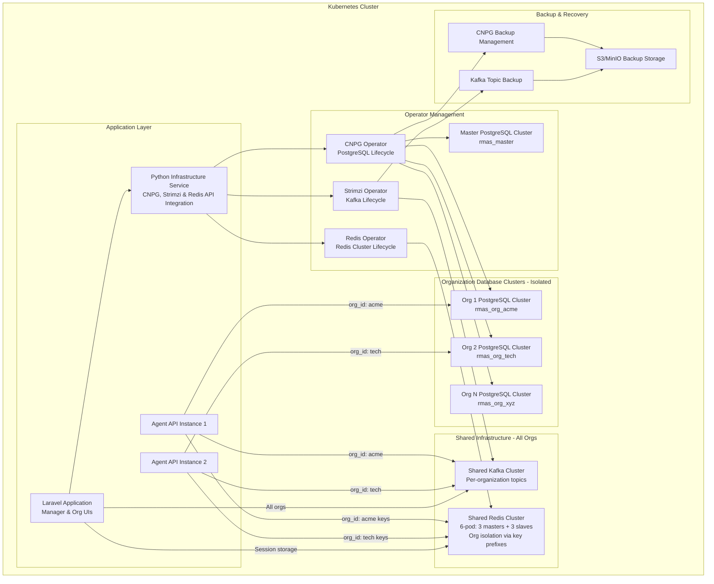
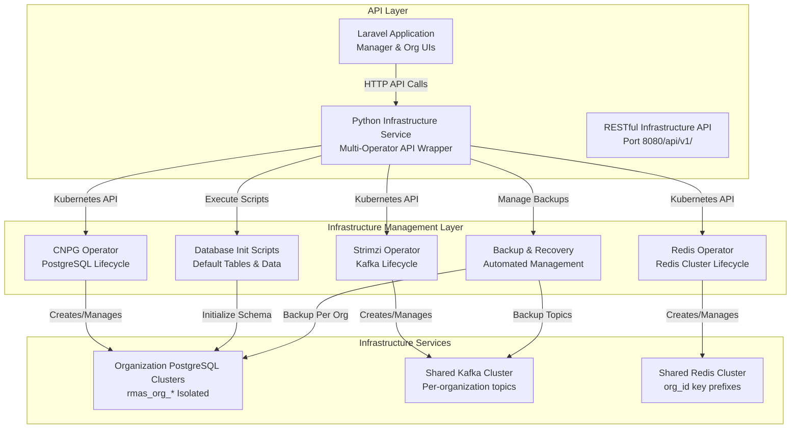
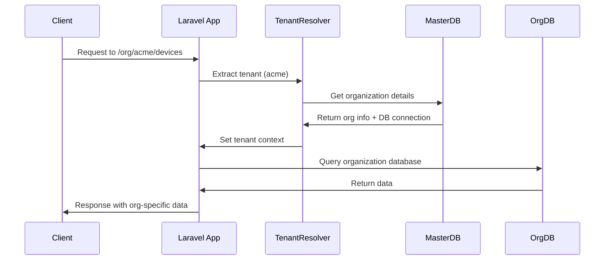
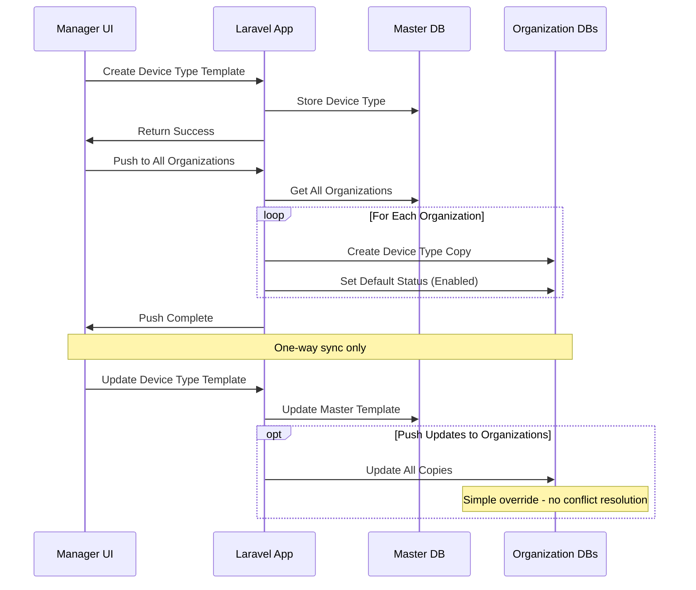

# Multi-Tenancy Strategy with Generic Kubernetes Service Manager

This document outlines the cloud-native multi-tenant architecture strategy for RMAS using a Python Infrastructure Service that acts as a generic API wrapper around Kubernetes operators (CNPG for PostgreSQL, Strimzi for Kafka, and Redis Operator) to create, manage, and maintain organization infrastructure on Kubernetes. Note: Kafka and Redis are shared services across all organizations with logical separation through org IDs, while PostgreSQL databases are isolated per organization.

## Cloud-Native Multi-Tenancy Architecture



## Python Infrastructure Service as Generic Kubernetes Operator Wrapper

The Python Infrastructure Service acts as a comprehensive API wrapper around multiple Kubernetes operators (CNPG, Strimzi, Redis Operator), providing high-level infrastructure management operations through RESTful endpoints. This service handles:

- **PostgreSQL databases**: Isolated per organization with dedicated clusters
- **Kafka messaging**: Shared cluster with topic-based organization isolation using org_id routing
- **Redis caching**: Shared 6-pod cluster with key-based organization isolation using org_id prefixes

This hybrid approach optimizes resource utilization while maintaining proper data isolation and security.

### Infrastructure Service API Architecture



### Infrastructure Service API Endpoints

#### Organization Database Management
```bash
# Create organization database with initialization
POST /api/v1/organizations/{org_slug}/database
Content-Type: application/json
{
    "storage_size": "50Gi",
    "instances": 3,
    "memory_limit": "2Gi",
    "cpu_limit": "1000m",
    "backup_enabled": true,
    "init_with_defaults": true
}

# Get database status and connection info
GET /api/v1/organizations/{org_slug}/database/status

# Scale database instances
PUT /api/v1/organizations/{org_slug}/database/scale
{
    "instances": 5
}

# Execute database initialization scripts
POST /api/v1/organizations/{org_slug}/database/initialize
{
    "script_version": "latest",
    "force_recreate": false
}

# Create database backup
POST /api/v1/organizations/{org_slug}/database/backup
{
    "backup_type": "full",
    "retention_days": 30
}

# Delete organization database
DELETE /api/v1/organizations/{org_slug}/database
```

#### Shared Kafka Management
```bash
# Get shared Kafka cluster status
GET /api/v1/infrastructure/kafka/status

# Create standard topics for new organization
POST /api/v1/infrastructure/kafka/organization-topics
Content-Type: application/json
{
    "org_id": "acme",
    "topics": [
        {
            "name": "device-events",
            "partitions": 6,
            "replication_factor": 3,
            "retention_ms": 604800000
        },
        {
            "name": "alert-notifications", 
            "partitions": 3,
            "replication_factor": 3,
            "retention_ms": 2592000000
        },
        {
            "name": "job-execution-results",
            "partitions": 3,
            "replication_factor": 3,
            "retention_ms": 1209600000
        },
        {
            "name": "audit-logs",
            "partitions": 3,
            "replication_factor": 3,
            "retention_ms": 7776000000
        }
    ]
}
# Creates: acme-device-events, acme-alert-notifications, etc.

# Create additional topic for organization
POST /api/v1/infrastructure/kafka/topics
Content-Type: application/json
{
    "org_id": "acme",
    "topic_name": "custom-metrics",
    "partitions": 6,
    "replication_factor": 3,
    "cleanup_policy": "delete",
    "retention_ms": 604800000
}
# Creates: acme-custom-metrics

# List topics for organization
GET /api/v1/infrastructure/kafka/topics?org_id=acme

# Get topic details for organization
GET /api/v1/infrastructure/kafka/topics/{org_id}-{topic_name}

# Scale Kafka brokers (affects all organizations)
PUT /api/v1/infrastructure/kafka/scale
{
    "brokers": 5
}

# Get Kafka consumer group info for organization
GET /api/v1/infrastructure/kafka/consumer-groups?org_id=acme

# Delete organization topics (when org is deleted)
DELETE /api/v1/infrastructure/kafka/organization-topics?org_id=acme
```

#### Shared Redis Management
```bash
# Get shared Redis cluster status
GET /api/v1/infrastructure/redis/status

# Get Redis cluster topology
GET /api/v1/infrastructure/redis/topology

# Scale Redis cluster (affects all organizations)
PUT /api/v1/infrastructure/redis/scale
{
    "masters": 3,
    "slaves_per_master": 2
}

# Get Redis key statistics for organization
GET /api/v1/infrastructure/redis/stats?org_id=acme

# Flush organization-specific keys (emergency operation)
DELETE /api/v1/infrastructure/redis/keys?org_id=acme
```

#### Infrastructure Monitoring
```bash
# Get overall infrastructure health
GET /api/v1/infrastructure/health

# Get resource utilization across all services
GET /api/v1/infrastructure/metrics

# Get organization-specific usage statistics
GET /api/v1/organizations/{org_slug}/infrastructure/usage
```

### Python Infrastructure Service Implementation
```python
from fastapi import FastAPI, HTTPException, BackgroundTasks
from kubernetes import client, config
from datetime import datetime
import yaml, logging, asyncio
import psycopg2
from pathlib import Path

app = FastAPI(title="RMAS Infrastructure Service", version="1.0.0")

class KubernetesInfrastructureService:
    def __init__(self):
        config.load_incluster_config()  # Load Kubernetes config
        self.custom_api = client.CustomObjectsApi()
        self.apps_v1 = client.AppsV1Api()
        self.core_v1 = client.CoreV1Api()
        
        # Operator configurations
        self.cnpg_group = "postgresql.cnpg.io"
        self.cnpg_version = "v1"
        self.cnpg_plural = "clusters"
        
        self.strimzi_group = "kafka.strimzi.io"
        self.strimzi_version = "v1beta2"
        self.kafka_plural = "kafkas"
        self.topic_plural = "kafkatopics"
        
        self.redis_group = "redis.redis.opstreelabs.in"
        self.redis_version = "v1beta2"
        self.redis_plural = "redisclusters"
        
        self.init_scripts_path = Path("/app/database/init_scripts")
        
    async def create_organization_database(self, org_slug: str, org_config: dict) -> dict:
        """Create a new PostgreSQL cluster for an organization with initialization"""
        
        cluster_name = f"rmas-org-{org_slug}"
        namespace = "rmas-system"
        database_name = f"rmas_org_{org_slug}"
        username = f"rmas_org_{org_slug}_user"
        
        # Create database credentials secret first
        await self.create_database_credentials(cluster_name, namespace, username, database_name)
        
        # CNPG Cluster definition with initialization
        cluster_spec = {
            "apiVersion": f"{self.cnpg_group}/{self.cnpg_version}",
            "kind": "Cluster",
            "metadata": {
                "name": cluster_name,
                "namespace": namespace,
                "labels": {
                    "app": "rmas",
                    "component": "database",
                    "organization": org_slug,
                    "managed-by": "rmas-db-service"
                }
            },
            "spec": {
                "instances": org_config.get("db_instances", 3),
                "primaryUpdateStrategy": "unsupervised",
                "postgresql": {
                    "parameters": {
                        "max_connections": "200",
                        "shared_buffers": "256MB",
                        "effective_cache_size": "1GB",
                        "maintenance_work_mem": "64MB",
                        "checkpoint_completion_target": "0.9",
                        "wal_buffers": "16MB",
                        "default_statistics_target": "100",
                        "random_page_cost": "1.1",
                        "effective_io_concurrency": "200"
                    }
                },
                "bootstrap": {
                    "initdb": {
                        "database": database_name,
                        "owner": username,
                        "secret": {
                            "name": f"{cluster_name}-credentials"
                        },
                        "postInitApplicationSQL": [
                            # Create extensions
                            "CREATE EXTENSION IF NOT EXISTS uuid-ossp;",
                            "CREATE EXTENSION IF NOT EXISTS pg_stat_statements;",
                            "CREATE EXTENSION IF NOT EXISTS pg_trgm;",
                            # Set up initial permissions
                            f"GRANT ALL PRIVILEGES ON DATABASE {database_name} TO {username};",
                            f"ALTER DATABASE {database_name} OWNER TO {username};"
                        ]
                    }
                },
                "storage": {
                    "size": org_config.get("storage_size", "50Gi"),
                    "storageClass": org_config.get("storage_class", "fast-ssd")
                },
                "resources": {
                    "requests": {
                        "memory": org_config.get("memory_request", "1Gi"),
                        "cpu": org_config.get("cpu_request", "500m")
                    },
                    "limits": {
                        "memory": org_config.get("memory_limit", "2Gi"),
                        "cpu": org_config.get("cpu_limit", "1000m")
                    }
                },
                "monitoring": {
                    "enabled": True,
                    "prometheusRule": {
                        "enabled": True
                    }
                },
                "backup": {
                    "retentionPolicy": "30d",
                    "target": "prefer-standby",
                    "schedule": "0 2 * * *",  # Daily at 2 AM
                    "s3": {
                        "bucket": org_config.get("backup_bucket", "rmas-backups"),
                        "path": f"/organizations/{org_slug}",
                        "accessKeyId": {
                            "name": "backup-credentials",
                            "key": "ACCESS_KEY_ID"
                        },
                        "secretAccessKey": {
                            "name": "backup-credentials", 
                            "key": "SECRET_ACCESS_KEY"
                        },
                        "endpoint": org_config.get("s3_endpoint", "s3.amazonaws.com"),
                        "region": org_config.get("s3_region", "us-east-1")
                    }
                }
            }
        }
        
        try:
            # Create the CNPG cluster
            response = self.custom_api.create_namespaced_custom_object(
                group=self.cnpg_group,
                version=self.cnpg_version,
                namespace=namespace,
                plural=self.cnpg_plural,
                body=cluster_spec
            )
            
            # Wait for cluster to be ready
            await self.wait_for_cluster_ready(cluster_name, namespace)
            
            # Execute initialization scripts
            if org_config.get("init_with_defaults", True):
                await self.initialize_organization_database(org_slug)
            
            # Get connection details
            connection_info = await self.get_cluster_connection_info(cluster_name, namespace)
            
            return {
                "status": "success",
                "cluster_name": cluster_name,
                "database_name": database_name,
                "connection_info": connection_info,
                "initialized": org_config.get("init_with_defaults", True),
                "created_at": datetime.utcnow().isoformat()
            }
            
        except Exception as e:
            logging.error(f"Failed to create organization database: {str(e)}")
            raise HTTPException(status_code=500, detail=f"Database creation failed: {str(e)}")
    
    async def create_database_credentials(self, cluster_name: str, namespace: str, username: str, database: str):
        """Create Kubernetes secret with database credentials"""
        import secrets
        import string
        
        # Generate secure password
        password = ''.join(secrets.choice(string.ascii_letters + string.digits) for _ in range(32))
        
        secret = {
            "apiVersion": "v1",
            "kind": "Secret",
            "metadata": {
                "name": f"{cluster_name}-credentials",
                "namespace": namespace,
                "labels": {
                    "app": "rmas",
                    "component": "database-credentials",
                    "cluster": cluster_name
                }
            },
            "type": "Opaque",
            "stringData": {
                "username": username,
                "password": password,
                "database": database
            }
        }
        
        self.core_v1.create_namespaced_secret(namespace=namespace, body=secret)
    
    async def initialize_organization_database(self, org_slug: str) -> dict:
        """Execute initialization scripts to create default tables and data"""
        
        cluster_name = f"rmas-org-{org_slug}"
        namespace = "rmas-system"
        
        try:
            # Get database connection
            connection_info = await self.get_cluster_connection_info(cluster_name, namespace)
            
            # Get credentials from secret
            secret = self.core_v1.read_namespaced_secret(
                name=f"{cluster_name}-credentials",
                namespace=namespace
            )
            
            username = secret.data["username"].decode('base64')
            password = secret.data["password"].decode('base64')
            database = secret.data["database"].decode('base64')
            
            # Connect to database
            conn = psycopg2.connect(
                host=connection_info["host"],
                port=connection_info["port"],
                database=database,
                user=username,
                password=password
            )
            
            # Execute initialization scripts in order
            init_scripts = [
                "001_create_base_tables.sql",
                "002_create_device_tables.sql", 
                "003_create_user_tables.sql",
                "004_create_job_tables.sql",
                "005_create_audit_tables.sql",
                "006_insert_default_data.sql",
                "007_create_indexes.sql",
                "008_create_triggers.sql"
            ]
            
            cursor = conn.cursor()
            executed_scripts = []
            
            for script in init_scripts:
                script_path = self.init_scripts_path / script
                if script_path.exists():
                    with open(script_path, 'r') as f:
                        sql_content = f.read()
                    
                    # Replace placeholders with organization-specific values
                    sql_content = sql_content.replace("{{ORG_SLUG}}", org_slug)
                    sql_content = sql_content.replace("{{DATABASE_NAME}}", database)
                    sql_content = sql_content.replace("{{TIMESTAMP}}", datetime.utcnow().isoformat())
                    
                    cursor.execute(sql_content)
                    executed_scripts.append(script)
                    logging.info(f"Executed initialization script: {script} for org: {org_slug}")
            
            conn.commit()
            cursor.close()
            conn.close()
            
            return {
                "status": "success",
                "organization": org_slug,
                "executed_scripts": executed_scripts,
                "initialized_at": datetime.utcnow().isoformat()
            }
            
        except Exception as e:
            logging.error(f"Failed to initialize organization database: {str(e)}")
            raise HTTPException(status_code=500, detail=f"Database initialization failed: {str(e)}")
    
    async def get_cluster_connection_info(self, cluster_name: str, namespace: str) -> dict:
        """Get connection information for a CNPG cluster"""
        
        try:
            # Get cluster status
            cluster = self.custom_api.get_namespaced_custom_object(
                group=self.cnpg_group,
                version=self.cnpg_version,
                namespace=namespace,
                plural=self.cnpg_plural,
                name=cluster_name
            )
            
            # Extract connection details from cluster status
            status = cluster.get("status", {})
            
            return {
                "host": f"{cluster_name}-rw.{namespace}.svc.cluster.local",
                "port": 5432,
                "readonly_host": f"{cluster_name}-ro.{namespace}.svc.cluster.local",
                "database": status.get("currentPrimary", ""),
                "secret_name": f"{cluster_name}-app",
                "instances": status.get("instances", 0),
                "ready_instances": status.get("readyInstances", 0),
                "phase": status.get("phase", "unknown")
            }
            
        except Exception as e:
            logging.error(f"Failed to get cluster connection info: {str(e)}")
            raise HTTPException(status_code=500, detail=f"Connection info retrieval failed: {str(e)}")
    
    async def scale_organization_database(self, org_slug: str, new_instance_count: int) -> dict:
        """Scale an organization's database cluster"""
        
        cluster_name = f"rmas-org-{org_slug}"
        namespace = "rmas-system"
        
        try:
            # Get current cluster
            cluster = self.custom_api.get_namespaced_custom_object(
                group=self.cnpg_group,
                version=self.cnpg_version,
                namespace=namespace,
                plural=self.cnpg_plural,
                name=cluster_name
            )
            
            # Update instance count
            cluster["spec"]["instances"] = new_instance_count
            
            # Apply the update
            response = self.custom_api.patch_namespaced_custom_object(
                group=self.cnpg_group,
                version=self.cnpg_version,
                namespace=namespace,
                plural=self.cnpg_plural,
                name=cluster_name,
                body=cluster
            )
            
            return {
                "status": "success",
                "cluster_name": cluster_name,
                "old_instances": cluster["spec"].get("instances", 0),
                "new_instances": new_instance_count,
                "scaled_at": datetime.utcnow().isoformat()
            }
            
        except Exception as e:
            logging.error(f"Failed to scale organization database: {str(e)}")
            raise HTTPException(status_code=500, detail=f"Database scaling failed: {str(e)}")
    
    async def create_organization_topics(self, org_id: str, topics_config: list) -> dict:
        """Create standard topics for an organization"""
        
        namespace = "rmas-system"
        created_topics = []
        failed_topics = []
        
        for topic_config in topics_config:
            topic_name = f"{org_id}-{topic_config['name']}"
            
            topic_spec = {
                "apiVersion": f"{self.strimzi_group}/{self.strimzi_version}",
                "kind": "KafkaTopic",
                "metadata": {
                    "name": topic_name,
                    "namespace": namespace,
                    "labels": {
                        "strimzi.io/cluster": "rmas-kafka-shared",
                        "organization": org_id,
                        "topic-type": topic_config['name'],
                        "managed-by": "rmas-infra-service"
                    }
                },
                "spec": {
                    "topicName": topic_name,
                    "partitions": topic_config.get("partitions", 6),
                    "replicas": topic_config.get("replication_factor", 3),
                    "config": {
                        "cleanup.policy": topic_config.get("cleanup_policy", "delete"),
                        "retention.ms": str(topic_config.get("retention_ms", 604800000)),
                        "min.insync.replicas": "2",
                        "compression.type": "lz4"
                    }
                }
            }
            
            try:
                response = self.custom_api.create_namespaced_custom_object(
                    group=self.strimzi_group,
                    version=self.strimzi_version,
                    namespace=namespace,
                    plural=self.topic_plural,
                    body=topic_spec
                )
                
                created_topics.append({
                    "name": topic_name,
                    "partitions": topic_config.get("partitions", 6),
                    "replication_factor": topic_config.get("replication_factor", 3),
                    "status": "created"
                })
                
            except Exception as e:
                logging.error(f"Failed to create topic {topic_name}: {str(e)}")
                failed_topics.append({
                    "name": topic_name,
                    "error": str(e)
                })
        
        return {
            "status": "completed",
            "organization": org_id,
            "created_topics": created_topics,
            "failed_topics": failed_topics,
            "total_requested": len(topics_config),
            "total_created": len(created_topics),
            "created_at": datetime.utcnow().isoformat()
        }
    
    async def create_organization_topic(self, org_id: str, topic_config: dict) -> dict:
        """Create a single organization-specific topic"""
        
        topic_name = f"{org_id}-{topic_config['topic_name']}"
        namespace = "rmas-system"
        
        topic_spec = {
            "apiVersion": f"{self.strimzi_group}/{self.strimzi_version}",
            "kind": "KafkaTopic",
            "metadata": {
                "name": topic_name,
                "namespace": namespace,
                "labels": {
                    "strimzi.io/cluster": "rmas-kafka-shared",
                    "organization": org_id,
                    "topic-type": topic_config['topic_name'],
                    "managed-by": "rmas-infra-service"
                }
            },
            "spec": {
                "topicName": topic_name,
                "partitions": topic_config.get("partitions", 6),
                "replicas": topic_config.get("replication_factor", 3),
                "config": {
                    "cleanup.policy": topic_config.get("cleanup_policy", "delete"),
                    "retention.ms": str(topic_config.get("retention_ms", 604800000)),
                    "min.insync.replicas": "2",
                    "compression.type": "lz4"
                }
            }
        }
        
        try:
            response = self.custom_api.create_namespaced_custom_object(
                group=self.strimzi_group,
                version=self.strimzi_version,
                namespace=namespace,
                plural=self.topic_plural,
                body=topic_spec
            )
            
            return {
                "status": "success",
                "topic_name": topic_name,
                "organization": org_id,
                "partitions": topic_config.get("partitions", 6),
                "replication_factor": topic_config.get("replication_factor", 3),
                "created_at": datetime.utcnow().isoformat()
            }
            
        except Exception as e:
            logging.error(f"Failed to create organization topic: {str(e)}")
            raise HTTPException(status_code=500, detail=f"Topic creation failed: {str(e)}")
    
    async def list_organization_topics(self, org_id: str) -> dict:
        """List all topics for an organization"""
        
        namespace = "rmas-system"
        
        try:
            topics = self.custom_api.list_namespaced_custom_object(
                group=self.strimzi_group,
                version=self.strimzi_version,
                namespace=namespace,
                plural=self.topic_plural,
                label_selector=f"organization={org_id}"
            )
            
            org_topics = []
            for topic in topics.get("items", []):
                topic_name = topic["spec"]["topicName"]
                org_topics.append({
                    "name": topic_name,
                    "partitions": topic["spec"]["partitions"],
                    "replicas": topic["spec"]["replicas"],
                    "config": topic["spec"].get("config", {}),
                    "status": topic.get("status", {}).get("conditions", [])
                })
            
            return {
                "organization": org_id,
                "topics": org_topics,
                "total_topics": len(org_topics)
            }
            
        except Exception as e:
            logging.error(f"Failed to list organization topics: {str(e)}")
            raise HTTPException(status_code=500, detail=f"Topic listing failed: {str(e)}")
    
    async def delete_organization_topics(self, org_id: str) -> dict:
        """Delete all topics for an organization"""
        
        namespace = "rmas-system"
        
        try:
            # First list all topics for the organization
            topics = self.custom_api.list_namespaced_custom_object(
                group=self.strimzi_group,
                version=self.strimzi_version,
                namespace=namespace,
                plural=self.topic_plural,
                label_selector=f"organization={org_id}"
            )
            
            deleted_topics = []
            failed_deletions = []
            
            for topic in topics.get("items", []):
                topic_name = topic["metadata"]["name"]
                try:
                    self.custom_api.delete_namespaced_custom_object(
                        group=self.strimzi_group,
                        version=self.strimzi_version,
                        namespace=namespace,
                        plural=self.topic_plural,
                        name=topic_name
                    )
                    deleted_topics.append(topic_name)
                except Exception as e:
                    failed_deletions.append({
                        "topic": topic_name,
                        "error": str(e)
                    })
            
            return {
                "status": "completed",
                "organization": org_id,
                "deleted_topics": deleted_topics,
                "failed_deletions": failed_deletions,
                "total_deleted": len(deleted_topics),
                "deleted_at": datetime.utcnow().isoformat()
            }
            
        except Exception as e:
            logging.error(f"Failed to delete organization topics: {str(e)}")
            raise HTTPException(status_code=500, detail=f"Topic deletion failed: {str(e)}")

# FastAPI Routes - Infrastructure Management
infra_service = KubernetesInfrastructureService()

# Database Management Routes
@app.post("/api/v1/organizations/{org_slug}/database")
async def create_organization_database(org_slug: str, config: dict, background_tasks: BackgroundTasks):
    """Create and initialize organization database"""
    result = await infra_service.create_organization_database(org_slug, config)
    return result

@app.get("/api/v1/organizations/{org_slug}/database/status")
async def get_database_status(org_slug: str):
    """Get organization database status"""
    cluster_name = f"rmas-org-{org_slug}"
    return await infra_service.get_database_connection_info(cluster_name, "rmas-system")

@app.post("/api/v1/organizations/{org_slug}/database/initialize")
async def initialize_database(org_slug: str, init_config: dict):
    """Execute database initialization scripts"""
    return await infra_service.initialize_organization_database(org_slug)

@app.put("/api/v1/organizations/{org_slug}/database/scale")
async def scale_database(org_slug: str, scale_config: dict):
    """Scale organization database instances"""
    return await infra_service.scale_organization_database(org_slug, scale_config["instances"])

# Shared Kafka Management Routes
@app.get("/api/v1/infrastructure/kafka/status")
async def get_shared_kafka_status():
    """Get shared Kafka cluster status"""
    return await infra_service.get_shared_kafka_status()

@app.post("/api/v1/infrastructure/kafka/topics")
async def create_organization_topic(topic_request: dict):
    """Create organization-specific topic"""
    org_id = topic_request.get("org_id")
    topic_config = {k: v for k, v in topic_request.items() if k != "org_id"}
    return await infra_service.create_organization_topic(org_id, topic_config)

@app.post("/api/v1/organizations/{org_id}/kafka/topics/bulk")
async def create_organization_topics_bulk(org_id: str, topics_config: list):
    """Create standard topics for an organization"""
    return await infra_service.create_organization_topics(org_id, topics_config)

@app.get("/api/v1/organizations/{org_id}/kafka/topics")
async def list_organization_topics(org_id: str):
    """List topics for organization"""
    return await infra_service.list_organization_topics(org_id)

@app.delete("/api/v1/organizations/{org_id}/kafka/topics")
async def delete_organization_topics(org_id: str):
    """Delete all topics for organization"""
    return await infra_service.delete_organization_topics(org_id)

@app.put("/api/v1/infrastructure/kafka/scale")
async def scale_shared_kafka(scale_config: dict):
    """Scale shared Kafka brokers (affects all organizations)"""
    return await infra_service.scale_shared_kafka_cluster(scale_config["brokers"])

@app.get("/api/v1/infrastructure/kafka/consumer-groups")
async def get_consumer_groups(org_id: str):
    """Get Kafka consumer group info for organization"""
    return await infra_service.get_organization_consumer_groups(org_id)

# Shared Redis Management Routes  
@app.get("/api/v1/infrastructure/redis/status")
async def get_shared_redis_status():
    """Get shared Redis cluster status"""
    return await infra_service.get_shared_redis_status()

@app.get("/api/v1/infrastructure/redis/topology")
async def get_redis_topology():
    """Get Redis cluster topology information"""
    return await infra_service.get_shared_redis_topology()

@app.put("/api/v1/infrastructure/redis/scale")
async def scale_shared_redis(scale_config: dict):
    """Scale shared Redis cluster (affects all organizations)"""
    return await infra_service.scale_shared_redis_cluster(scale_config)

@app.get("/api/v1/infrastructure/redis/stats")
async def get_redis_stats(org_id: str):
    """Get Redis key statistics for organization"""
    return await infra_service.get_organization_redis_stats(org_id)

@app.delete("/api/v1/infrastructure/redis/keys")
async def flush_organization_keys(org_id: str):
    """Flush organization-specific keys (emergency operation)"""
    return await infra_service.flush_organization_redis_keys(org_id)
```

## Shared Service Multi-Tenancy Patterns

### Kafka Multi-Tenancy with Per-Organization Topics

#### Topic Creation Strategy
Each organization gets dedicated topics created automatically when the organization is provisioned. Topics are created with standardized naming and optimal configurations.

```bash
# Standard topics created per organization:
{org_id}-device-events          # Device telemetry and events
{org_id}-alert-notifications    # System alerts and notifications  
{org_id}-job-execution-results  # Job execution status and results
{org_id}-audit-logs            # Audit trail events
{org_id}-monitoring-metrics    # Custom monitoring metrics

# Examples for different organizations:
acme-device-events             # Acme Corp device events
acme-alert-notifications       # Acme Corp alerts
acme-job-execution-results     # Acme Corp job results

techcorp-device-events         # TechCorp device events
techcorp-alert-notifications   # TechCorp alerts
techcorp-job-execution-results # TechCorp job results
```

#### Consumer Group Naming
Consumer groups are organization-specific: `{org_id}-{service}-{group_name}`

```bash
# Examples:
acme-agent-api-device-processor     # Acme's agent API device processor
acme-monitoring-alert-handler       # Acme's monitoring alert handler
techcorp-agent-api-device-processor # TechCorp's agent API device processor
```

#### Producer/Consumer Implementation
```python
# Kafka Producer for organization-specific topics
class OrganizationKafkaProducer:
    def __init__(self, org_id: str):
        self.org_id = org_id
        self.producer = KafkaProducer(
            bootstrap_servers=['rmas-kafka-shared:9092'],
            value_serializer=lambda v: json.dumps(v).encode('utf-8')
        )
    
    def send_device_event(self, device_id: str, event_data: dict):
        topic = f"{self.org_id}-device-events"
        message = {
            "org_id": self.org_id,
            "device_id": device_id,
            "timestamp": datetime.utcnow().isoformat(),
            "data": event_data
        }
        self.producer.send(topic, value=message)
    
    def send_alert(self, alert_type: str, alert_data: dict):
        topic = f"{self.org_id}-alert-notifications"
        message = {
            "org_id": self.org_id,
            "alert_type": alert_type,
            "timestamp": datetime.utcnow().isoformat(),
            "data": alert_data
        }
        self.producer.send(topic, value=message)

# Kafka Consumer for organization-specific topics
class OrganizationKafkaConsumer:
    def __init__(self, org_id: str, service_name: str, group_name: str):
        self.org_id = org_id
        self.topics = [
            f"{org_id}-device-events",
            f"{org_id}-alert-notifications",
            f"{org_id}-job-execution-results"
        ]
        self.consumer = KafkaConsumer(
            *self.topics,
            bootstrap_servers=['rmas-kafka-shared:9092'],
            group_id=f"{org_id}-{service_name}-{group_name}",
            value_deserializer=lambda m: json.loads(m.decode('utf-8'))
        )
    
    def process_messages(self):
        for message in self.consumer:
            topic = message.topic
            org_data = message.value
            
            # Route based on topic type
            if topic.endswith('-device-events'):
                self.handle_device_event(org_data)
            elif topic.endswith('-alert-notifications'):
                self.handle_alert(org_data)
            elif topic.endswith('-job-execution-results'):
                self.handle_job_result(org_data)
```
```

### Redis Multi-Tenancy with Key Prefixes

#### Key Naming Convention
All Redis keys use the prefix pattern: `{org_id}:{key_type}:{identifier}`

```bash
# Examples:
acme:session:user_123           # User session for Acme
acme:cache:device_456           # Device cache for Acme  
acme:rate_limit:api_789         # Rate limiting for Acme API
acme:job_status:job_101         # Job status for Acme

techcorp:session:user_456       # User session for TechCorp
techcorp:cache:device_789       # Device cache for TechCorp
```

#### Redis Client Implementation
```python
import redis
from typing import Optional, Any

class OrganizationRedisClient:
    def __init__(self, org_id: str):
        self.org_id = org_id
        self.redis_client = redis.RedisCluster(
            startup_nodes=[
                {"host": "rmas-redis-shared", "port": "6379"}
            ],
            decode_responses=True,
            skip_full_coverage_check=True
        )
    
    def _get_key(self, key: str) -> str:
        """Generate org-prefixed key"""
        return f"{self.org_id}:{key}"
    
    def set(self, key: str, value: Any, ttl: Optional[int] = None) -> bool:
        """Set value with org prefix"""
        org_key = self._get_key(key)
        if ttl:
            return self.redis_client.setex(org_key, ttl, value)
        return self.redis_client.set(org_key, value)
    
    def get(self, key: str) -> Optional[str]:
        """Get value with org prefix"""
        org_key = self._get_key(key)
        return self.redis_client.get(org_key)
    
    def delete(self, key: str) -> int:
        """Delete key with org prefix"""
        org_key = self._get_key(key)
        return self.redis_client.delete(org_key)
    
    def get_org_keys(self, pattern: str = "*") -> list:
        """Get all keys for this organization"""
        org_pattern = f"{self.org_id}:{pattern}"
        return self.redis_client.keys(org_pattern)
    
    def flush_org_data(self) -> int:
        """Emergency: Delete all organization data"""
        org_keys = self.get_org_keys()
        if org_keys:
            return self.redis_client.delete(*org_keys)
        return 0

# Usage Examples
redis_client = OrganizationRedisClient("acme")

# Session storage
redis_client.set("session:user_123", json.dumps(session_data), ttl=3600)
session = redis_client.get("session:user_123")

# Device caching
redis_client.set("cache:device_456", json.dumps(device_info), ttl=300)
device = redis_client.get("cache:device_456")

# Rate limiting
redis_client.set("rate_limit:api_789", "100", ttl=60)
```

### Multi-Tenancy Isolation Benefits

#### Kafka Benefits:
- **High Throughput**: Shared cluster handles all organizations efficiently
- **Topic Isolation**: Organization data completely separated by topics
- **Consumer Group Isolation**: No cross-organization message consumption
- **Scalability**: Single cluster scales for all organizations
- **Cost Efficiency**: Shared infrastructure reduces resource overhead

#### Redis Benefits:
- **Memory Efficiency**: Shared cluster optimizes memory usage
- **Key Isolation**: Organization data separated by key prefixes
- **Performance**: Single cluster provides consistent performance
- **Management Simplicity**: One cluster to monitor and maintain
- **Backup Efficiency**: Single backup strategy for all organization data

#### Monitoring and Metrics:
```python
# Organization-specific monitoring
def get_organization_metrics(org_id: str):
    kafka_metrics = {
        "topics": get_org_topic_count(org_id),
        "messages_per_second": get_org_message_rate(org_id),
        "consumer_lag": get_org_consumer_lag(org_id)
    }
    
    redis_metrics = {
        "keys": get_org_key_count(org_id),
        "memory_usage": get_org_memory_usage(org_id),
        "hit_rate": get_org_cache_hit_rate(org_id)
    }
    
    return {
        "organization": org_id,
        "kafka": kafka_metrics,
        "redis": redis_metrics
    }
```

## Database Initialization Scripts

The Database Service includes a comprehensive set of initialization scripts that create the default schema and data for each organization database. These scripts ensure consistent database structure across all tenants.

### Initialization Script Structure

```
database/init_scripts/
├── 001_create_base_tables.sql          # Core system tables
├── 002_create_device_tables.sql        # Device management tables
├── 003_create_user_tables.sql          # User and role tables
├── 004_create_job_tables.sql           # Job and template tables
├── 005_create_audit_tables.sql         # Audit and logging tables
├── 006_insert_default_data.sql         # Default configuration data
├── 007_create_indexes.sql              # Performance indexes
└── 008_create_triggers.sql             # Database triggers
```

### Example Initialization Scripts

#### 001_create_base_tables.sql
```sql
-- Core system tables for organization {{ORG_SLUG}}
-- Generated at: {{TIMESTAMP}}

-- Organization configuration
CREATE TABLE organization_config (
    id SERIAL PRIMARY KEY,
    key VARCHAR(255) NOT NULL UNIQUE,
    value TEXT,
    data_type VARCHAR(50) DEFAULT 'string',
    is_encrypted BOOLEAN DEFAULT FALSE,
    created_at TIMESTAMP DEFAULT CURRENT_TIMESTAMP,
    updated_at TIMESTAMP DEFAULT CURRENT_TIMESTAMP
);

-- System settings
CREATE TABLE system_settings (
    id SERIAL PRIMARY KEY,
    category VARCHAR(100) NOT NULL,
    setting_key VARCHAR(255) NOT NULL,
    setting_value TEXT,
    description TEXT,
    is_user_configurable BOOLEAN DEFAULT TRUE,
    created_at TIMESTAMP DEFAULT CURRENT_TIMESTAMP,
    updated_at TIMESTAMP DEFAULT CURRENT_TIMESTAMP,
    UNIQUE(category, setting_key)
);

-- Audit log for all system activities
CREATE TABLE audit_logs (
    id BIGSERIAL PRIMARY KEY,
    user_id INTEGER,
    action VARCHAR(100) NOT NULL,
    resource_type VARCHAR(100),
    resource_id VARCHAR(255),
    old_values JSONB,
    new_values JSONB,
    ip_address INET,
    user_agent TEXT,
    created_at TIMESTAMP DEFAULT CURRENT_TIMESTAMP,
    INDEX idx_audit_user_id (user_id),
    INDEX idx_audit_resource (resource_type, resource_id),
    INDEX idx_audit_created_at (created_at)
);

-- Session management
CREATE TABLE user_sessions (
    id UUID PRIMARY KEY DEFAULT uuid_generate_v4(),
    user_id INTEGER NOT NULL,
    session_token VARCHAR(255) NOT NULL UNIQUE,
    ip_address INET,
    user_agent TEXT,
    last_activity TIMESTAMP DEFAULT CURRENT_TIMESTAMP,
    expires_at TIMESTAMP NOT NULL,
    is_active BOOLEAN DEFAULT TRUE,
    created_at TIMESTAMP DEFAULT CURRENT_TIMESTAMP,
    INDEX idx_sessions_user_id (user_id),
    INDEX idx_sessions_token (session_token),
    INDEX idx_sessions_expires (expires_at)
);
```

#### 002_create_device_tables.sql
```sql
-- Device management tables for organization {{ORG_SLUG}}

-- Device groups
CREATE TABLE device_groups (
    id SERIAL PRIMARY KEY,
    name VARCHAR(255) NOT NULL,
    description TEXT,
    parent_group_id INTEGER REFERENCES device_groups(id) ON DELETE SET NULL,
    created_by INTEGER NOT NULL,
    is_active BOOLEAN DEFAULT TRUE,
    created_at TIMESTAMP DEFAULT CURRENT_TIMESTAMP,
    updated_at TIMESTAMP DEFAULT CURRENT_TIMESTAMP,
    INDEX idx_device_groups_parent (parent_group_id),
    INDEX idx_device_groups_active (is_active)
);

-- Device types (inherited from master database)
CREATE TABLE device_types (
    id SERIAL PRIMARY KEY,
    master_device_type_id INTEGER NOT NULL, -- Reference to master database
    name VARCHAR(255) NOT NULL,
    description TEXT,
    icon VARCHAR(100),
    category VARCHAR(100),
    default_port INTEGER,
    default_protocol VARCHAR(50),
    is_enabled BOOLEAN DEFAULT TRUE,
    custom_fields JSONB, -- Organization-specific custom fields
    created_at TIMESTAMP DEFAULT CURRENT_TIMESTAMP,
    updated_at TIMESTAMP DEFAULT CURRENT_TIMESTAMP,
    INDEX idx_device_types_master (master_device_type_id),
    INDEX idx_device_types_category (category),
    INDEX idx_device_types_enabled (is_enabled)
);

-- Devices
CREATE TABLE devices (
    id SERIAL PRIMARY KEY,
    name VARCHAR(255) NOT NULL,
    hostname VARCHAR(255),
    ip_address INET,
    mac_address VARCHAR(17),
    device_type_id INTEGER REFERENCES device_types(id),
    device_group_id INTEGER REFERENCES device_groups(id),
    status VARCHAR(50) DEFAULT 'unknown',
    last_seen TIMESTAMP,
    agent_version VARCHAR(50),
    custom_fields JSONB, -- Values for custom fields defined in device type
    credentials_encrypted TEXT, -- Encrypted connection credentials
    is_active BOOLEAN DEFAULT TRUE,
    created_by INTEGER NOT NULL,
    created_at TIMESTAMP DEFAULT CURRENT_TIMESTAMP,
    updated_at TIMESTAMP DEFAULT CURRENT_TIMESTAMP,
    INDEX idx_devices_type (device_type_id),
    INDEX idx_devices_group (device_group_id),
    INDEX idx_devices_status (status),
    INDEX idx_devices_last_seen (last_seen),
    INDEX idx_devices_ip (ip_address),
    UNIQUE(hostname, device_group_id)
);

-- Device heartbeats
CREATE TABLE device_heartbeats (
    id BIGSERIAL PRIMARY KEY,
    device_id INTEGER REFERENCES devices(id) ON DELETE CASCADE,
    status VARCHAR(50) NOT NULL,
    cpu_usage DECIMAL(5,2),
    memory_usage DECIMAL(5,2),
    disk_usage DECIMAL(5,2),
    network_stats JSONB,
    agent_version VARCHAR(50),
    last_heartbeat TIMESTAMP DEFAULT CURRENT_TIMESTAMP,
    INDEX idx_heartbeats_device (device_id),
    INDEX idx_heartbeats_timestamp (last_heartbeat),
    INDEX idx_heartbeats_status (status)
);
```

#### 006_insert_default_data.sql
```sql
-- Default configuration data for organization {{ORG_SLUG}}

-- Insert default organization configuration
INSERT INTO organization_config (key, value, data_type) VALUES
('org_name', '{{ORG_SLUG}}', 'string'),
('timezone', 'UTC', 'string'),
('date_format', 'Y-m-d H:i:s', 'string'),
('max_devices', '1000', 'integer'),
('backup_retention_days', '30', 'integer'),
('session_timeout_minutes', '60', 'integer'),
('enable_audit_logs', 'true', 'boolean'),
('enable_device_auto_discovery', 'true', 'boolean'),
('default_job_timeout_minutes', '30', 'integer'),
('max_concurrent_jobs', '10', 'integer');

-- Insert default system settings
INSERT INTO system_settings (category, setting_key, setting_value, description) VALUES
-- Notification settings
('notifications', 'email_enabled', 'true', 'Enable email notifications'),
('notifications', 'sms_enabled', 'false', 'Enable SMS notifications'),
('notifications', 'slack_enabled', 'false', 'Enable Slack notifications'),
('notifications', 'alert_threshold_cpu', '80', 'CPU usage alert threshold (%)'),
('notifications', 'alert_threshold_memory', '85', 'Memory usage alert threshold (%)'),
('notifications', 'alert_threshold_disk', '90', 'Disk usage alert threshold (%)'),

-- Security settings
('security', 'password_min_length', '8', 'Minimum password length'),
('security', 'password_require_special', 'true', 'Require special characters in password'),
('security', 'session_timeout', '3600', 'Session timeout in seconds'),
('security', 'max_login_attempts', '5', 'Maximum failed login attempts'),
('security', 'lockout_duration', '900', 'Account lockout duration in seconds'),
('security', 'enable_mfa', 'false', 'Enable multi-factor authentication'),

-- Job settings
('jobs', 'default_timeout', '1800', 'Default job timeout in seconds'),
('jobs', 'max_retries', '3', 'Maximum job retry attempts'),
('jobs', 'cleanup_completed_jobs_days', '7', 'Days to keep completed job logs'),
('jobs', 'cleanup_failed_jobs_days', '30', 'Days to keep failed job logs'),

-- Monitoring settings
('monitoring', 'heartbeat_interval', '300', 'Device heartbeat interval in seconds'),
('monitoring', 'offline_threshold', '900', 'Device offline threshold in seconds'),
('monitoring', 'enable_snmp', 'true', 'Enable SNMP monitoring'),
('monitoring', 'snmp_community', 'public', 'Default SNMP community string'),
('monitoring', 'enable_performance_metrics', 'true', 'Enable performance metric collection');

-- Create default device group
INSERT INTO device_groups (name, description, created_by) VALUES
('Default Group', 'Default device group for uncategorized devices', 1),
('Servers', 'Server devices', 1),
('Network Equipment', 'Routers, switches, and network devices', 1),
('Workstations', 'Desktop and laptop computers', 1),
('IoT Devices', 'Internet of Things devices', 1);

-- Create default admin user (will be updated during organization setup)
INSERT INTO users (username, email, first_name, last_name, role, is_active, created_by) VALUES
('admin', 'admin@{{ORG_SLUG}}.local', 'Organization', 'Administrator', 'admin', true, 1);
```

### Script Execution Process

1. **Ordered Execution**: Scripts are executed in numerical order (001, 002, etc.)
2. **Variable Replacement**: Placeholders like `{{ORG_SLUG}}` are replaced with actual values
3. **Error Handling**: If any script fails, the entire initialization is rolled back
4. **Idempotency**: Scripts can be re-run safely using `IF NOT EXISTS` clauses
5. **Logging**: Each script execution is logged for audit purposes

### Custom Field Initialization

Organizations can have custom fields defined in their device types. The initialization process includes:

```sql
-- Example custom field initialization for a device type
INSERT INTO device_types (master_device_type_id, name, custom_fields) VALUES
(1, 'Server', '{
    "fields": [
        {
            "name": "rack_location",
            "type": "string",
            "label": "Rack Location",
            "required": false,
            "validation": "^[A-Z]\\d{2}-\\d{2}$"
        },
        {
            "name": "service_tag",
            "type": "string", 
            "label": "Service Tag",
            "required": true,
            "validation": "^[A-Z0-9]{7}$"
        },
        {
            "name": "warranty_expires",
            "type": "date",
            "label": "Warranty Expiration",
            "required": false
        }
    ]
}');
```
```

## Laravel Integration with Infrastructure Service API

The Laravel application interacts with the Python Infrastructure Service through HTTP API calls for database management, while using shared Kafka and Redis services directly with organization-specific routing and key prefixes.

### Laravel Infrastructure Service Client

```php
<?php

namespace App\Services;

use Illuminate\Support\Facades\Http;
use Illuminate\Support\Facades\Log;
use App\Exceptions\InfrastructureServiceException;

class InfrastructureServiceClient
{
    private string $baseUrl;
    private string $apiKey;
    
    public function __construct()
    {
        $this->baseUrl = config('services.infrastructure.url', 'http://infrastructure-service:8080');
        $this->apiKey = config('services.infrastructure.api_key');
    }
    
    /**
     * Create a new organization database
     */
    public function createOrganizationDatabase(string $orgSlug, array $config = []): array
    {
        $defaultConfig = [
            'storage_size' => '50Gi',
            'instances' => 3,
            'memory_limit' => '2Gi',
            'cpu_limit' => '1000m',
            'backup_enabled' => true,
            'init_with_defaults' => true
        ];
        
        $config = array_merge($defaultConfig, $config);
        
        try {
            $response = Http::withHeaders([
                'Authorization' => "Bearer {$this->apiKey}",
                'Content-Type' => 'application/json'
            ])->timeout(300) // 5 minutes for database creation
              ->post("{$this->baseUrl}/api/v1/organizations/{$orgSlug}/database", $config);
            
            if ($response->successful()) {
                Log::info("Database created successfully for organization: {$orgSlug}");
                return $response->json();
            }
            
            throw new DatabaseServiceException(
                "Database creation failed: " . $response->body(),
                $response->status()
            );
            
        } catch (\Exception $e) {
            Log::error("Database service error: " . $e->getMessage());
            throw new DatabaseServiceException("Database service unavailable", 500, $e);
        }
    }
    
    /**
     * Get database status and connection information
     */
    public function getDatabaseStatus(string $orgSlug): array
    {
        try {
            $response = Http::withHeaders([
                'Authorization' => "Bearer {$this->apiKey}"
            ])->get("{$this->baseUrl}/api/v1/organizations/{$orgSlug}/database/status");
            
            if ($response->successful()) {
                return $response->json();
            }
            
            throw new DatabaseServiceException(
                "Failed to get database status: " . $response->body(),
                $response->status()
            );
            
        } catch (\Exception $e) {
            Log::error("Database status check failed: " . $e->getMessage());
            throw new DatabaseServiceException("Database status check failed", 500, $e);
        }
    }
    
    /**
     * Initialize or reinitialize organization database
     */
    public function initializeDatabase(string $orgSlug, bool $forceRecreate = false): array
    {
        $config = [
            'script_version' => 'latest',
            'force_recreate' => $forceRecreate
        ];
        
        try {
            $response = Http::withHeaders([
                'Authorization' => "Bearer {$this->apiKey}",
                'Content-Type' => 'application/json'
            ])->timeout(180) // 3 minutes for initialization
              ->post("{$this->baseUrl}/api/v1/organizations/{$orgSlug}/database/initialize", $config);
            
            if ($response->successful()) {
                Log::info("Database initialized successfully for organization: {$orgSlug}");
                return $response->json();
            }
            
            throw new DatabaseServiceException(
                "Database initialization failed: " . $response->body(),
                $response->status()
            );
            
        } catch (\Exception $e) {
            Log::error("Database initialization error: " . $e->getMessage());
            throw new DatabaseServiceException("Database initialization failed", 500, $e);
        }
    }
    
    /**
     * Scale database instances
     */
    public function scaleDatabase(string $orgSlug, int $instances): array
    {
        $config = ['instances' => $instances];
        
        try {
            $response = Http::withHeaders([
                'Authorization' => "Bearer {$this->apiKey}",
                'Content-Type' => 'application/json'
            ])->timeout(120) // 2 minutes for scaling
              ->put("{$this->baseUrl}/api/v1/organizations/{$orgSlug}/database/scale", $config);
            
            if ($response->successful()) {
                Log::info("Database scaled successfully for organization: {$orgSlug} to {$instances} instances");
                return $response->json();
            }
            
            throw new DatabaseServiceException(
                "Database scaling failed: " . $response->body(),
                $response->status()
            );
            
        } catch (\Exception $e) {
            Log::error("Database scaling error: " . $e->getMessage());
            throw new DatabaseServiceException("Database scaling failed", 500, $e);
        }
    }
    
    /**
     * Create database backup
     */
    public function createBackup(string $orgSlug, string $backupType = 'full', int $retentionDays = 30): array
    {
        $config = [
            'backup_type' => $backupType,
            'retention_days' => $retentionDays
        ];
        
        try {
            $response = Http::withHeaders([
                'Authorization' => "Bearer {$this->apiKey}",
                'Content-Type' => 'application/json'
            ])->timeout(60)
              ->post("{$this->baseUrl}/api/v1/organizations/{$orgSlug}/database/backup", $config);
            
            if ($response->successful()) {
                Log::info("Database backup created for organization: {$orgSlug}");
                return $response->json();
            }
            
            throw new DatabaseServiceException(
                "Database backup failed: " . $response->body(),
                $response->status()
            );
            
        } catch (\Exception $e) {
            Log::error("Database backup error: " . $e->getMessage());
            throw new DatabaseServiceException("Database backup failed", 500, $e);
        }
    }
    
    /**
     * Delete organization database
     */
    public function deleteDatabase(string $orgSlug): array
    {
        try {
            $response = Http::withHeaders([
                'Authorization' => "Bearer {$this->apiKey}"
            ])->timeout(180) // 3 minutes for deletion
              ->delete("{$this->baseUrl}/api/v1/organizations/{$orgSlug}/database");
            
            if ($response->successful()) {
                Log::warning("Database deleted for organization: {$orgSlug}");
                return $response->json();
            }
            
            throw new DatabaseServiceException(
                "Database deletion failed: " . $response->body(),
                $response->status()
            );
            
        } catch (\Exception $e) {
            Log::error("Database deletion error: " . $e->getMessage());
            throw new InfrastructureServiceException("Database deletion failed", 500, $e);
        }
    }
    
    /**
     * Get shared Kafka cluster status
     */
    public function getSharedKafkaStatus(): array
    {
        try {
            $response = Http::withHeaders([
                'Authorization' => "Bearer {$this->apiKey}"
            ])->get("{$this->baseUrl}/api/v1/infrastructure/kafka/status");
            
            if ($response->successful()) {
                return $response->json();
            }
            
            throw new InfrastructureServiceException(
                "Failed to get Kafka status: " . $response->body(),
                $response->status()
            );
            
        } catch (\Exception $e) {
            Log::error("Kafka status check failed: " . $e->getMessage());
            throw new InfrastructureServiceException("Kafka status check failed", 500, $e);
        }
    }
    
    /**
     * Create organization-specific topic with org_id prefix
     */
    public function createOrganizationTopic(string $orgId, array $topicConfig): array
    {
        $requestData = array_merge(['org_id' => $orgId], $topicConfig);
        
        try {
            $response = Http::withHeaders([
                'Authorization' => "Bearer {$this->apiKey}",
                'Content-Type' => 'application/json'
            ])->timeout(60)
              ->post("{$this->baseUrl}/api/v1/infrastructure/kafka/topics", $requestData);
            
            if ($response->successful()) {
                Log::info("Kafka topic created for organization: {$orgId}");
                return $response->json();
            }
            
            throw new InfrastructureServiceException(
                "Topic creation failed: " . $response->body(),
                $response->status()
            );
            
        } catch (\Exception $e) {
            Log::error("Topic creation error: " . $e->getMessage());
            throw new InfrastructureServiceException("Topic creation failed", 500, $e);
        }
    }
    
    /**
     * Get shared Redis cluster status
     */
    public function getSharedRedisStatus(): array
    {
        try {
            $response = Http::withHeaders([
                'Authorization' => "Bearer {$this->apiKey}"
            ])->get("{$this->baseUrl}/api/v1/infrastructure/redis/status");
            
            if ($response->successful()) {
                return $response->json();
            }
            
            throw new InfrastructureServiceException(
                "Failed to get Redis status: " . $response->body(),
                $response->status()
            );
            
        } catch (\Exception $e) {
            Log::error("Redis status check failed: " . $e->getMessage());
            throw new InfrastructureServiceException("Redis status check failed", 500, $e);
        }
    }
    
    /**
     * Get Redis usage statistics for organization
     */
    public function getOrganizationRedisStats(string $orgId): array
    {
        try {
            $response = Http::withHeaders([
                'Authorization' => "Bearer {$this->apiKey}"
            ])->get("{$this->baseUrl}/api/v1/infrastructure/redis/stats?org_id={$orgId}");
            
            if ($response->successful()) {
                return $response->json();
            }
            
            throw new InfrastructureServiceException(
                "Failed to get Redis stats: " . $response->body(),
                $response->status()
            );
            
        } catch (\Exception $e) {
            Log::error("Redis stats check failed: " . $e->getMessage());
            throw new InfrastructureServiceException("Redis stats check failed", 500, $e);
        }
        }
    }
}
```

### Organization Management Integration

```php
<?php

namespace App\Services;

use App\Models\Organization;
use App\Services\DatabaseServiceClient;
use Illuminate\Support\Facades\DB;
use Illuminate\Support\Facades\Log;

class OrganizationService
{
    private DatabaseServiceClient $databaseService;
    
    public function __construct(DatabaseServiceClient $databaseService)
    {
        $this->databaseService = $databaseService;
    }
    
    /**
     * Create a new organization with database
     */
    public function createOrganization(array $data): Organization
    {
        return DB::transaction(function () use ($data) {
            // Create organization record in master database
            $organization = Organization::create([
                'name' => $data['name'],
                'slug' => $data['slug'],
                'email' => $data['email'],
                'status' => 'provisioning',
                'database_status' => 'creating',
                'settings' => $data['settings'] ?? []
            ]);
            
            try {
                // Create organization database via API
                $dbConfig = [
                    'storage_size' => $data['storage_size'] ?? '50Gi',
                    'instances' => $data['db_instances'] ?? 3,
                    'memory_limit' => $data['memory_limit'] ?? '2Gi',
                    'cpu_limit' => $data['cpu_limit'] ?? '1000m',
                    'backup_enabled' => $data['backup_enabled'] ?? true,
                    'init_with_defaults' => true
                ];
                
                $result = $this->databaseService->createOrganizationDatabase(
                    $organization->slug, 
                    $dbConfig
                );
                
                // Update organization with database details
                $organization->update([
                    'database_name' => $result['database_name'],
                    'database_cluster' => $result['cluster_name'],
                    'database_status' => 'ready',
                    'status' => 'active',
                    'database_connection_info' => $result['connection_info']
                ]);
                
                Log::info("Organization created successfully", [
                    'organization_id' => $organization->id,
                    'slug' => $organization->slug,
                    'database_cluster' => $result['cluster_name']
                ]);
                
                return $organization;
                
            } catch (\Exception $e) {
                // Mark organization as failed and log error
                $organization->update([
                    'status' => 'failed',
                    'database_status' => 'failed',
                    'error_message' => $e->getMessage()
                ]);
                
                Log::error("Organization creation failed", [
                    'organization_id' => $organization->id,
                    'error' => $e->getMessage()
                ]);
                
                throw $e;
            }
        });
    }
    
    /**
     * Scale organization database
     */
    public function scaleOrganizationDatabase(Organization $organization, int $instances): array
    {
        $result = $this->databaseService->scaleDatabase($organization->slug, $instances);
        
        // Update organization record
        $connectionInfo = $organization->database_connection_info;
        $connectionInfo['instances'] = $instances;
        
        $organization->update([
            'database_connection_info' => $connectionInfo
        ]);
        
        return $result;
    }
    
    /**
     * Get organization database health status
     */
    public function getDatabaseHealth(Organization $organization): array
    {
        try {
            $status = $this->databaseService->getDatabaseStatus($organization->slug);
            
            // Update organization health status
            $organization->update([
                'last_health_check' => now(),
                'database_status' => $status['phase'] ?? 'unknown'
            ]);
            
            return $status;
            
        } catch (\Exception $e) {
            Log::warning("Database health check failed for organization: {$organization->slug}", [
                'error' => $e->getMessage()
            ]);
            
            $organization->update([
                'last_health_check' => now(),
                'database_status' => 'unhealthy'
            ]);
            
            throw $e;
        }
    }
}
```

## Multi-Tenancy Models Comparison

| Aspect | Shared Database | Database per Tenant (Our Choice) | Schema per Tenant |
|--------|----------------|-----------------------------------|-------------------|
| **Data Isolation** | Low | High ✓ | Medium |
| **Security** | Application-level | Database-level ✓ | Schema-level |
| **Scalability** | Limited | High ✓ | Medium |
| **Customization** | Limited | High ✓ | Medium |
| **Maintenance** | Easy | Complex (CNPG Managed) ✓ | Medium |
| **Cost per Tenant** | Low | Medium | Low |
| **Backup/Recovery** | Shared | Individual ✓ | Individual |
| **Kubernetes Native** | No | Yes ✓ | Partial |

## Implementation Strategy

### 1. Database-per-Tenant Model

#### Benefits
- **Complete Data Isolation**: Each organization has its own PostgreSQL database
- **Enhanced Security**: No risk of cross-tenant data leaks
- **Custom Schema**: Organizations can have custom fields and tables
- **Independent Scaling**: Each database can be scaled independently
- **Isolated Backups**: Organization-specific backup and recovery
- **Compliance**: Easier to meet data residency requirements

#### Challenges and Mitigation
- **Connection Management**: Mitigated with connection pooling
- **Schema Migrations**: Automated migration scripts across all databases
- **Monitoring**: Database-specific monitoring and alerting
- **Backup Complexity**: Automated backup scheduling per organization

### 2. Tenant Identification Strategy

#### URL-based Tenant Identification
```
Manager Interface:
https://app.rmas.com/manager/

Organization Interface:
https://app.rmas.com/org/{org_slug}/

Agent API:
https://api.rmas.com/agent/
```

#### Request Flow


### 3. Database Connection Management

#### Connection Pool Strategy
```php
// Laravel Database Configuration
'connections' => [
    'master' => [
        'driver' => 'pgsql',
        'host' => env('DB_MASTER_HOST'),
        'database' => env('DB_MASTER_DATABASE'),
        'username' => env('DB_MASTER_USERNAME'),
        'password' => env('DB_MASTER_PASSWORD'),
    ],
    
    // Dynamic organization connections
    'organization_template' => [
        'driver' => 'pgsql',
        'host' => env('DB_ORG_HOST'),
        'username' => env('DB_ORG_USERNAME'),
        'password' => env('DB_ORG_PASSWORD'),
    ]
];
```

#### Dynamic Connection Resolution
```php
class TenantDatabaseManager
{
    public function connection(string $organizationSlug): Connection
    {
        $organization = $this->getOrganization($organizationSlug);
        
        if (!isset($this->connections[$organizationSlug])) {
            $config = config('database.connections.organization_template');
            $config['database'] = $organization->database_name;
            
            $this->connections[$organizationSlug] = $this->createConnection($config);
        }
        
        return $this->connections[$organizationSlug];
    }
}
```

#### FastAPI Connection Management
```python
class TenantDatabaseManager:
    def __init__(self):
        self.connections = {}
        self.master_engine = create_engine(MASTER_DATABASE_URL)
    
    async def get_org_connection(self, org_id: str):
        if org_id not in self.connections:
            org_info = await self.get_organization_info(org_id)
            engine = create_engine(org_info.database_url)
            self.connections[org_id] = engine
        
        return self.connections[org_id]
```

### 4. Tenant Context Management

#### Middleware Implementation
```php
class TenantContextMiddleware
{
    public function handle(Request $request, Closure $next)
    {
        // Extract tenant from URL or header
        $tenantSlug = $this->extractTenant($request);
        
        if ($tenantSlug) {
            // Set tenant context
            app(TenantManager::class)->setCurrentTenant($tenantSlug);
            
            // Switch database connection
            DB::setDefaultConnection('tenant');
            config(['database.default' => 'tenant']);
        }
        
        return $next($request);
    }
}
```

#### Agent API Tenant Resolution
```python
@app.middleware("http")
async def tenant_middleware(request: Request, call_next):
    # Extract organization from agent token
    auth_header = request.headers.get("Authorization")
    if auth_header:
        token = auth_header.replace("Bearer ", "")
        org_id = await extract_org_from_token(token)
        request.state.org_id = org_id
    
    response = await call_next(request)
    return response
```

### 5. Schema Management and Migrations

#### Master Database Migrations
```sql
-- Master database schema migrations
-- Run once for the entire system
migrations/
├── master/
│   ├── 001_create_managers_table.sql
│   ├── 002_create_organizations_table.sql
│   └── 003_create_device_types_table.sql
```

#### Organization Database Template
```sql
-- Organization database template
-- Applied to each new organization database
migrations/
├── organization/
│   ├── 001_create_users_table.sql
│   ├── 002_create_devices_table.sql
│   ├── 003_create_device_groups_table.sql
│   └── 004_create_job_templates_table.sql
```

#### Migration Management
```php
class TenantMigrationCommand extends Command
{
    public function handle()
    {
        $organizations = Organization::all();
        
        foreach ($organizations as $org) {
            $this->migrateOrganization($org);
        }
    }
    
    private function migrateOrganization(Organization $org)
    {
        // Switch to organization database
        DB::setDefaultConnection($org->database_name);
        
        // Run migrations
        Artisan::call('migrate', [
            '--path' => 'database/migrations/organization',
            '--database' => $org->database_name
        ]);
    }
}
```

### 6. Data Synchronization Strategy

#### Device Type Synchronization


#### Sync Implementation
```php
class DeviceTypeSyncService
{
    public function syncToOrganizations(DeviceType $masterDeviceType)
    {
        $organizations = Organization::where('is_active', true)->get();
        
        foreach ($organizations as $org) {
            $this->syncToOrganization($masterDeviceType, $org);
        }
    }
    
    private function syncToOrganization(DeviceType $master, Organization $org)
    {
        $orgConnection = $this->getOrgConnection($org);
        
        $existing = $orgConnection->table('device_types')
            ->where('master_device_type_id', $master->id)
            ->first();
        
        if (!$existing) {
            // Create new device type
            $this->createDeviceType($orgConnection, $master);
        } else {
            // Update existing device type (simple override)
            $this->updateDeviceType($orgConnection, $existing, $master);
        }
    }
}
```

### 7. Backup and Recovery Strategy

#### Organization-Specific Backups
```bash
#!/bin/bash
# Organization backup script

# Get list of organization databases
ORG_DATABASES=$(psql -h $DB_HOST -U $DB_USER -d rmas_master -t -c "
    SELECT database_name FROM organization_databases 
    WHERE status = 'active'
")

# Backup each organization database
for db in $ORG_DATABASES; do
    echo "Backing up $db..."
    pg_dump -h $DB_HOST -U $DB_USER $db > "backups/${db}_$(date +%Y%m%d_%H%M%S).sql"
    
    # Upload to cloud storage
    aws s3 cp "backups/${db}_$(date +%Y%m%d_%H%M%S).sql" \
        "s3://rmas-backups/organizations/$db/"
done
```

#### Automated Backup Scheduling
```yaml
# Kubernetes CronJob for organization backups
apiVersion: batch/v1
kind: CronJob
metadata:
  name: org-database-backup
spec:
  schedule: "0 2 * * *"  # Daily at 2 AM
  jobTemplate:
    spec:
      template:
        spec:
          containers:
          - name: backup
            image: postgres:14
            command: ["/scripts/backup-organizations.sh"]
            env:
            - name: DB_HOST
              value: "postgres-master"
            - name: DB_USER
              valueFrom:
                secretKeyRef:
                  name: postgres-credentials
                  key: username
```

### 8. Monitoring and Observability

#### Per-Tenant Metrics
```python
# Prometheus metrics per organization
from prometheus_client import Counter, Histogram, Gauge

# Request metrics per organization
REQUEST_COUNT = Counter(
    'rmas_requests_total',
    'Total requests',
    ['organization', 'method', 'endpoint']
)

# Database connection metrics
DB_CONNECTIONS = Gauge(
    'rmas_db_connections',
    'Active database connections',
    ['organization', 'database']
)

# Job execution metrics
JOB_EXECUTION_TIME = Histogram(
    'rmas_job_execution_seconds',
    'Job execution time',
    ['organization', 'job_type']
)
```

#### Health Check Implementation
Organization health checks are accessed through the manager UI dashboard.

```php
class OrganizationHealthCheck
{
    public function check(): array
    {
        $results = [];
        $organizations = Organization::where('is_active', true)->get();
        
        foreach ($organizations as $org) {
            $results[$org->slug] = [
                'database_status' => $this->checkDatabase($org),
                'device_count' => $this->getDeviceCount($org),
                'active_agents' => $this->getActiveAgentCount($org),
                'last_heartbeat' => $this->getLastHeartbeat($org),
            ];
        }
        
        return $results;
    }
}
```

### 9. Security Considerations

#### Cross-Tenant Security Measures
1. **Database-Level Isolation**: Each organization has its own database
2. **Connection Validation**: Verify organization context on every request
3. **Token Scoping**: Agent tokens are scoped to specific organizations
4. **Audit Logging**: Organization-specific audit trails
5. **Access Control**: Role-based permissions within organizations

#### Cross-Tenant Security Middleware
```php
class TenantSecurityMiddleware
{
    public function handle(Request $request, Closure $next)
    {
        $tenant = app(TenantManager::class)->getCurrentTenant();
        
        // Validate user has access to this tenant
        if (!$this->userCanAccessTenant($request->user(), $tenant)) {
            abort(403, 'Access denied to organization');
        }
        
        // Set up query filters to prevent cross-tenant data access
        $this->setupTenantFilters($tenant);
        
        return $next($request);
    }
}
```

### 10. Scaling Considerations

#### Horizontal Scaling
- **Database Sharding**: Organization databases can be distributed across multiple servers
- **Read Replicas**: Create read replicas for high-traffic organizations
- **Connection Pooling**: Implement connection pooling to manage database connections efficiently

#### Performance Optimization
- **Database Indexing**: Organization-specific index optimization
- **Caching Strategy**: Redis with organization-scoped keys
- **CDN Integration**: Organization-specific static asset caching

#### Future Scaling Options
1. **Geographic Distribution**: Deploy organization databases closer to users
2. **Database Clustering**: Implement PostgreSQL clustering for high availability
3. **Microservices**: Split services by functionality while maintaining tenant isolation
4. **Event Sourcing**: Implement event sourcing for audit trails and replication
