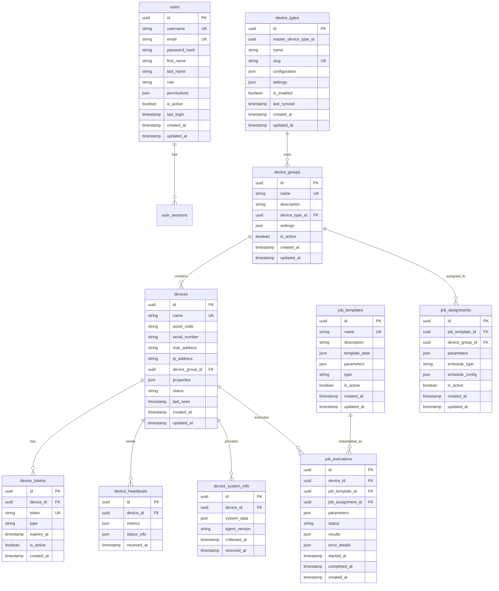

# Organization Database Schema

Each organization has its own dedicated database to ensure complete data isolation. The organization database contains all operational data specific to that organization including users, devices, jobs, and monitoring data.

## Database: `rmas_org_{org_slug}`

### Tables Overview



## Detailed Table Schemas

### 1. users
Organization-specific users who can access the organization interface.

```sql
CREATE TABLE users (
    id UUID PRIMARY KEY DEFAULT gen_random_uuid(),
    username VARCHAR(50) UNIQUE NOT NULL,
    email VARCHAR(255) UNIQUE NOT NULL,
    password_hash VARCHAR(255) NOT NULL,
    first_name VARCHAR(100) NOT NULL,
    last_name VARCHAR(100) NOT NULL,
    role VARCHAR(50) DEFAULT 'user',
    permissions JSONB DEFAULT '{}',
    is_active BOOLEAN DEFAULT TRUE,
    last_login TIMESTAMP NULL,
    created_at TIMESTAMP DEFAULT CURRENT_TIMESTAMP,
    updated_at TIMESTAMP DEFAULT CURRENT_TIMESTAMP
);

-- Indexes
CREATE INDEX idx_users_email ON users(email);
CREATE INDEX idx_users_username ON users(username);
CREATE INDEX idx_users_role ON users(role);
CREATE INDEX idx_users_is_active ON users(is_active);
```

**User Roles:**
- `admin` - Full organization access
- `manager` - Limited management access
- `operator` - Device operation access
- `viewer` - Read-only access

**Permissions Structure:**
```json
{
    "devices": {
        "read": true,
        "create": true,
        "update": true,
        "delete": false
    },
    "device_groups": {
        "read": true,
        "create": false,
        "update": false,
        "delete": false
    },
    "jobs": {
        "read": true,
        "create": true,
        "execute": true,
        "delete": false
    },
    "reports": {
        "read": true,
        "export": false
    }
}
```

### 2. device_types
Synced from master database, can be customized per organization.

```sql
CREATE TABLE device_types (
    id UUID PRIMARY KEY DEFAULT gen_random_uuid(),
    master_device_type_id UUID NOT NULL,
    name VARCHAR(100) NOT NULL,
    slug VARCHAR(100) UNIQUE NOT NULL,
    configuration JSONB DEFAULT '{}',
    settings JSONB DEFAULT '{}',
    is_enabled BOOLEAN DEFAULT TRUE,
    last_synced TIMESTAMP NULL,
    created_at TIMESTAMP DEFAULT CURRENT_TIMESTAMP,
    updated_at TIMESTAMP DEFAULT CURRENT_TIMESTAMP
);

-- Indexes
CREATE INDEX idx_device_types_master_id ON device_types(master_device_type_id);
CREATE INDEX idx_device_types_slug ON device_types(slug);
CREATE INDEX idx_device_types_enabled ON device_types(is_enabled);
```

### 3. device_groups
Logical grouping of devices for management and job assignment.

```sql
CREATE TABLE device_groups (
    id UUID PRIMARY KEY DEFAULT gen_random_uuid(),
    name VARCHAR(100) UNIQUE NOT NULL,
    description TEXT NULL,
    device_type_id UUID NOT NULL REFERENCES device_types(id) ON DELETE RESTRICT,
    settings JSONB DEFAULT '{}',
    is_active BOOLEAN DEFAULT TRUE,
    created_at TIMESTAMP DEFAULT CURRENT_TIMESTAMP,
    updated_at TIMESTAMP DEFAULT CURRENT_TIMESTAMP
);

-- Indexes
CREATE INDEX idx_device_groups_device_type_id ON device_groups(device_type_id);
CREATE INDEX idx_device_groups_is_active ON device_groups(is_active);
```

**Settings Structure:**
```json
{
    "auto_approve_devices": false,
    "max_devices": 100,
    "heartbeat_interval": 60,
    "system_info_interval": 3600,
    "job_execution": {
        "parallel_jobs": 1,
        "timeout_seconds": 3600,
        "retry_attempts": 3
    }
}
```

### 4. devices
Individual devices managed by the organization.

```sql
CREATE TABLE devices (
    id UUID PRIMARY KEY DEFAULT gen_random_uuid(),
    name VARCHAR(100) UNIQUE NOT NULL,
    asset_code VARCHAR(100) NULL,
    serial_number VARCHAR(100) NULL,
    mac_address VARCHAR(17) NULL,
    ip_address INET NULL,
    device_group_id UUID NOT NULL REFERENCES device_groups(id) ON DELETE RESTRICT,
    properties JSONB DEFAULT '{}',
    status VARCHAR(50) DEFAULT 'pending',
    last_seen TIMESTAMP NULL,
    created_at TIMESTAMP DEFAULT CURRENT_TIMESTAMP,
    updated_at TIMESTAMP DEFAULT CURRENT_TIMESTAMP
);

-- Indexes
CREATE INDEX idx_devices_device_group_id ON devices(device_group_id);
CREATE INDEX idx_devices_status ON devices(status);
CREATE INDEX idx_devices_last_seen ON devices(last_seen);
CREATE INDEX idx_devices_mac_address ON devices(mac_address);
CREATE INDEX idx_devices_asset_code ON devices(asset_code);
```

**Device Status Values:**
- `pending` - Device created but not registered
- `active` - Device online and communicating
- `offline` - Device not responding to heartbeats
- `error` - Device in error state
- `maintenance` - Device in maintenance mode
- `decommissioned` - Device removed from service

**Properties Structure:**
```json
{
    "hardware": {
        "manufacturer": "Dell",
        "model": "OptiPlex 7090",
        "cpu": "Intel i7-10700",
        "memory_gb": 16,
        "storage_gb": 512
    },
    "location": {
        "building": "Main Office",
        "floor": "3",
        "room": "IT-301"
    },
    "assignment": {
        "user": "john.doe",
        "department": "IT",
        "purpose": "Development"
    }
}
```

### 5. device_tokens
Secure tokens for device authentication and communication.

```sql
CREATE TABLE device_tokens (
    id UUID PRIMARY KEY DEFAULT gen_random_uuid(),
    device_id UUID NOT NULL REFERENCES devices(id) ON DELETE CASCADE,
    token VARCHAR(255) UNIQUE NOT NULL,
    type VARCHAR(50) NOT NULL,
    expires_at TIMESTAMP NOT NULL,
    is_active BOOLEAN DEFAULT TRUE,
    created_at TIMESTAMP DEFAULT CURRENT_TIMESTAMP
);

-- Indexes
CREATE INDEX idx_device_tokens_device_id ON device_tokens(device_id);
CREATE INDEX idx_device_tokens_token ON device_tokens(token);
CREATE INDEX idx_device_tokens_expires_at ON device_tokens(expires_at);
CREATE INDEX idx_device_tokens_type ON device_tokens(type);
```

**Token Types:**
- `registration` - Initial device registration token
- `agent` - Long-term agent authentication token
- `temporary` - Short-term access token

### 6. device_heartbeats
Regular status updates from devices.

```sql
CREATE TABLE device_heartbeats (
    id UUID PRIMARY KEY DEFAULT gen_random_uuid(),
    device_id UUID NOT NULL REFERENCES devices(id) ON DELETE CASCADE,
    metrics JSONB DEFAULT '{}',
    status_info JSONB DEFAULT '{}',
    received_at TIMESTAMP DEFAULT CURRENT_TIMESTAMP
);

-- Indexes
CREATE INDEX idx_device_heartbeats_device_id ON device_heartbeats(device_id);
CREATE INDEX idx_device_heartbeats_received_at ON device_heartbeats(received_at);

-- Partition by month for performance
CREATE TABLE device_heartbeats_y2025m01 PARTITION OF device_heartbeats
FOR VALUES FROM ('2025-01-01') TO ('2025-02-01');
```

**Metrics Structure:**
```json
{
    "cpu": {
        "usage_percent": 25.5,
        "load_average": [1.2, 1.5, 1.8]
    },
    "memory": {
        "total_gb": 16,
        "used_gb": 8.2,
        "usage_percent": 51.25
    },
    "disk": {
        "drives": [
            {
                "path": "C:",
                "total_gb": 500,
                "used_gb": 250,
                "usage_percent": 50
            }
        ]
    },
    "network": {
        "interfaces": [
            {
                "name": "eth0",
                "bytes_sent": 1048576,
                "bytes_received": 2097152
            }
        ]
    }
}
```

### 7. device_system_info
Detailed system information collected from devices.

```sql
CREATE TABLE device_system_info (
    id UUID PRIMARY KEY DEFAULT gen_random_uuid(),
    device_id UUID NOT NULL REFERENCES devices(id) ON DELETE CASCADE,
    system_data JSONB NOT NULL,
    agent_version VARCHAR(50) NOT NULL,
    collected_at TIMESTAMP NOT NULL,
    received_at TIMESTAMP DEFAULT CURRENT_TIMESTAMP
);

-- Indexes
CREATE INDEX idx_device_system_info_device_id ON device_system_info(device_id);
CREATE INDEX idx_device_system_info_received_at ON device_system_info(received_at);
CREATE INDEX idx_device_system_info_agent_version ON device_system_info(agent_version);
```

**System Data Structure:**
```json
{
    "operating_system": {
        "name": "Windows 11",
        "version": "22H2",
        "build": "22621.1702",
        "architecture": "x64"
    },
    "hardware": {
        "cpu": {
            "name": "Intel(R) Core(TM) i7-10700 CPU @ 2.90GHz",
            "cores": 8,
            "threads": 16,
            "architecture": "x64"
        },
        "memory": {
            "total_bytes": 17179869184,
            "type": "DDR4",
            "speed_mhz": 3200
        },
        "storage": [
            {
                "device": "C:",
                "type": "SSD",
                "size_bytes": 536870912000,
                "model": "Samsung SSD 980"
            }
        ]
    },
    "network": {
        "hostname": "DEV-MACHINE-01",
        "domain": "company.local",
        "interfaces": [
            {
                "name": "Ethernet",
                "mac": "00:1B:44:11:3A:B7",
                "ip": "192.168.1.100",
                "subnet": "255.255.255.0"
            }
        ]
    },
    "software": {
        "installed_programs": [
            {
                "name": "Microsoft Office",
                "version": "16.0.15629",
                "install_date": "2023-05-15"
            }
        ],
        "running_services": [
            {
                "name": "Windows Update",
                "status": "running",
                "startup_type": "automatic"
            }
        ]
    }
}
```

### 8. job_templates
Reusable job templates for device automation.

```sql
CREATE TABLE job_templates (
    id UUID PRIMARY KEY DEFAULT gen_random_uuid(),
    name VARCHAR(100) UNIQUE NOT NULL,
    description TEXT NULL,
    template_data JSONB NOT NULL,
    parameters JSONB DEFAULT '{}',
    type VARCHAR(50) NOT NULL,
    is_active BOOLEAN DEFAULT TRUE,
    created_at TIMESTAMP DEFAULT CURRENT_TIMESTAMP,
    updated_at TIMESTAMP DEFAULT CURRENT_TIMESTAMP
);

-- Indexes
CREATE INDEX idx_job_templates_type ON job_templates(type);
CREATE INDEX idx_job_templates_is_active ON job_templates(is_active);
```

**Job Types:**
- `script` - Execute custom scripts
- `update` - Software/OS updates
- `maintenance` - System maintenance tasks
- `monitoring` - Monitoring setup
- `backup` - Backup operations
- `security` - Security scans/updates

**Template Data Structure:**
```json
{
    "steps": [
        {
            "id": 1,
            "name": "Check disk space",
            "type": "command",
            "command": "df -h",
            "timeout": 30,
            "continue_on_error": false
        },
        {
            "id": 2,
            "name": "Clean temporary files",
            "type": "script",
            "script": "cleanup_temp.ps1",
            "timeout": 300,
            "continue_on_error": true
        }
    ],
    "requirements": {
        "min_agent_version": "1.0.0",
        "supported_platforms": ["windows", "linux"],
        "required_permissions": ["admin"]
    },
    "notification": {
        "on_success": true,
        "on_failure": true,
        "recipients": ["admin@company.com"]
    }
}
```

### 9. job_assignments
Links job templates to device groups with scheduling.

```sql
CREATE TABLE job_assignments (
    id UUID PRIMARY KEY DEFAULT gen_random_uuid(),
    job_template_id UUID NOT NULL REFERENCES job_templates(id) ON DELETE CASCADE,
    device_group_id UUID NOT NULL REFERENCES device_groups(id) ON DELETE CASCADE,
    parameters JSONB DEFAULT '{}',
    schedule_type VARCHAR(50) DEFAULT 'manual',
    schedule_config JSONB DEFAULT '{}',
    is_active BOOLEAN DEFAULT TRUE,
    created_at TIMESTAMP DEFAULT CURRENT_TIMESTAMP,
    updated_at TIMESTAMP DEFAULT CURRENT_TIMESTAMP
);

-- Indexes
CREATE INDEX idx_job_assignments_job_template_id ON job_assignments(job_template_id);
CREATE INDEX idx_job_assignments_device_group_id ON job_assignments(device_group_id);
CREATE INDEX idx_job_assignments_schedule_type ON job_assignments(schedule_type);
```

**Schedule Types:**
- `manual` - Execute on demand
- `immediate` - Execute immediately
- `scheduled` - Execute at specific time
- `recurring` - Execute on schedule

**Schedule Config Structure:**
```json
{
    "cron": "0 2 * * *",
    "timezone": "UTC",
    "max_concurrent": 5,
    "retry_failed": true,
    "retry_delay_minutes": 30
}
```

### 10. job_executions
Individual job execution records and results.

```sql
CREATE TABLE job_executions (
    id UUID PRIMARY KEY DEFAULT gen_random_uuid(),
    device_id UUID NOT NULL REFERENCES devices(id) ON DELETE CASCADE,
    job_template_id UUID NOT NULL REFERENCES job_templates(id) ON DELETE CASCADE,
    job_assignment_id UUID NULL REFERENCES job_assignments(id) ON DELETE SET NULL,
    parameters JSONB DEFAULT '{}',
    status VARCHAR(50) DEFAULT 'pending',
    results JSONB DEFAULT '{}',
    error_details JSONB NULL,
    started_at TIMESTAMP NULL,
    completed_at TIMESTAMP NULL,
    created_at TIMESTAMP DEFAULT CURRENT_TIMESTAMP
);

-- Indexes
CREATE INDEX idx_job_executions_device_id ON job_executions(device_id);
CREATE INDEX idx_job_executions_job_template_id ON job_executions(job_template_id);
CREATE INDEX idx_job_executions_status ON job_executions(status);
CREATE INDEX idx_job_executions_created_at ON job_executions(created_at);
```

**Execution Status Values:**
- `pending` - Waiting to be executed
- `running` - Currently executing
- `completed` - Successfully completed
- `failed` - Execution failed
- `cancelled` - Execution cancelled
- `timeout` - Execution timed out

## Additional Tables

### 11. user_sessions
User session management for organization interface.

```sql
CREATE TABLE user_sessions (
    id UUID PRIMARY KEY DEFAULT gen_random_uuid(),
    user_id UUID NOT NULL REFERENCES users(id) ON DELETE CASCADE,
    session_token VARCHAR(255) UNIQUE NOT NULL,
    ip_address INET NULL,
    user_agent TEXT NULL,
    expires_at TIMESTAMP NOT NULL,
    is_active BOOLEAN DEFAULT TRUE,
    created_at TIMESTAMP DEFAULT CURRENT_TIMESTAMP,
    updated_at TIMESTAMP DEFAULT CURRENT_TIMESTAMP
);

-- Indexes
CREATE INDEX idx_user_sessions_user_id ON user_sessions(user_id);
CREATE INDEX idx_user_sessions_session_token ON user_sessions(session_token);
CREATE INDEX idx_user_sessions_expires_at ON user_sessions(expires_at);
```

### 12. audit_logs
Organization-specific audit logging.

```sql
CREATE TABLE audit_logs (
    id UUID PRIMARY KEY DEFAULT gen_random_uuid(),
    user_id UUID NULL REFERENCES users(id) ON DELETE SET NULL,
    device_id UUID NULL REFERENCES devices(id) ON DELETE SET NULL,
    action VARCHAR(100) NOT NULL,
    entity_type VARCHAR(100) NOT NULL,
    entity_id UUID NULL,
    old_values JSONB NULL,
    new_values JSONB NULL,
    ip_address INET NULL,
    user_agent TEXT NULL,
    created_at TIMESTAMP DEFAULT CURRENT_TIMESTAMP
);

-- Indexes
CREATE INDEX idx_audit_logs_user_id ON audit_logs(user_id);
CREATE INDEX idx_audit_logs_device_id ON audit_logs(device_id);
CREATE INDEX idx_audit_logs_action ON audit_logs(action);
CREATE INDEX idx_audit_logs_created_at ON audit_logs(created_at);
```

## Database Functions and Triggers

### Device Status Update Function
```sql
CREATE OR REPLACE FUNCTION update_device_last_seen()
RETURNS TRIGGER AS $$
BEGIN
    UPDATE devices 
    SET last_seen = NEW.received_at,
        status = CASE 
            WHEN status = 'offline' THEN 'active'
            ELSE status
        END
    WHERE id = NEW.device_id;
    
    RETURN NEW;
END;
$$ LANGUAGE plpgsql;

CREATE TRIGGER trigger_update_device_last_seen
    AFTER INSERT ON device_heartbeats
    FOR EACH ROW
    EXECUTE FUNCTION update_device_last_seen();
```

### Job Execution Status Update Function
```sql
CREATE OR REPLACE FUNCTION update_job_execution_timestamps()
RETURNS TRIGGER AS $$
BEGIN
    IF NEW.status = 'running' AND OLD.status = 'pending' THEN
        NEW.started_at = CURRENT_TIMESTAMP;
    END IF;
    
    IF NEW.status IN ('completed', 'failed', 'cancelled', 'timeout') AND OLD.status = 'running' THEN
        NEW.completed_at = CURRENT_TIMESTAMP;
    END IF;
    
    RETURN NEW;
END;
$$ LANGUAGE plpgsql;

CREATE TRIGGER trigger_update_job_execution_timestamps
    BEFORE UPDATE ON job_executions
    FOR EACH ROW
    EXECUTE FUNCTION update_job_execution_timestamps();
```
