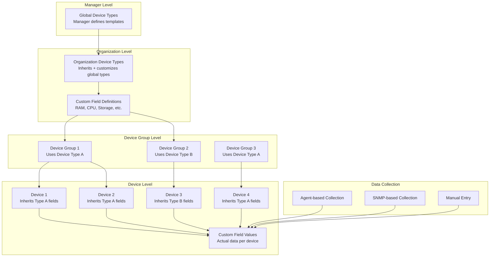

# Custom Device Fields System

The custom device fields system allows organizations to define custom data columns for device types beyond the standard fields. These custom fields are inherited by all devices in device groups that use the specific device type, enabling flexible and extensible device management.

## Architecture Overview

### Custom Fields Inheritance Model


## Custom Field Definition System

### Field Type Support
```json
{
  "field_types": {
    "integer": {
      "description": "Whole numbers",
      "validation": "integer",
      "ui_component": "number_input",
      "default_value": 0,
      "examples": ["8", "16", "64"]
    },
    "float": {
      "description": "Decimal numbers",
      "validation": "float", 
      "ui_component": "decimal_input",
      "default_value": 0.0,
      "examples": ["2.4", "3.6", "15.75"]
    },
    "string": {
      "description": "Text values",
      "validation": "string",
      "ui_component": "text_input",
      "max_length": 255,
      "default_value": "",
      "examples": ["Intel i7", "Samsung SSD", "Production"]
    },
    "boolean": {
      "description": "True/False values",
      "validation": "boolean",
      "ui_component": "checkbox",
      "default_value": false,
      "examples": [true, false]
    },
    "enum": {
      "description": "Predefined list of values",
      "validation": "enum",
      "ui_component": "select_dropdown",
      "allowed_values": [],
      "default_value": null,
      "examples": ["Production", "Staging", "Development"]
    },
    "json": {
      "description": "Structured JSON data",
      "validation": "json",
      "ui_component": "json_editor",
      "default_value": {},
      "examples": [{"key": "value"}]
    },
    "datetime": {
      "description": "Date and time values",
      "validation": "datetime",
      "ui_component": "datetime_picker",
      "default_value": null,
      "examples": ["2025-01-16T12:00:00Z"]
    },
    "url": {
      "description": "Web URLs",
      "validation": "url",
      "ui_component": "url_input",
      "default_value": "",
      "examples": ["https://example.com"]
    },
    "email": {
      "description": "Email addresses",
      "validation": "email",
      "ui_component": "email_input",
      "default_value": "",
      "examples": ["admin@company.com"]
    }
  }
}
```

### Device Type Custom Field Configuration
```json
{
  "device_type_id": "550e8400-e29b-41d4-a716-446655440001",
  "device_type_name": "Windows Desktop",
  "organization_id": "550e8400-e29b-41d4-a716-446655440010",
  "custom_fields": {
    "hardware_specs": {
      "category": "Hardware",
      "fields": {
        "cpu_cores": {
          "name": "CPU Cores",
          "type": "integer",
          "required": true,
          "default_value": 4,
          "validation_rules": {
            "min": 1,
            "max": 128
          },
          "unit": "cores",
          "description": "Number of CPU cores",
          "collection_method": "agent",
          "agent_source": "system_info.hardware.cpu.cores",
          "display_order": 1,
          "is_searchable": true,
          "is_filterable": true,
          "show_in_list": true,
          "show_in_dashboard": true
        },
        "ram_gb": {
          "name": "RAM (GB)",
          "type": "integer",
          "required": true,
          "default_value": 8,
          "validation_rules": {
            "min": 1,
            "max": 1024
          },
          "unit": "GB",
          "description": "System memory in gigabytes",
          "collection_method": "agent",
          "agent_source": "system_info.hardware.memory.total_gb",
          "display_order": 2,
          "is_searchable": true,
          "is_filterable": true,
          "show_in_list": true,
          "show_in_dashboard": true
        },
        "storage_type": {
          "name": "Primary Storage Type",
          "type": "enum",
          "required": false,
          "allowed_values": ["HDD", "SSD", "NVMe", "Hybrid"],
          "default_value": "SSD",
          "description": "Type of primary storage device",
          "collection_method": "agent",
          "agent_source": "system_info.hardware.storage[0].type",
          "display_order": 3,
          "is_searchable": true,
          "is_filterable": true,
          "show_in_list": true,
          "show_in_dashboard": false
        },
        "storage_capacity_gb": {
          "name": "Storage Capacity (GB)",
          "type": "integer",
          "required": false,
          "validation_rules": {
            "min": 50,
            "max": 10240
          },
          "unit": "GB",
          "description": "Primary storage capacity in gigabytes",
          "collection_method": "agent",
          "agent_source": "system_info.hardware.storage[0].size_gb",
          "display_order": 4,
          "is_searchable": true,
          "is_filterable": true,
          "show_in_list": false,
          "show_in_dashboard": false
        }
      }
    },
    "business_info": {
      "category": "Business",
      "fields": {
        "department": {
          "name": "Department",
          "type": "enum",
          "required": true,
          "allowed_values": ["IT", "Finance", "HR", "Marketing", "Operations"],
          "default_value": "IT",
          "description": "Department this device belongs to",
          "collection_method": "manual",
          "display_order": 1,
          "is_searchable": true,
          "is_filterable": true,
          "show_in_list": true,
          "show_in_dashboard": true
        },
        "cost_center": {
          "name": "Cost Center",
          "type": "string",
          "required": false,
          "validation_rules": {
            "pattern": "^[A-Z]{3}-[0-9]{4}$"
          },
          "description": "Cost center code for billing",
          "collection_method": "manual",
          "display_order": 2,
          "is_searchable": true,
          "is_filterable": true,
          "show_in_list": false,
          "show_in_dashboard": false
        },
        "purchase_date": {
          "name": "Purchase Date",
          "type": "datetime",
          "required": false,
          "description": "Date when device was purchased",
          "collection_method": "manual",
          "display_order": 3,
          "is_searchable": false,
          "is_filterable": true,
          "show_in_list": false,
          "show_in_dashboard": false
        },
        "warranty_expiry": {
          "name": "Warranty Expiry",
          "type": "datetime",
          "required": false,
          "description": "Date when warranty expires",
          "collection_method": "manual",
          "display_order": 4,
          "is_searchable": false,
          "is_filterable": true,
          "show_in_list": false,
          "show_in_dashboard": true
        }
      }
    },
    "location_info": {
      "category": "Location",
      "fields": {
        "building": {
          "name": "Building",
          "type": "enum",
          "required": true,
          "allowed_values": ["Main Office", "Branch A", "Branch B", "Data Center"],
          "default_value": "Main Office",
          "description": "Building location",
          "collection_method": "manual",
          "display_order": 1,
          "is_searchable": true,
          "is_filterable": true,
          "show_in_list": true,
          "show_in_dashboard": true
        },
        "floor": {
          "name": "Floor",
          "type": "string",
          "required": false,
          "validation_rules": {
            "max_length": 10
          },
          "description": "Floor number or name",
          "collection_method": "manual",
          "display_order": 2,
          "is_searchable": true,
          "is_filterable": true,
          "show_in_list": false,
          "show_in_dashboard": false
        },
        "room": {
          "name": "Room",
          "type": "string",
          "required": false,
          "validation_rules": {
            "max_length": 20
          },
          "description": "Room number or identifier",
          "collection_method": "manual",
          "display_order": 3,
          "is_searchable": true,
          "is_filterable": true,
          "show_in_list": false,
          "show_in_dashboard": false
        }
      }
    },
    "performance_metrics": {
      "category": "Performance",
      "fields": {
        "benchmark_score": {
          "name": "Benchmark Score",
          "type": "integer",
          "required": false,
          "validation_rules": {
            "min": 1000,
            "max": 50000
          },
          "description": "System benchmark performance score",
          "collection_method": "agent",
          "agent_source": "custom_metrics.benchmark_score",
          "display_order": 1,
          "is_searchable": false,
          "is_filterable": true,
          "show_in_list": false,
          "show_in_dashboard": true
        },
        "last_boot_time": {
          "name": "Last Boot Time",
          "type": "datetime",
          "required": false,
          "description": "Last system boot time",
          "collection_method": "agent",
          "agent_source": "system_info.operating_system.last_boot",
          "display_order": 2,
          "is_searchable": false,
          "is_filterable": true,
          "show_in_list": false,
          "show_in_dashboard": true
        }
      }
    }
  }
}
```

## Custom Field Processing Engine

### Field Value Processing
```python
from typing import Dict, Any, Optional, List
import json
from datetime import datetime
from dataclasses import dataclass

@dataclass
class CustomFieldDefinition:
    name: str
    field_type: str
    required: bool
    default_value: Any
    validation_rules: Dict
    collection_method: str
    agent_source: Optional[str] = None
    unit: Optional[str] = None
    description: Optional[str] = None

class CustomFieldProcessor:
    def __init__(self, redis_client, database_client):
        self.redis_client = redis_client
        self.database_client = database_client
        self.field_validators = {
            'integer': self.validate_integer,
            'float': self.validate_float,
            'string': self.validate_string,
            'boolean': self.validate_boolean,
            'enum': self.validate_enum,
            'json': self.validate_json,
            'datetime': self.validate_datetime,
            'url': self.validate_url,
            'email': self.validate_email
        }
    
    async def process_device_custom_fields(self, device_id: str, org_id: str, 
                                         device_type_id: str, raw_data: Dict) -> Dict:
        """Process custom field values for a device"""
        
        # Get custom field definitions for device type
        field_definitions = await self.get_custom_field_definitions(
            device_type_id, org_id
        )
        
        processed_fields = {}
        validation_errors = []
        
        for category_name, category_data in field_definitions.items():
            category_fields = category_data.get('fields', {})
            processed_category = {}
            
            for field_name, field_def in category_fields.items():
                try:
                    # Extract value based on collection method
                    raw_value = self.extract_field_value(
                        raw_data, field_def, field_name
                    )
                    
                    # Validate and convert value
                    processed_value = await self.validate_and_convert_value(
                        raw_value, field_def, field_name
                    )
                    
                    processed_category[field_name] = {
                        'value': processed_value,
                        'last_updated': datetime.utcnow().isoformat(),
                        'collection_method': field_def['collection_method'],
                        'data_type': field_def['type']
                    }
                    
                except Exception as e:
                    validation_errors.append({
                        'field': field_name,
                        'error': str(e),
                        'category': category_name
                    })
                    
                    # Use default value if validation fails
                    processed_category[field_name] = {
                        'value': field_def.get('default_value'),
                        'last_updated': datetime.utcnow().isoformat(),
                        'collection_method': 'default',
                        'data_type': field_def['type'],
                        'error': str(e)
                    }
            
            if processed_category:
                processed_fields[category_name] = processed_category
        
        # Store processed fields
        await self.store_device_custom_fields(device_id, processed_fields)
        
        # Update search index
        await self.update_search_index(device_id, org_id, processed_fields)
        
        return {
            'processed_fields': processed_fields,
            'validation_errors': validation_errors
        }
    
    def extract_field_value(self, raw_data: Dict, field_def: Dict, 
                          field_name: str) -> Any:
        """Extract field value from raw data based on collection method"""
        
        collection_method = field_def.get('collection_method', 'manual')
        
        if collection_method == 'agent':
            # Extract from agent data using source path
            agent_source = field_def.get('agent_source', '')
            return self.extract_nested_value(raw_data, agent_source)
        
        elif collection_method == 'snmp':
            # Extract from SNMP data
            snmp_oid = field_def.get('snmp_oid', '')
            snmp_data = raw_data.get('snmp_data', {})
            return snmp_data.get(snmp_oid)
        
        elif collection_method == 'manual':
            # Extract from manual input
            manual_data = raw_data.get('manual_fields', {})
            return manual_data.get(field_name)
        
        elif collection_method == 'calculated':
            # Calculate from other fields
            return self.calculate_field_value(raw_data, field_def)
        
        else:
            return None
    
    def extract_nested_value(self, data: Dict, path: str) -> Any:
        """Extract nested value from data using dot notation path"""
        
        if not path:
            return None
        
        try:
            keys = path.split('.')
            current = data
            
            for key in keys:
                if isinstance(current, dict):
                    # Handle array indices in brackets
                    if '[' in key and ']' in key:
                        base_key = key.split('[')[0]
                        index = int(key.split('[')[1].split(']')[0])
                        current = current.get(base_key, [])[index]
                    else:
                        current = current.get(key)
                else:
                    return None
            
            return current
            
        except (KeyError, IndexError, ValueError):
            return None
    
    async def validate_and_convert_value(self, value: Any, field_def: Dict, 
                                       field_name: str) -> Any:
        """Validate and convert field value"""
        
        field_type = field_def['type']
        required = field_def.get('required', False)
        
        # Handle null/empty values
        if value is None or value == '':
            if required:
                raise ValueError(f"Field '{field_name}' is required")
            return field_def.get('default_value')
        
        # Validate using type-specific validator
        if field_type in self.field_validators:
            return self.field_validators[field_type](value, field_def)
        else:
            raise ValueError(f"Unsupported field type: {field_type}")
    
    def validate_integer(self, value: Any, field_def: Dict) -> int:
        """Validate integer field"""
        try:
            int_value = int(value)
            
            # Check min/max constraints
            validation_rules = field_def.get('validation_rules', {})
            min_val = validation_rules.get('min')
            max_val = validation_rules.get('max')
            
            if min_val is not None and int_value < min_val:
                raise ValueError(f"Value must be at least {min_val}")
            
            if max_val is not None and int_value > max_val:
                raise ValueError(f"Value must be at most {max_val}")
            
            return int_value
            
        except (ValueError, TypeError):
            raise ValueError("Invalid integer value")
    
    def validate_float(self, value: Any, field_def: Dict) -> float:
        """Validate float field"""
        try:
            float_value = float(value)
            
            # Check min/max constraints
            validation_rules = field_def.get('validation_rules', {})
            min_val = validation_rules.get('min')
            max_val = validation_rules.get('max')
            
            if min_val is not None and float_value < min_val:
                raise ValueError(f"Value must be at least {min_val}")
            
            if max_val is not None and float_value > max_val:
                raise ValueError(f"Value must be at most {max_val}")
            
            return float_value
            
        except (ValueError, TypeError):
            raise ValueError("Invalid float value")
    
    def validate_string(self, value: Any, field_def: Dict) -> str:
        """Validate string field"""
        str_value = str(value)
        
        validation_rules = field_def.get('validation_rules', {})
        
        # Check length constraints
        max_length = validation_rules.get('max_length')
        if max_length and len(str_value) > max_length:
            raise ValueError(f"String too long (max {max_length} characters)")
        
        min_length = validation_rules.get('min_length')
        if min_length and len(str_value) < min_length:
            raise ValueError(f"String too short (min {min_length} characters)")
        
        # Check pattern matching
        pattern = validation_rules.get('pattern')
        if pattern:
            import re
            if not re.match(pattern, str_value):
                raise ValueError("String does not match required pattern")
        
        return str_value
    
    def validate_boolean(self, value: Any, field_def: Dict) -> bool:
        """Validate boolean field"""
        if isinstance(value, bool):
            return value
        
        # Convert string representations
        if isinstance(value, str):
            return value.lower() in ['true', '1', 'yes', 'on']
        
        # Convert numeric representations
        if isinstance(value, (int, float)):
            return bool(value)
        
        raise ValueError("Invalid boolean value")
    
    def validate_enum(self, value: Any, field_def: Dict) -> str:
        """Validate enum field"""
        str_value = str(value)
        allowed_values = field_def.get('allowed_values', [])
        
        if str_value not in allowed_values:
            raise ValueError(f"Value must be one of: {', '.join(allowed_values)}")
        
        return str_value
    
    def validate_json(self, value: Any, field_def: Dict) -> Dict:
        """Validate JSON field"""
        if isinstance(value, dict):
            return value
        
        if isinstance(value, str):
            try:
                return json.loads(value)
            except json.JSONDecodeError:
                raise ValueError("Invalid JSON format")
        
        raise ValueError("Value must be a JSON object")
    
    def validate_datetime(self, value: Any, field_def: Dict) -> str:
        """Validate datetime field"""
        if isinstance(value, datetime):
            return value.isoformat()
        
        if isinstance(value, str):
            try:
                # Try to parse various datetime formats
                parsed_dt = datetime.fromisoformat(value.replace('Z', '+00:00'))
                return parsed_dt.isoformat()
            except ValueError:
                raise ValueError("Invalid datetime format")
        
        raise ValueError("Invalid datetime value")
    
    def validate_url(self, value: Any, field_def: Dict) -> str:
        """Validate URL field"""
        import re
        
        url_pattern = re.compile(
            r'^https?://'  # http:// or https://
            r'(?:(?:[A-Z0-9](?:[A-Z0-9-]{0,61}[A-Z0-9])?\.)+[A-Z]{2,6}\.?|'  # domain...
            r'localhost|'  # localhost...
            r'\d{1,3}\.\d{1,3}\.\d{1,3}\.\d{1,3})'  # ...or ip
            r'(?::\d+)?'  # optional port
            r'(?:/?|[/?]\S+)$', re.IGNORECASE)
        
        str_value = str(value)
        if not url_pattern.match(str_value):
            raise ValueError("Invalid URL format")
        
        return str_value
    
    def validate_email(self, value: Any, field_def: Dict) -> str:
        """Validate email field"""
        import re
        
        email_pattern = re.compile(
            r'^[a-zA-Z0-9._%+-]+@[a-zA-Z0-9.-]+\.[a-zA-Z]{2,}$'
        )
        
        str_value = str(value)
        if not email_pattern.match(str_value):
            raise ValueError("Invalid email format")
        
        return str_value
```

## Device Group Inheritance

### Inheritance Management
```python
class DeviceGroupInheritance:
    def __init__(self, database_client, redis_client):
        self.database_client = database_client
        self.redis_client = redis_client
    
    async def apply_device_type_to_group(self, group_id: str, device_type_id: str, 
                                       org_id: str):
        """Apply device type custom fields to all devices in group"""
        
        # Get all devices in the group
        devices = await self.get_devices_in_group(group_id)
        
        # Get custom field definitions for the device type
        field_definitions = await self.get_custom_field_definitions(
            device_type_id, org_id
        )
        
        inheritance_results = []
        
        for device in devices:
            try:
                # Apply custom fields to device
                result = await self.apply_custom_fields_to_device(
                    device['device_id'], field_definitions, org_id
                )
                inheritance_results.append(result)
                
                # Trigger field collection for agent-based fields
                await self.trigger_field_collection(device['device_id'])
                
            except Exception as e:
                inheritance_results.append({
                    'device_id': device['device_id'],
                    'success': False,
                    'error': str(e)
                })
        
        # Update group metadata
        await self.update_group_field_metadata(group_id, device_type_id, field_definitions)
        
        return inheritance_results
    
    async def apply_custom_fields_to_device(self, device_id: str, 
                                          field_definitions: Dict, org_id: str) -> Dict:
        """Apply custom field definitions to a single device"""
        
        device_fields = {}
        
        for category_name, category_data in field_definitions.items():
            category_fields = {}
            
            for field_name, field_def in category_data.get('fields', {}).items():
                # Initialize field with default value
                category_fields[field_name] = {
                    'value': field_def.get('default_value'),
                    'last_updated': datetime.utcnow().isoformat(),
                    'collection_method': field_def['collection_method'],
                    'data_type': field_def['type'],
                    'requires_collection': field_def['collection_method'] in ['agent', 'snmp']
                }
            
            device_fields[category_name] = category_fields
        
        # Store device custom fields
        await self.store_device_custom_fields(device_id, device_fields)
        
        # Update device metadata
        await self.update_device_field_metadata(device_id, field_definitions)
        
        return {
            'device_id': device_id,
            'success': True,
            'fields_applied': len([
                field for category in device_fields.values() 
                for field in category.keys()
            ])
        }
    
    async def trigger_field_collection(self, device_id: str):
        """Trigger collection of agent-based custom fields"""
        
        # Send message to agent to collect custom field data
        collection_request = {
            'event_type': 'custom_field_collection_request',
            'timestamp': datetime.utcnow().isoformat(),
            'device_id': device_id,
            'collection_id': f"collection_{int(datetime.utcnow().timestamp())}",
            'priority': 'normal'
        }
        
        # Add to device's pending jobs queue
        await self.redis_client.lpush(
            f"device:{device_id}:pending_jobs",
            json.dumps(collection_request)
        )
        
        # Set expiration for the job
        await self.redis_client.expire(
            f"device:{device_id}:pending_jobs", 3600
        )
    
    async def handle_device_type_change(self, group_id: str, old_device_type_id: str, 
                                      new_device_type_id: str, org_id: str):
        """Handle device type change for a group"""
        
        # Get devices in group
        devices = await self.get_devices_in_group(group_id)
        
        # Get old and new field definitions
        old_fields = await self.get_custom_field_definitions(old_device_type_id, org_id)
        new_fields = await self.get_custom_field_definitions(new_device_type_id, org_id)
        
        # Calculate field changes
        field_changes = self.calculate_field_changes(old_fields, new_fields)
        
        migration_results = []
        
        for device in devices:
            try:
                # Migrate device fields
                result = await self.migrate_device_fields(
                    device['device_id'], field_changes, org_id
                )
                migration_results.append(result)
                
            except Exception as e:
                migration_results.append({
                    'device_id': device['device_id'],
                    'success': False,
                    'error': str(e)
                })
        
        return migration_results
    
    def calculate_field_changes(self, old_fields: Dict, new_fields: Dict) -> Dict:
        """Calculate what field changes are needed"""
        
        changes = {
            'added_fields': {},
            'removed_fields': {},
            'modified_fields': {},
            'unchanged_fields': {}
        }
        
        # Flatten field structures for comparison
        old_flat = self.flatten_field_definitions(old_fields)
        new_flat = self.flatten_field_definitions(new_fields)
        
        # Find added fields
        for field_path, field_def in new_flat.items():
            if field_path not in old_flat:
                changes['added_fields'][field_path] = field_def
        
        # Find removed fields
        for field_path, field_def in old_flat.items():
            if field_path not in new_flat:
                changes['removed_fields'][field_path] = field_def
        
        # Find modified fields
        for field_path, field_def in new_flat.items():
            if field_path in old_flat:
                old_def = old_flat[field_path]
                if self.field_definitions_differ(old_def, field_def):
                    changes['modified_fields'][field_path] = {
                        'old': old_def,
                        'new': field_def
                    }
                else:
                    changes['unchanged_fields'][field_path] = field_def
        
        return changes
    
    def flatten_field_definitions(self, field_definitions: Dict) -> Dict:
        """Flatten nested field definitions to simple path->definition mapping"""
        
        flattened = {}
        
        for category_name, category_data in field_definitions.items():
            for field_name, field_def in category_data.get('fields', {}).items():
                field_path = f"{category_name}.{field_name}"
                flattened[field_path] = field_def
        
        return flattened
    
    def field_definitions_differ(self, old_def: Dict, new_def: Dict) -> bool:
        """Check if two field definitions are different"""
        
        # Compare key properties that would require migration
        comparison_keys = ['type', 'required', 'default_value', 'validation_rules']
        
        for key in comparison_keys:
            if old_def.get(key) != new_def.get(key):
                return True
        
        return False
```

## Custom Field Search and Filtering

### Search Index Management
```python
class CustomFieldSearchIndex:
    def __init__(self, elasticsearch_client, redis_client):
        self.es_client = elasticsearch_client
        self.redis_client = redis_client
        self.index_name = "rmas_device_custom_fields"
    
    async def update_device_search_index(self, device_id: str, org_id: str, 
                                       custom_fields: Dict):
        """Update search index with device custom fields"""
        
        # Prepare document for indexing
        search_doc = {
            'device_id': device_id,
            'organization_id': org_id,
            'last_updated': datetime.utcnow().isoformat(),
            'searchable_fields': {},
            'filterable_fields': {}
        }
        
        # Extract searchable and filterable fields
        for category_name, category_data in custom_fields.items():
            for field_name, field_data in category_data.items():
                field_value = field_data.get('value')
                field_type = field_data.get('data_type')
                
                # Get field definition to check if searchable/filterable
                field_def = await self.get_field_definition(
                    device_id, category_name, field_name
                )
                
                if field_def and field_def.get('is_searchable'):
                    search_doc['searchable_fields'][f"{category_name}_{field_name}"] = {
                        'value': field_value,
                        'type': field_type,
                        'category': category_name
                    }
                
                if field_def and field_def.get('is_filterable'):
                    search_doc['filterable_fields'][f"{category_name}_{field_name}"] = {
                        'value': field_value,
                        'type': field_type,
                        'category': category_name
                    }
        
        # Index document
        await self.es_client.index(
            index=self.index_name,
            id=device_id,
            body=search_doc
        )
    
    async def search_devices_by_custom_fields(self, org_id: str, search_query: str, 
                                            filters: Dict = None) -> List[str]:
        """Search devices by custom field values"""
        
        # Build Elasticsearch query
        query = {
            'bool': {
                'must': [
                    {'term': {'organization_id': org_id}}
                ],
                'should': []
            }
        }
        
        # Add text search across searchable fields
        if search_query:
            query['bool']['should'].extend([
                {
                    'multi_match': {
                        'query': search_query,
                        'fields': ['searchable_fields.*.value'],
                        'type': 'best_fields'
                    }
                },
                {
                    'wildcard': {
                        'searchable_fields.*.value': f"*{search_query}*"
                    }
                }
            ])
        
        # Add filters
        if filters:
            for filter_field, filter_value in filters.items():
                if isinstance(filter_value, list):
                    # Multiple values (OR condition)
                    query['bool']['must'].append({
                        'terms': {
                            f'filterable_fields.{filter_field}.value': filter_value
                        }
                    })
                else:
                    # Single value
                    query['bool']['must'].append({
                        'term': {
                            f'filterable_fields.{filter_field}.value': filter_value
                        }
                    })
        
        # Execute search
        search_result = await self.es_client.search(
            index=self.index_name,
            body={
                'query': query,
                'size': 1000,  # Adjust as needed
                '_source': ['device_id']
            }
        )
        
        # Extract device IDs
        device_ids = [
            hit['_source']['device_id'] 
            for hit in search_result['hits']['hits']
        ]
        
        return device_ids
    
    async def get_filter_options(self, org_id: str, field_name: str) -> List[str]:
        """Get available filter options for a custom field"""
        
        # Aggregate unique values for the field
        agg_query = {
            'query': {
                'bool': {
                    'must': [
                        {'term': {'organization_id': org_id}},
                        {'exists': {'field': f'filterable_fields.{field_name}.value'}}
                    ]
                }
            },
            'aggs': {
                'unique_values': {
                    'terms': {
                        'field': f'filterable_fields.{field_name}.value.keyword',
                        'size': 100
                    }
                }
            },
            'size': 0
        }
        
        result = await self.es_client.search(
            index=self.index_name,
            body=agg_query
        )
        
        # Extract unique values
        buckets = result['aggregations']['unique_values']['buckets']
        return [bucket['key'] for bucket in buckets]
```

## Performance Optimization

### Caching Strategy
```python
class CustomFieldsCacheManager:
    def __init__(self, redis_client):
        self.redis_client = redis_client
        self.cache_ttl = {
            'field_definitions': 3600,  # 1 hour
            'device_fields': 1800,      # 30 minutes
            'search_results': 300,      # 5 minutes
            'filter_options': 600       # 10 minutes
        }
    
    async def cache_field_definitions(self, device_type_id: str, org_id: str, 
                                    definitions: Dict):
        """Cache custom field definitions"""
        
        cache_key = f"custom_fields:definitions:{org_id}:{device_type_id}"
        
        await self.redis_client.setex(
            cache_key,
            self.cache_ttl['field_definitions'],
            json.dumps(definitions)
        )
    
    async def get_cached_field_definitions(self, device_type_id: str, 
                                         org_id: str) -> Optional[Dict]:
        """Get cached field definitions"""
        
        cache_key = f"custom_fields:definitions:{org_id}:{device_type_id}"
        cached_data = await self.redis_client.get(cache_key)
        
        if cached_data:
            return json.loads(cached_data)
        
        return None
    
    async def invalidate_field_definitions_cache(self, device_type_id: str, 
                                               org_id: str):
        """Invalidate field definitions cache"""
        
        cache_key = f"custom_fields:definitions:{org_id}:{device_type_id}"
        await self.redis_client.delete(cache_key)
        
        # Also invalidate related device caches
        pattern = f"custom_fields:device:{org_id}:*"
        keys = await self.redis_client.keys(pattern)
        if keys:
            await self.redis_client.delete(*keys)
```
