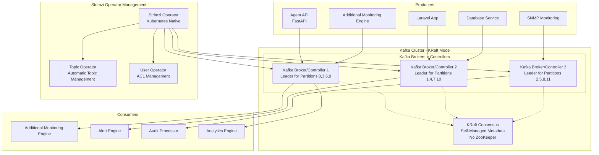

# Kafka Integration with KRaft Mode

Apache Kafka serves as the central message broker for the RMAS system using KRaft mode (no ZooKeeper) and managed by the Strimzi operator on Kubernetes.

## Kafka KRaft Architecture

### KRaft Cluster Configuration


## Topic Architecture

### Topic Overview
| Topic Name | Partitions | Replication | Retention | Purpose |
|------------|------------|-------------|-----------|---------|
| `agent-responses` | 12 | 3 | 7 days | Agent heartbeats and system info |
| `monitoring-data` | 24 | 3 | 30 days | Device metrics and custom measurements |
| `audit-logs` | 6 | 3 | 90 days | System audit events |
| `alert-events` | 8 | 3 | 30 days | Alert triggers and notifications |
| `snmp-data` | 8 | 3 | 14 days | SNMP polling results and traps |
| `job-events` | 4 | 3 | 14 days | Job execution events |
| `device-events` | 6 | 3 | 30 days | Device lifecycle events |

### Partitioning Strategy
- **agent-responses**: Partitioned by `device_id` hash for ordered processing
- **monitoring-data**: Partitioned by `org_id` for organization isolation
- **audit-logs**: Partitioned by `org_id` for compliance and isolation
- **alert-events**: Partitioned by `alert_type` for parallel processing
- **snmp-data**: Partitioned by `network_segment` for geographic distribution

## Message Schemas

### 1. Agent Responses Topic (`agent-responses`)

#### Heartbeat Message
```json
{
  "event_type": "heartbeat",
  "timestamp": "2025-01-16T12:00:00.000Z",
  "device_id": "550e8400-e29b-41d4-a716-446655440030",
  "organization_id": "550e8400-e29b-41d4-a716-446655440001",
  "agent_version": "1.2.3",
  "data": {
    "status": "online",
    "metrics": {
      "cpu": {
        "usage_percent": 25.5,
        "load_average": [1.2, 1.5, 1.8],
        "process_count": 156
      },
      "memory": {
        "total_bytes": 17179869184,
        "used_bytes": 8858370048,
        "usage_percent": 51.5,
        "available_bytes": 8321499136
      },
      "disk": {
        "drives": [
          {
            "path": "C:",
            "total_bytes": 536870912000,
            "used_bytes": 268435456000,
            "usage_percent": 50.0,
            "free_bytes": 268435456000
          }
        ]
      },
      "network": {
        "interfaces": [
          {
            "name": "Ethernet",
            "bytes_sent": 1048576000,
            "bytes_received": 2097152000,
            "packets_sent": 1000000,
            "packets_received": 1500000,
            "errors": 0
          }
        ]
      }
    },
    "running_jobs": [
      {
        "execution_id": "550e8400-e29b-41d4-a716-446655440050",
        "status": "running",
        "progress": 75
      }
    ],
    "custom_metrics": {
      "cpu_cores": 8,
      "ram_gb": 16,
      "disk_io_ops": 1250,
      "network_latency_ms": 15,
      "application_response_time": 120
    }
  },
  "headers": {
    "correlation_id": "req_12345",
    "source": "agent-api",
    "content_encoding": "gzip"
  }
}
```

#### System Information Message
```json
{
  "event_type": "system_info",
  "timestamp": "2025-01-16T12:00:00.000Z",
  "device_id": "550e8400-e29b-41d4-a716-446655440030",
  "organization_id": "550e8400-e29b-41d4-a716-446655440001",
  "data": {
    "collected_at": "2025-01-16T12:00:00.000Z",
    "operating_system": {
      "name": "Windows 11 Pro",
      "version": "22H2",
      "build": "22621.1702",
      "architecture": "x64"
    },
    "hardware": {
      "cpu": {
        "name": "Intel(R) Core(TM) i7-10700 CPU @ 2.90GHz",
        "cores": 8,
        "threads": 16,
        "architecture": "x64"
      },
      "memory": {
        "total_bytes": 17179869184,
        "type": "DDR4",
        "speed_mhz": 3200
      },
      "storage": [
        {
          "device": "C:",
          "type": "SSD",
          "size_bytes": 536870912000,
          "model": "Samsung SSD 980"
        }
      ]
    },
    "network": {
      "hostname": "DEV-LAPTOP-001",
      "domain": "company.local",
      "interfaces": [
        {
          "name": "Ethernet",
          "mac_address": "00:1B:44:11:3A:B7",
          "ip_addresses": ["192.168.1.100"]
        }
      ]
    },
    "software": {
      "installed_programs": [],
      "running_services": []
    }
  }
}
```

### 2. Monitoring Data Topic (`monitoring-data`)

#### Real-time Metrics Message
```json
{
  "event_type": "metrics",
  "timestamp": "2025-01-16T12:00:00.000Z",
  "device_id": "550e8400-e29b-41d4-a716-446655440030",
  "organization_id": "550e8400-e29b-41d4-a716-446655440001",
  "device_group_id": "550e8400-e29b-41d4-a716-446655440020",
  "device_type": "windows_desktop",
  "data": {
    "standard_metrics": {
      "cpu_usage": 25.5,
      "memory_usage": 51.5,
      "disk_usage": 50.0,
      "network_rx_bytes": 2097152000,
      "network_tx_bytes": 1048576000
    },
    "custom_metrics": {
      "application_threads": 45,
      "database_connections": 12,
      "queue_length": 8,
      "response_time_ms": 120,
      "error_rate": 0.02
    },
    "health_indicators": {
      "service_status": "healthy",
      "last_backup": "2025-01-16T02:00:00.000Z",
      "security_score": 85,
      "compliance_status": "compliant"
    }
  },
  "metadata": {
    "collection_method": "agent",
    "data_quality": "high",
    "sampling_interval": 60
  }
}
```

### 3. Audit Logs Topic (`audit-logs`)

#### User Action Audit
```json
{
  "event_type": "user_action",
  "timestamp": "2025-01-16T12:00:00.000Z",
  "organization_id": "550e8400-e29b-41d4-a716-446655440001",
  "user_id": "550e8400-e29b-41d4-a716-446655440010",
  "session_id": "sess_12345",
  "data": {
    "action": "device_create",
    "entity_type": "device",
    "entity_id": "550e8400-e29b-41d4-a716-446655440030",
    "old_values": null,
    "new_values": {
      "name": "New Device",
      "device_group_id": "550e8400-e29b-41d4-a716-446655440020",
      "status": "pending"
    },
    "ip_address": "192.168.1.150",
    "user_agent": "Mozilla/5.0...",
    "request_id": "req_67890"
  },
  "severity": "info",
  "category": "device_management"
}
```

#### System Event Audit
```json
{
  "event_type": "system_event",
  "timestamp": "2025-01-16T12:00:00.000Z",
  "organization_id": "550e8400-e29b-41d4-a716-446655440001",
  "data": {
    "event": "alert_triggered",
    "entity_type": "alert_rule",
    "entity_id": "550e8400-e29b-41d4-a716-446655440040",
    "details": {
      "device_id": "550e8400-e29b-41d4-a716-446655440030",
      "metric": "cpu_usage",
      "threshold": 80,
      "current_value": 85,
      "duration": 300
    },
    "source": "monitoring-engine",
    "correlation_id": "alert_12345"
  },
  "severity": "warning",
  "category": "alerting"
}
```

### 4. Alert Events Topic (`alert-events`)

#### Alert Trigger Message
```json
{
  "event_type": "alert_triggered",
  "timestamp": "2025-01-16T12:00:00.000Z",
  "alert_id": "alert_12345",
  "organization_id": "550e8400-e29b-41d4-a716-446655440001",
  "device_id": "550e8400-e29b-41d4-a716-446655440030",
  "data": {
    "rule_id": "550e8400-e29b-41d4-a716-446655440040",
    "rule_name": "High CPU Usage",
    "metric": "cpu_usage",
    "threshold": 80,
    "current_value": 85,
    "severity": "warning",
    "duration": 300,
    "notification_settings": {
      "email": {
        "enabled": true,
        "recipients": ["admin@company.com", "ops@company.com"]
      },
      "webhook": {
        "enabled": true,
        "url": "https://hooks.slack.com/services/..."
      },
      "snmp_trap": {
        "enabled": true,
        "community": "monitoring",
        "oid": "1.3.6.1.4.1.12345.1.1"
      }
    }
  },
  "priority": "high",
  "escalation_level": 1
}
```

### 5. SNMP Data Topic (`snmp-data`)

#### SNMP Poll Result
```json
{
  "event_type": "snmp_poll",
  "timestamp": "2025-01-16T12:00:00.000Z",
  "device_ip": "192.168.1.1",
  "organization_id": "550e8400-e29b-41d4-a716-446655440001",
  "data": {
    "community": "public",
    "version": "2c",
    "response_time_ms": 15,
    "oids": {
      "1.3.6.1.2.1.1.3.0": {
        "value": "12345678",
        "type": "TimeTicks",
        "description": "sysUpTime"
      },
      "1.3.6.1.2.1.2.2.1.10.1": {
        "value": "1048576",
        "type": "Counter32",
        "description": "ifInOctets.1"
      },
      "1.3.6.1.2.1.2.2.1.16.1": {
        "value": "2097152",
        "type": "Counter32",
        "description": "ifOutOctets.1"
      }
    },
    "custom_oids": {
      "1.3.6.1.4.1.9.2.1.56.0": {
        "value": "25",
        "type": "Gauge32",
        "description": "avgBusy5"
      }
    }
  },
  "status": "success",
  "error": null
}
```

#### SNMP Trap Received
```json
{
  "event_type": "snmp_trap",
  "timestamp": "2025-01-16T12:00:00.000Z",
  "source_ip": "192.168.1.1",
  "organization_id": "550e8400-e29b-41d4-a716-446655440001",
  "data": {
    "version": "2c",
    "community": "public",
    "trap_oid": "1.3.6.1.6.3.1.1.5.4",
    "enterprise_oid": "1.3.6.1.4.1.9",
    "generic_trap": 6,
    "specific_trap": 4,
    "uptime": 12345678,
    "variables": [
      {
        "oid": "1.3.6.1.2.1.2.2.1.1.1",
        "value": "1",
        "type": "Integer"
      },
      {
        "oid": "1.3.6.1.2.1.2.2.1.7.1",
        "value": "2",
        "type": "Integer"
      }
    ]
  },
  "severity": "warning",
  "description": "Link Down Trap"
}
```

## Producer Implementation

### Agent API Producer (FastAPI)
```python
from kafka import KafkaProducer
import json
import gzip
from datetime import datetime

class AgentResponseProducer:
    def __init__(self):
        self.producer = KafkaProducer(
            bootstrap_servers=['kafka1:9092', 'kafka2:9092', 'kafka3:9092'],
            value_serializer=lambda v: gzip.compress(
                json.dumps(v, default=str).encode('utf-8')
            ),
            key_serializer=lambda k: k.encode('utf-8'),
            acks='all',
            retries=3,
            retry_backoff_ms=100,
            batch_size=16384,
            linger_ms=10,
            compression_type='snappy'
        )
    
    async def send_heartbeat(self, device_id, org_id, heartbeat_data):
        message = {
            "event_type": "heartbeat",
            "timestamp": datetime.utcnow().isoformat() + "Z",
            "device_id": device_id,
            "organization_id": org_id,
            "agent_version": heartbeat_data.get("agent_version", "1.0.0"),
            "data": heartbeat_data,
            "headers": {
                "correlation_id": f"hb_{device_id}_{int(time.time())}",
                "source": "agent-api",
                "content_encoding": "gzip"
            }
        }
        
        # Use device_id as partition key for ordered processing
        await self.producer.send(
            'agent-responses',
            key=device_id,
            value=message
        )
    
    async def send_system_info(self, device_id, org_id, system_data):
        message = {
            "event_type": "system_info",
            "timestamp": datetime.utcnow().isoformat() + "Z",
            "device_id": device_id,
            "organization_id": org_id,
            "data": system_data
        }
        
        await self.producer.send(
            'agent-responses',
            key=device_id,
            value=message
        )
```

### Laravel Audit Producer
```php
<?php
namespace App\Services;

use RdKafka\Producer;
use RdKafka\TopicConf;

class AuditLogProducer
{
    private $producer;
    private $topic;
    
    public function __construct()
    {
        $conf = new \RdKafka\Conf();
        $conf->set('bootstrap.servers', config('kafka.brokers'));
        $conf->set('compression.type', 'snappy');
        $conf->set('acks', 'all');
        $conf->set('retries', 3);
        
        $this->producer = new Producer($conf);
        
        $topicConf = new TopicConf();
        $topicConf->set('partitioner', 'murmur2_random');
        
        $this->topic = $this->producer->newTopic('audit-logs', $topicConf);
    }
    
    public function logUserAction($userId, $orgId, $action, $entityType, $entityId, $oldValues = null, $newValues = null)
    {
        $message = [
            'event_type' => 'user_action',
            'timestamp' => now()->toISOString(),
            'organization_id' => $orgId,
            'user_id' => $userId,
            'session_id' => session()->getId(),
            'data' => [
                'action' => $action,
                'entity_type' => $entityType,
                'entity_id' => $entityId,
                'old_values' => $oldValues,
                'new_values' => $newValues,
                'ip_address' => request()->ip(),
                'user_agent' => request()->userAgent(),
                'request_id' => request()->header('X-Request-ID')
            ],
            'severity' => 'info',
            'category' => 'user_management'
        ];
        
        $this->topic->produce(
            RD_KAFKA_PARTITION_UA,
            0,
            json_encode($message, JSON_THROW_ON_ERROR),
            $orgId // Use org_id as partition key
        );
        
        $this->producer->flush(1000);
    }
}
```

## Consumer Implementation

### Monitoring Data Consumer
```python
from kafka import KafkaConsumer
import json
import gzip
from influxdb import InfluxDBClient

class MonitoringDataConsumer:
    def __init__(self):
        self.consumer = KafkaConsumer(
            'monitoring-data',
            bootstrap_servers=['kafka1:9092', 'kafka2:9092', 'kafka3:9092'],
            group_id='monitoring-engine',
            value_deserializer=lambda m: json.loads(
                gzip.decompress(m).decode('utf-8')
            ),
            key_deserializer=lambda k: k.decode('utf-8'),
            auto_offset_reset='latest',
            enable_auto_commit=True,
            auto_commit_interval_ms=1000,
            max_poll_records=100,
            session_timeout_ms=30000
        )
        
        self.influx_client = InfluxDBClient(
            host='influxdb',
            port=8086,
            database='monitoring'
        )
    
    def process_messages(self):
        for message in self.consumer:
            try:
                data = message.value
                self.process_monitoring_data(data)
            except Exception as e:
                logger.error(f"Error processing message: {e}")
                # Send to dead letter queue
                self.send_to_dlq(message)
    
    def process_monitoring_data(self, data):
        # Convert to InfluxDB point
        point = {
            "measurement": "device_metrics",
            "tags": {
                "device_id": data["device_id"],
                "organization_id": data["organization_id"],
                "device_type": data.get("device_type", "unknown")
            },
            "time": data["timestamp"],
            "fields": {}
        }
        
        # Add standard metrics
        if "standard_metrics" in data["data"]:
            point["fields"].update(data["data"]["standard_metrics"])
        
        # Add custom metrics
        if "custom_metrics" in data["data"]:
            for key, value in data["data"]["custom_metrics"].items():
                point["fields"][f"custom_{key}"] = value
        
        # Write to InfluxDB
        self.influx_client.write_points([point])
        
        # Update Redis cache
        self.update_redis_cache(data)
```

### Alert Processing Consumer
```python
class AlertProcessor:
    def __init__(self):
        self.consumer = KafkaConsumer(
            'alert-events',
            bootstrap_servers=['kafka1:9092', 'kafka2:9092', 'kafka3:9092'],
            group_id='alert-engine',
            value_deserializer=lambda m: json.loads(m.decode('utf-8')),
            auto_offset_reset='latest'
        )
        
        self.notification_producer = KafkaProducer(
            bootstrap_servers=['kafka1:9092', 'kafka2:9092', 'kafka3:9092'],
            value_serializer=lambda v: json.dumps(v).encode('utf-8')
        )
    
    def process_alerts(self):
        for message in self.consumer:
            alert_data = message.value
            
            if alert_data["event_type"] == "alert_triggered":
                self.handle_alert_trigger(alert_data)
            elif alert_data["event_type"] == "alert_resolved":
                self.handle_alert_resolution(alert_data)
    
    def handle_alert_trigger(self, alert_data):
        notifications = alert_data["data"]["notification_settings"]
        
        # Send email notifications
        if notifications.get("email", {}).get("enabled"):
            self.send_email_notification(alert_data)
        
        # Send webhook notifications
        if notifications.get("webhook", {}).get("enabled"):
            self.send_webhook_notification(alert_data)
        
        # Send SNMP trap
        if notifications.get("snmp_trap", {}).get("enabled"):
            self.send_snmp_trap(alert_data)
        
        # Log to audit
        self.log_alert_action(alert_data, "triggered")
```

## Stream Processing

### Kafka Streams for Real-time Analytics
```python
from kafka import KafkaConsumer, KafkaProducer
import json
from collections import defaultdict, deque
from datetime import datetime, timedelta

class RealTimeAnalytics:
    def __init__(self):
        self.metrics_consumer = KafkaConsumer(
            'monitoring-data',
            bootstrap_servers=['kafka1:9092', 'kafka2:9092', 'kafka3:9092'],
            group_id='analytics-stream',
            auto_offset_reset='latest'
        )
        
        self.analytics_producer = KafkaProducer(
            bootstrap_servers=['kafka1:9092', 'kafka2:9092', 'kafka3:9092'],
            value_serializer=lambda v: json.dumps(v).encode('utf-8')
        )
        
        # Sliding window for metrics (5 minutes)
        self.metrics_window = defaultdict(lambda: deque(maxlen=300))
        self.org_aggregates = defaultdict(dict)
    
    def process_stream(self):
        for message in self.metrics_consumer:
            data = json.loads(message.value.decode('utf-8'))
            
            device_id = data["device_id"]
            org_id = data["organization_id"]
            timestamp = datetime.fromisoformat(data["timestamp"].replace('Z', '+00:00'))
            metrics = data["data"]["standard_metrics"]
            
            # Update sliding window
            self.metrics_window[device_id].append({
                'timestamp': timestamp,
                'metrics': metrics
            })
            
            # Calculate real-time aggregates
            self.calculate_device_aggregates(device_id, org_id)
            self.calculate_org_aggregates(org_id)
            
            # Publish aggregated data
            self.publish_aggregates(device_id, org_id)
    
    def calculate_device_aggregates(self, device_id, org_id):
        window_data = list(self.metrics_window[device_id])
        if not window_data:
            return
        
        # Calculate averages over 5-minute window
        cpu_values = [d['metrics']['cpu_usage'] for d in window_data]
        memory_values = [d['metrics']['memory_usage'] for d in window_data]
        
        aggregates = {
            'device_id': device_id,
            'organization_id': org_id,
            'window_start': window_data[0]['timestamp'].isoformat(),
            'window_end': window_data[-1]['timestamp'].isoformat(),
            'metrics': {
                'cpu_usage_avg': sum(cpu_values) / len(cpu_values),
                'cpu_usage_max': max(cpu_values),
                'cpu_usage_min': min(cpu_values),
                'memory_usage_avg': sum(memory_values) / len(memory_values),
                'memory_usage_max': max(memory_values),
                'memory_usage_min': min(memory_values),
                'sample_count': len(window_data)
            }
        }
        
        # Publish to aggregated metrics topic
        self.analytics_producer.send(
            'device-aggregates',
            value=aggregates
        )
```

## Dead Letter Queue (DLQ) Handling

### Error Handling and Recovery
```python
class DLQHandler:
    def __init__(self):
        self.dlq_producer = KafkaProducer(
            bootstrap_servers=['kafka1:9092', 'kafka2:9092', 'kafka3:9092'],
            value_serializer=lambda v: json.dumps(v).encode('utf-8')
        )
    
    def send_to_dlq(self, original_message, error, processing_attempt=1):
        dlq_message = {
            'original_topic': original_message.topic,
            'original_partition': original_message.partition,
            'original_offset': original_message.offset,
            'original_key': original_message.key.decode('utf-8') if original_message.key else None,
            'original_value': original_message.value,
            'error_message': str(error),
            'processing_attempt': processing_attempt,
            'failed_at': datetime.utcnow().isoformat(),
            'headers': {
                'retry_count': processing_attempt,
                'max_retries': 3,
                'next_retry_at': (datetime.utcnow() + timedelta(minutes=processing_attempt * 5)).isoformat()
            }
        }
        
        dlq_topic = f"{original_message.topic}-dlq"
        self.dlq_producer.send(dlq_topic, value=dlq_message)
    
    def process_dlq_messages(self):
        dlq_consumer = KafkaConsumer(
            'monitoring-data-dlq',
            'audit-logs-dlq',
            'alert-events-dlq',
            bootstrap_servers=['kafka1:9092', 'kafka2:9092', 'kafka3:9092'],
            group_id='dlq-processor',
            auto_offset_reset='earliest'
        )
        
        for message in dlq_consumer:
            dlq_data = json.loads(message.value.decode('utf-8'))
            
            # Check if message should be retried
            if self.should_retry(dlq_data):
                original_topic = dlq_data['original_topic']
                original_value = dlq_data['original_value']
                
                # Retry processing
                try:
                    self.retry_message_processing(original_topic, original_value)
                except Exception as e:
                    # Update retry count and reschedule
                    if dlq_data['processing_attempt'] < dlq_data['headers']['max_retries']:
                        self.send_to_dlq(message, e, dlq_data['processing_attempt'] + 1)
                    else:
                        # Send to permanent failure topic
                        self.send_to_permanent_failure(dlq_data)
```

## Performance Monitoring

### Kafka Metrics Collection
```python
import psutil
from kafka.admin import KafkaAdminClient, ConfigResource, ConfigResourceType

class KafkaMonitoring:
    def __init__(self):
        self.admin_client = KafkaAdminClient(
            bootstrap_servers=['kafka1:9092', 'kafka2:9092', 'kafka3:9092']
        )
    
    def get_topic_metrics(self):
        metadata = self.admin_client.describe_topics()
        
        metrics = {}
        for topic_name, topic_metadata in metadata.items():
            partition_count = len(topic_metadata.partitions)
            
            # Get topic configuration
            config_resource = ConfigResource(ConfigResourceType.TOPIC, topic_name)
            configs = self.admin_client.describe_configs([config_resource])
            
            metrics[topic_name] = {
                'partition_count': partition_count,
                'replication_factor': len(topic_metadata.partitions[0].replicas),
                'retention_ms': configs[config_resource].config_entries.get('retention.ms', {}).value,
                'size_bytes': self.get_topic_size(topic_name)
            }
        
        return metrics
    
    def get_consumer_lag(self, group_id):
        # Use Kafka's consumer group API to get lag information
        from kafka import KafkaConsumer
        
        consumer = KafkaConsumer(
            bootstrap_servers=['kafka1:9092', 'kafka2:9092', 'kafka3:9092'],
            group_id=group_id
        )
        
        # Get current consumer positions
        partitions = consumer.assignment()
        lag_info = {}
        
        for partition in partitions:
            position = consumer.position(partition)
            high_water_mark = consumer.end_offsets([partition])[partition]
            lag = high_water_mark - position
            
            lag_info[f"{partition.topic}-{partition.partition}"] = {
                'current_offset': position,
                'high_water_mark': high_water_mark,
                'lag': lag
            }
        
        return lag_info
```

## Backup and Disaster Recovery

### Topic Backup Strategy
```bash
#!/bin/bash
# Kafka backup script

BACKUP_DIR="/backup/kafka"
DATE=$(date +%Y%m%d_%H%M%S)
TOPICS=("agent-responses" "monitoring-data" "audit-logs" "alert-events" "snmp-data")

for topic in "${TOPICS[@]}"; do
    echo "Backing up topic: $topic"
    
    # Create backup directory
    mkdir -p "$BACKUP_DIR/$DATE/$topic"
    
    # Export topic data
    kafka-console-consumer.sh \
        --bootstrap-server kafka1:9092,kafka2:9092,kafka3:9092 \
        --topic "$topic" \
        --from-beginning \
        --timeout-ms 10000 \
        > "$BACKUP_DIR/$DATE/$topic/data.json"
    
    # Compress backup
    gzip "$BACKUP_DIR/$DATE/$topic/data.json"
done

# Cleanup old backups (keep 30 days)
find "$BACKUP_DIR" -type d -name "20*" -mtime +30 -exec rm -rf {} \;
```

### Disaster Recovery Plan
```yaml
# disaster-recovery.yml
apiVersion: v1
kind: ConfigMap
metadata:
  name: kafka-dr-config
data:
  recovery-steps: |
    1. Restore Zookeeper cluster
    2. Restore Kafka brokers with original broker IDs
    3. Recreate topics with original configurations
    4. Restore data from backups
    5. Restart consumer applications
    6. Verify data integrity and processing
```
