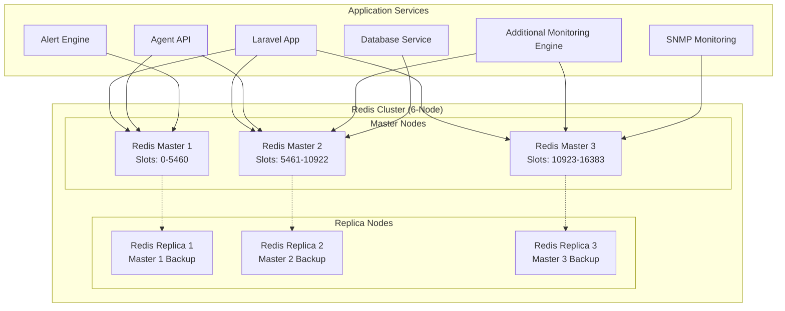

# Redis Cluster Integration

Redis serves as the primary caching layer and session store for the RMAS system using a 6-node cluster configuration for high availability and scalability.

## Redis Cluster Architecture

### 6-Node Cluster Deployment


### Kubernetes Deployment with Redis Operator
```yaml
apiVersion: redis.io/v1beta1
kind: RedisCluster
metadata:
  name: rmas-redis-cluster
  namespace: rmas-system
spec:
  redisClusterSize: 6
  masterSize: 3
  redisExporter:
    enabled: true
    image: quay.io/opstree/redis-exporter:v1.44.0
  kubernetesConfig:
    image: quay.io/opstree/redis:v7.0.5
    imagePullPolicy: IfNotPresent
    resources:
      requests:
        cpu: 100m
        memory: 256Mi
      limits:
        cpu: 1000m
        memory: 2Gi
    redisSecret:
      name: redis-secret
      key: password
  storage:
    volumeClaimTemplate:
      spec:
        accessModes: ["ReadWriteOnce"]
        resources:
          requests:
            storage: 20Gi
  redisConfig:
    maxmemory: 1gb
    maxmemory-policy: allkeys-lru
    timeout: 300
    tcp-keepalive: 60
    databases: 16
    cluster-enabled: "yes"
    cluster-config-file: nodes.conf
    cluster-node-timeout: 5000
```

## Redis Cluster Database Organization

### Hash Slot Distribution Strategy
Redis cluster uses 16384 hash slots distributed across 3 master nodes:

- **Master 1 (Slots 0-5460)**: Session data and authentication
- **Master 2 (Slots 5461-10922)**: Device data and monitoring cache  
- **Master 3 (Slots 10923-16383)**: SNMP data and configuration cache

### Database Allocation per Cluster Node
Each master node manages multiple logical databases:

#### Master 1 - Authentication & Sessions
- **DB 0**: Laravel sessions and user authentication
- **DB 1**: JWT tokens and permissions cache
- **DB 2**: API rate limiting and security tokens

#### Master 2 - Device & Monitoring  
- **DB 0**: Device lists and status cache
- **DB 1**: Real-time monitoring metrics
- **DB 2**: Device heartbeat and health status
- **DB 3**: Custom device fields cache

#### Master 3 - SNMP & Configuration
- **DB 0**: SNMP device discovery and polling cache
- **DB 1**: MIB and OID definitions cache
- **DB 2**: System configuration and settings
- **DB 3**: Alert rules and notification cache

## Key Usage Patterns

### 1. Device Management Cache

#### Device Name Lists
```redis
# Active devices by organization
SADD "org:{org_id}:devices:active" {device_id_1} {device_id_2} ...
EXPIRE "org:{org_id}:devices:active" 300

# Device names mapping
HSET "org:{org_id}:devices:names" {device_id} "Device Name"
EXPIRE "org:{org_id}:devices:names" 3600

# Device groups mapping
SMEMBERS "org:{org_id}:group:{group_id}:devices"
EXPIRE "org:{org_id}:group:{group_id}:devices" 1800
```

#### Device Status Cache
```redis
# Real-time device status
HSET "device:{device_id}:status" 
  "status" "online"
  "last_seen" "2025-01-16T12:00:00Z"
  "cpu_usage" "25.5"
  "memory_usage" "51.2"
  "disk_usage" "45.8"
EXPIRE "device:{device_id}:status" 120

# Device heartbeat tracking
ZADD "org:{org_id}:heartbeats" {timestamp} {device_id}
EXPIRE "org:{org_id}:heartbeats" 600
```

#### Device Configuration Cache
```redis
# Device type configurations
HSET "device_type:{type_id}:config"
  "heartbeat_interval" "60"
  "system_info_interval" "3600"
  "custom_fields" "{\"cpu_cores\": \"integer\", \"ram_gb\": \"integer\"}"
EXPIRE "device_type:{type_id}:config" 7200

# Device group settings
HSET "device_group:{group_id}:settings"
  "auto_approve" "false"
  "max_devices" "100"
  "monitoring_enabled" "true"
EXPIRE "device_group:{group_id}:settings" 3600
```

### 2. Session Management

#### User Sessions (Laravel)
```redis
# Laravel session storage
SET "laravel_session:{session_id}" 
  "{\"user_id\": \"{user_id}\", \"org_id\": \"{org_id}\", \"permissions\": {...}}"
EXPIRE "laravel_session:{session_id}" 7200

# User organization mapping
SADD "user:{user_id}:organizations" {org_id_1} {org_id_2}
EXPIRE "user:{user_id}:organizations" 3600

# Active user sessions by organization
SADD "org:{org_id}:active_users" {user_id}
EXPIRE "org:{org_id}:active_users" 1800
```

#### Agent Authentication Cache
```redis
# JWT token validation cache
SET "agent_token:{token_hash}"
  "{\"device_id\": \"{device_id}\", \"org_id\": \"{org_id}\", \"expires_at\": \"...\"}"
EXPIRE "agent_token:{token_hash}" 86400

# Device authentication status
HSET "device:{device_id}:auth"
  "token_active" "true"
  "last_auth" "2025-01-16T12:00:00Z"
  "auth_failures" "0"
EXPIRE "device:{device_id}:auth" 3600
```

### 3. Real-time Monitoring Cache

#### Live Metrics
```redis
# Real-time device metrics (sliding window)
ZADD "device:{device_id}:metrics:cpu" {timestamp} {cpu_percentage}
ZREMRANGEBYSCORE "device:{device_id}:metrics:cpu" 0 {timestamp-300}
EXPIRE "device:{device_id}:metrics:cpu" 600

# Aggregated organization metrics
HSET "org:{org_id}:metrics:summary"
  "total_devices" "150"
  "online_devices" "142"
  "avg_cpu_usage" "23.4"
  "avg_memory_usage" "67.2"
EXPIRE "org:{org_id}:metrics:summary" 60

# Alert states
SET "device:{device_id}:alert:cpu_high" 
  "{\"triggered_at\": \"2025-01-16T12:00:00Z\", \"threshold\": 80, \"current\": 85}"
EXPIRE "device:{device_id}:alert:cpu_high" 3600
```

#### Custom Metrics Cache
```redis
# Custom device type metrics
HSET "device:{device_id}:custom_metrics"
  "cpu_cores" "8"
  "ram_gb" "16"
  "disk_io_ops" "1250"
  "network_latency_ms" "15"
EXPIRE "device:{device_id}:custom_metrics" 300

# Custom metric definitions by device type
HGET "device_type:{type_id}:custom_fields" 
# Returns: {"cpu_cores": {"type": "integer", "unit": "count"}, ...}
```

### 4. SNMP Integration Cache

#### SNMP Device Discovery
```redis
# Discovered SNMP devices
SADD "org:{org_id}:snmp:discovered" "{ip}:{community}"
EXPIRE "org:{org_id}:snmp:discovered" 1800

# SNMP device information cache
HSET "snmp:{ip}:info"
  "sysName" "Router-01"
  "sysDescr" "Cisco IOS Software"
  "sysUpTime" "12345678"
  "community" "public"
EXPIRE "snmp:{ip}:info" 3600

# SNMP OID cache
HSET "snmp:{ip}:oids"
  "1.3.6.1.2.1.1.3.0" "12345678"  # sysUpTime
  "1.3.6.1.2.1.2.2.1.10.1" "1048576"  # ifInOctets.1
EXPIRE "snmp:{ip}:oids" 300
```

#### SNMP Configuration Cache
```redis
# SNMP community strings by organization
HSET "org:{org_id}:snmp:communities"
  "public" "read"
  "private" "write"
  "monitoring" "read"
EXPIRE "org:{org_id}:snmp:communities" 7200

# SNMP trap receivers
SADD "org:{org_id}:snmp:trap_receivers" 
  "192.168.1.100:162"
  "10.0.0.50:162"
EXPIRE "org:{org_id}:snmp:trap_receivers" 3600
```

### 5. Job and Template Cache

#### Job Template Cache
```redis
# Active job templates by organization
SMEMBERS "org:{org_id}:job_templates:active"
EXPIRE "org:{org_id}:job_templates:active" 1800

# Job template data cache
HSET "job_template:{template_id}:data"
  "name" "System Cleanup"
  "type" "maintenance"
  "steps" "[{...}]"
  "parameters" "{...}"
EXPIRE "job_template:{template_id}:data" 3600

# Pending jobs by device
LPUSH "device:{device_id}:pending_jobs" {execution_id}
EXPIRE "device:{device_id}:pending_jobs" 1800
```

### 6. Alert Rule Cache

#### Alert Configurations
```redis
# Alert rules by organization
SMEMBERS "org:{org_id}:alert_rules"
EXPIRE "org:{org_id}:alert_rules" 1800

# Alert rule definitions
HSET "alert_rule:{rule_id}"
  "name" "High CPU Usage"
  "metric" "cpu_usage"
  "threshold" "80"
  "duration" "300"
  "notification_methods" "[\"email\", \"webhook\"]"
EXPIRE "alert_rule:{rule_id}" 3600

# Active alerts
ZADD "org:{org_id}:active_alerts" {timestamp} {alert_id}
EXPIRE "org:{org_id}:active_alerts" 86400
```

## Redis Configuration

### Memory Management
```ini
# redis.conf
maxmemory 2gb
maxmemory-policy allkeys-lru
maxmemory-samples 5

# Enable persistence
save 900 1
save 300 10
save 60 10000

# AOF persistence
appendonly yes
appendfsync everysec
```

### Clustering Configuration
```ini
# Redis Cluster setup
cluster-enabled yes
cluster-config-file nodes-6379.conf
cluster-node-timeout 15000
cluster-replica-validity-factor 10
cluster-migration-barrier 1
```

### Security Configuration
```ini
# Authentication
requirepass your_redis_password

# Network security
bind 127.0.0.1 10.0.0.0/8
protected-mode yes

# Disable dangerous commands
rename-command FLUSHDB ""
rename-command FLUSHALL ""
rename-command KEYS ""
```

## Cache Invalidation Strategy

### Time-based Expiration
- **Session data**: 2-4 hours depending on activity
- **Device status**: 1-2 minutes for real-time updates
- **Configuration data**: 1-2 hours for stable settings
- **Monitoring metrics**: 5-10 minutes for recent data
- **SNMP data**: 5 minutes for polling results

### Event-based Invalidation
```python
# Example cache invalidation triggers
class CacheInvalidator:
    def device_status_changed(self, device_id, org_id):
        redis.delete(f"device:{device_id}:status")
        redis.delete(f"org:{org_id}:devices:active")
        redis.delete(f"org:{org_id}:metrics:summary")
    
    def device_type_updated(self, device_type_id, org_id):
        redis.delete(f"device_type:{device_type_id}:config")
        # Invalidate all devices of this type
        devices = get_devices_by_type(device_type_id)
        for device_id in devices:
            redis.delete(f"device:{device_id}:custom_metrics")
    
    def user_permissions_changed(self, user_id):
        sessions = redis.smembers(f"user:{user_id}:sessions")
        for session_id in sessions:
            redis.delete(f"laravel_session:{session_id}")
```

## Performance Optimization

### Connection Pooling
```python
# Redis connection pool configuration
import redis

redis_pool = redis.ConnectionPool(
    host='localhost',
    port=6379,
    db=0,
    max_connections=20,
    retry_on_timeout=True,
    socket_keepalive=True,
    socket_keepalive_options={}
)

redis_client = redis.Redis(connection_pool=redis_pool)
```

### Pipeline Operations
```python
# Batch operations for better performance
def update_device_metrics(device_id, metrics):
    pipe = redis_client.pipeline()
    pipe.hset(f"device:{device_id}:status", mapping=metrics)
    pipe.expire(f"device:{device_id}:status", 120)
    pipe.zadd(f"device:{device_id}:metrics:cpu", 
              {metrics['cpu_usage']: time.time()})
    pipe.execute()
```

### Lua Scripts for Atomic Operations
```lua
-- Atomic device status update with alerting
local device_id = KEYS[1]
local org_id = KEYS[2]
local status_key = "device:" .. device_id .. ":status"
local alert_key = "device:" .. device_id .. ":alert:offline"

-- Update device status
redis.call('HSET', status_key, 'status', ARGV[1], 'last_seen', ARGV[2])
redis.call('EXPIRE', status_key, 120)

-- Check if device went offline
if ARGV[1] == 'offline' then
    redis.call('SET', alert_key, ARGV[2])
    redis.call('EXPIRE', alert_key, 3600)
    return 1  -- Alert triggered
else
    redis.call('DEL', alert_key)
    return 0  -- No alert
end
```

## Monitoring and Alerts

### Redis Health Monitoring
```python
# Redis health check
def check_redis_health():
    try:
        info = redis_client.info()
        return {
            'status': 'healthy',
            'memory_usage': info['used_memory_human'],
            'connected_clients': info['connected_clients'],
            'commands_processed': info['total_commands_processed'],
            'keyspace_hits': info['keyspace_hits'],
            'keyspace_misses': info['keyspace_misses']
        }
    except Exception as e:
        return {'status': 'unhealthy', 'error': str(e)}
```

### Cache Performance Metrics
```python
# Monitor cache hit rates
def get_cache_stats():
    info = redis_client.info()
    hit_rate = info['keyspace_hits'] / (info['keyspace_hits'] + info['keyspace_misses'])
    return {
        'hit_rate': hit_rate,
        'memory_usage_percent': info['used_memory'] / info['maxmemory'] * 100,
        'fragmentation_ratio': info['mem_fragmentation_ratio'],
        'expired_keys': info['expired_keys']
    }
```

## Backup and Recovery

### Redis Backup Strategy
```bash
# Daily Redis backup
#!/bin/bash
BACKUP_DIR="/backup/redis"
DATE=$(date +%Y%m%d_%H%M%S)

# Create RDB snapshot
redis-cli BGSAVE
sleep 10

# Copy RDB file
cp /var/lib/redis/dump.rdb $BACKUP_DIR/redis_backup_$DATE.rdb

# Compress backup
gzip $BACKUP_DIR/redis_backup_$DATE.rdb

# Cleanup old backups (keep 7 days)
find $BACKUP_DIR -name "redis_backup_*.rdb.gz" -mtime +7 -delete
```

### Disaster Recovery
```python
# Redis failover handling
class RedisFailoverHandler:
    def __init__(self):
        self.sentinel = redis.sentinel.Sentinel([
            ('sentinel1', 26379),
            ('sentinel2', 26379),
            ('sentinel3', 26379)
        ])
    
    def get_redis_connection(self):
        try:
            return self.sentinel.master_for('mymaster', socket_timeout=0.1)
        except redis.sentinel.MasterNotFoundError:
            # Fallback to read-only slave
            return self.sentinel.slave_for('mymaster', socket_timeout=0.1)
```
