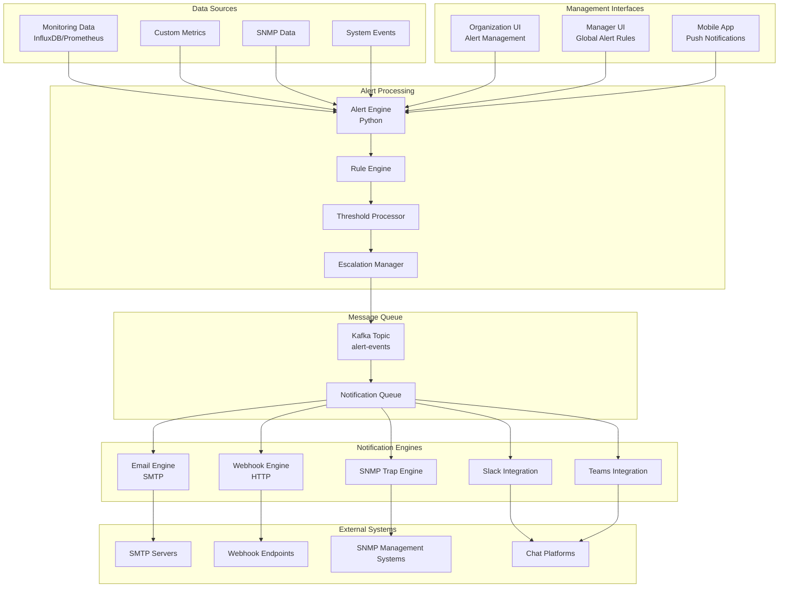

# Alert System

The RMAS alert system provides comprehensive alerting capabilities with multiple notification methods including SNMP traps, webhooks, and email notifications at both organization and manager levels with customizable thresholds and escalation rules.

## Alert Architecture

### Overview


## Alert Rule Configuration

### Alert Rule Types

#### 1. Threshold-based Alerts
```json
{
  "rule_id": "rule_cpu_high",
  "name": "High CPU Usage",
  "description": "Alert when CPU usage exceeds threshold",
  "type": "threshold",
  "severity": "warning",
  "category": "performance",
  "organization_id": "org_123",
  "device_scope": {
    "scope_type": "device_group",
    "scope_ids": ["group_456"],
    "device_types": ["windows_desktop", "linux_server"]
  },
  "conditions": {
    "metric": "cpu_usage",
    "operator": "greater_than",
    "threshold": 80,
    "duration": "5m",
    "evaluation_period": "1m"
  },
  "notifications": {
    "email": {
      "enabled": true,
      "recipients": ["admin@company.com", "ops@company.com"],
      "template": "cpu_high_alert"
    },
    "webhook": {
      "enabled": true,
      "url": "https://hooks.slack.com/services/...",
      "method": "POST",
      "headers": {
        "Authorization": "Bearer token123"
      }
    },
    "snmp_trap": {
      "enabled": true,
      "community": "alerts",
      "oid": "1.3.6.1.4.1.12345.1.1.1",
      "severity": "major"
    }
  },
  "escalation": {
    "enabled": true,
    "levels": [
      {
        "level": 1,
        "delay": "15m",
        "recipients": ["team-lead@company.com"]
      },
      {
        "level": 2,
        "delay": "30m",
        "recipients": ["manager@company.com"]
      }
    ]
  },
  "schedule": {
    "timezone": "UTC",
    "active_hours": {
      "monday": {"start": "08:00", "end": "18:00"},
      "tuesday": {"start": "08:00", "end": "18:00"},
      "wednesday": {"start": "08:00", "end": "18:00"},
      "thursday": {"start": "08:00", "end": "18:00"},
      "friday": {"start": "08:00", "end": "18:00"}
    },
    "holidays": ["2025-01-01", "2025-12-25"]
  },
  "suppression": {
    "enabled": true,
    "duration": "1h",
    "similar_alerts": true
  }
}
```

#### 2. Custom Metrics Alerts
```json
{
  "rule_id": "rule_custom_response_time",
  "name": "High Application Response Time",
  "type": "custom_metric_threshold",
  "severity": "critical",
  "organization_id": "org_123",
  "conditions": {
    "custom_metric": "application_response_time",
    "operator": "greater_than",
    "threshold": 5000,
    "unit": "milliseconds",
    "duration": "3m"
  },
  "device_filter": {
    "device_types": ["web_server"],
    "custom_field_filters": {
      "environment": "production",
      "criticality": "high"
    }
  },
  "notifications": {
    "immediate": {
      "email": ["devops@company.com"],
      "sms": ["+1234567890"],
      "pager_duty": {
        "service_key": "abc123",
        "severity": "critical"
      }
    }
  }
}
```

#### 3. Composite Alerts
```json
{
  "rule_id": "rule_system_degradation",
  "name": "System Performance Degradation",
  "type": "composite",
  "severity": "warning",
  "organization_id": "org_123",
  "conditions": {
    "logic": "AND",
    "rules": [
      {
        "metric": "cpu_usage",
        "operator": "greater_than",
        "threshold": 70,
        "duration": "10m"
      },
      {
        "metric": "memory_usage", 
        "operator": "greater_than",
        "threshold": 80,
        "duration": "10m"
      },
      {
        "custom_metric": "application_response_time",
        "operator": "greater_than",
        "threshold": 2000,
        "duration": "5m"
      }
    ]
  }
}
```

#### 4. Anomaly Detection Alerts
```json
{
  "rule_id": "rule_anomaly_detection",
  "name": "CPU Usage Anomaly",
  "type": "anomaly",
  "severity": "info",
  "organization_id": "org_123",
  "conditions": {
    "metric": "cpu_usage",
    "baseline_period": "7d",
    "detection_method": "isolation_forest",
    "sensitivity": 0.1,
    "min_samples": 100
  },
  "machine_learning": {
    "model_type": "isolation_forest",
    "training_data_days": 30,
    "retrain_frequency": "weekly"
  }
}
```

## Alert Engine Implementation

### Core Alert Engine
```python
import asyncio
from datetime import datetime, timedelta
from typing import Dict, List, Any
import json
from dataclasses import dataclass
from enum import Enum

class AlertSeverity(Enum):
    INFO = "info"
    WARNING = "warning" 
    CRITICAL = "critical"
    EMERGENCY = "emergency"

class AlertStatus(Enum):
    TRIGGERED = "triggered"
    ACKNOWLEDGED = "acknowledged"
    RESOLVED = "resolved"
    SUPPRESSED = "suppressed"

@dataclass
class AlertEvent:
    alert_id: str
    rule_id: str
    device_id: str
    organization_id: str
    severity: AlertSeverity
    status: AlertStatus
    metric_name: str
    current_value: float
    threshold: float
    triggered_at: datetime
    message: str
    context: Dict[str, Any]

class AlertEngine:
    def __init__(self, influx_client, redis_client, kafka_producer):
        self.influx_client = influx_client
        self.redis_client = redis_client
        self.kafka_producer = kafka_producer
        self.active_alerts = {}
        self.alert_rules = {}
        
    async def evaluate_alert_rules(self):
        """Main loop to evaluate all alert rules"""
        while True:
            try:
                # Get all active alert rules
                alert_rules = await self.get_active_alert_rules()
                
                # Evaluate each rule
                for rule in alert_rules:
                    await self.evaluate_rule(rule)
                
                # Clean up resolved alerts
                await self.cleanup_resolved_alerts()
                
                # Wait before next evaluation
                await asyncio.sleep(60)  # 1 minute evaluation cycle
                
            except Exception as e:
                print(f"Error in alert evaluation: {e}")
                await asyncio.sleep(30)
    
    async def evaluate_rule(self, rule: Dict):
        """Evaluate a single alert rule"""
        rule_id = rule["rule_id"]
        organization_id = rule["organization_id"]
        
        try:
            # Get devices in scope for this rule
            devices = await self.get_devices_in_scope(rule["device_scope"])
            
            # Evaluate condition for each device
            for device in devices:
                await self.evaluate_device_condition(rule, device)
                
        except Exception as e:
            print(f"Error evaluating rule {rule_id}: {e}")
    
    async def evaluate_device_condition(self, rule: Dict, device: Dict):
        """Evaluate alert condition for a specific device"""
        device_id = device["device_id"]
        rule_id = rule["rule_id"]
        conditions = rule["conditions"]
        
        # Query metric data
        current_value = await self.get_current_metric_value(
            device_id, conditions["metric"], conditions.get("duration", "5m")
        )
        
        if current_value is None:
            return
        
        # Evaluate threshold condition
        threshold_exceeded = self.evaluate_threshold(
            current_value, 
            conditions["operator"], 
            conditions["threshold"]
        )
        
        alert_key = f"{rule_id}:{device_id}"
        
        if threshold_exceeded:
            # Check if alert already exists
            if alert_key not in self.active_alerts:
                # Create new alert
                alert = AlertEvent(
                    alert_id=f"alert_{int(datetime.utcnow().timestamp())}",
                    rule_id=rule_id,
                    device_id=device_id,
                    organization_id=rule["organization_id"],
                    severity=AlertSeverity(rule["severity"]),
                    status=AlertStatus.TRIGGERED,
                    metric_name=conditions["metric"],
                    current_value=current_value,
                    threshold=conditions["threshold"],
                    triggered_at=datetime.utcnow(),
                    message=self.generate_alert_message(rule, device, current_value),
                    context={
                        "device_name": device.get("name", "Unknown"),
                        "device_type": device.get("type", "Unknown"),
                        "rule_name": rule["name"]
                    }
                )
                
                self.active_alerts[alert_key] = alert
                await self.trigger_alert(alert, rule)
            else:
                # Update existing alert
                self.active_alerts[alert_key].current_value = current_value
        else:
            # Condition not met, resolve alert if it exists
            if alert_key in self.active_alerts:
                alert = self.active_alerts[alert_key]
                alert.status = AlertStatus.RESOLVED
                await self.resolve_alert(alert, rule)
                del self.active_alerts[alert_key]
    
    async def trigger_alert(self, alert: AlertEvent, rule: Dict):
        """Trigger an alert and send notifications"""
        
        # Check if alert should be suppressed
        if await self.should_suppress_alert(alert, rule):
            alert.status = AlertStatus.SUPPRESSED
            return
        
        # Send to Kafka for processing
        alert_message = {
            "event_type": "alert_triggered",
            "timestamp": alert.triggered_at.isoformat(),
            "alert_id": alert.alert_id,
            "organization_id": alert.organization_id,
            "device_id": alert.device_id,
            "data": {
                "rule_id": alert.rule_id,
                "rule_name": rule["name"],
                "metric": alert.metric_name,
                "threshold": alert.threshold,
                "current_value": alert.current_value,
                "severity": alert.severity.value,
                "message": alert.message,
                "context": alert.context,
                "notification_settings": rule["notifications"]
            },
            "priority": self.get_priority(alert.severity),
            "escalation_level": 1
        }
        
        await self.kafka_producer.send('alert-events', value=alert_message)
        
        # Store alert in Redis for quick access
        await self.store_alert_in_cache(alert)
        
        # Log to audit
        await self.log_alert_event(alert, "triggered")
    
    def evaluate_threshold(self, value: float, operator: str, threshold: float) -> bool:
        """Evaluate threshold condition"""
        if operator == "greater_than":
            return value > threshold
        elif operator == "less_than":
            return value < threshold
        elif operator == "equal_to":
            return value == threshold
        elif operator == "not_equal_to":
            return value != threshold
        elif operator == "greater_than_or_equal":
            return value >= threshold
        elif operator == "less_than_or_equal":
            return value <= threshold
        else:
            return False
    
    async def get_current_metric_value(self, device_id: str, metric: str, duration: str) -> float:
        """Get current metric value from InfluxDB"""
        
        # Convert duration to InfluxDB format
        influx_duration = duration.replace("m", "m").replace("h", "h").replace("d", "d")
        
        query = f"""
        SELECT mean({metric}) as value
        FROM device_metrics 
        WHERE device_id = '{device_id}' 
        AND time >= now() - {influx_duration}
        """
        
        try:
            result = self.influx_client.query(query)
            if result:
                points = list(result.get_points())
                if points and points[0]["value"] is not None:
                    return float(points[0]["value"])
        except Exception as e:
            print(f"Error querying metric {metric} for device {device_id}: {e}")
        
        return None
```

## Notification Engines

### Email Notification Engine
```python
import smtplib
from email.mime.text import MIMEText
from email.mime.multipart import MIMEMultipart
from email.mime.base import MIMEBase
from email import encoders
import jinja2

class EmailNotificationEngine:
    def __init__(self, smtp_config: Dict):
        self.smtp_config = smtp_config
        self.template_env = jinja2.Environment(
            loader=jinja2.FileSystemLoader('templates/email')
        )
    
    async def send_alert_notification(self, alert_data: Dict, notification_config: Dict):
        """Send email notification for alert"""
        
        recipients = notification_config.get("recipients", [])
        template_name = notification_config.get("template", "default_alert")
        
        if not recipients:
            return
        
        # Render email template
        template = self.template_env.get_template(f"{template_name}.html")
        html_content = template.render(
            alert=alert_data,
            organization_name=await self.get_organization_name(alert_data["organization_id"]),
            device_name=alert_data["data"]["context"]["device_name"],
            dashboard_url=self.generate_dashboard_url(alert_data)
        )
        
        # Create email message
        msg = MIMEMultipart('alternative')
        msg['Subject'] = f"[RMAS Alert] {alert_data['data']['rule_name']} - {alert_data['data']['severity'].upper()}"
        msg['From'] = self.smtp_config['from_address']
        msg['To'] = ', '.join(recipients)
        
        # Add HTML content
        html_part = MIMEText(html_content, 'html')
        msg.attach(html_part)
        
        # Add plain text version
        text_content = self.html_to_text(html_content)
        text_part = MIMEText(text_content, 'plain')
        msg.attach(text_part)
        
        # Send email
        try:
            server = smtplib.SMTP(self.smtp_config['host'], self.smtp_config['port'])
            if self.smtp_config.get('use_tls'):
                server.starttls()
            if self.smtp_config.get('username'):
                server.login(self.smtp_config['username'], self.smtp_config['password'])
            
            server.send_message(msg)
            server.quit()
            
            return True
            
        except Exception as e:
            print(f"Failed to send email notification: {e}")
            return False
    
    def generate_dashboard_url(self, alert_data: Dict) -> str:
        """Generate URL to alert dashboard"""
        base_url = self.smtp_config.get('dashboard_base_url', 'https://rmas.company.com')
        org_id = alert_data['organization_id']
        device_id = alert_data['device_id']
        
        return f"{base_url}/org/{org_id}/devices/{device_id}/dashboard"

# Email template example
email_template_html = """
<!DOCTYPE html>
<html>
<head>
    <style>
        .alert-critical { background-color: #ffebee; border-left: 4px solid #f44336; }
        .alert-warning { background-color: #fff3e0; border-left: 4px solid #ff9800; }
        .alert-info { background-color: #e3f2fd; border-left: 4px solid #2196f3; }
        .alert-box { padding: 20px; margin: 20px 0; }
        .metric-value { font-size: 24px; font-weight: bold; }
        .threshold { color: #666; }
    </style>
</head>
<body>
    <div class="alert-box alert-{{ alert.data.severity }}">
        <h2>🚨 Alert: {{ alert.data.rule_name }}</h2>
        <p><strong>Organization:</strong> {{ organization_name }}</p>
        <p><strong>Device:</strong> {{ device_name }}</p>
        <p><strong>Metric:</strong> {{ alert.data.metric }}</p>
        <p><strong>Current Value:</strong> <span class="metric-value">{{ alert.data.current_value }}%</span></p>
        <p><strong>Threshold:</strong> <span class="threshold">{{ alert.data.threshold }}%</span></p>
        <p><strong>Triggered At:</strong> {{ alert.timestamp }}</p>
        <p><strong>Message:</strong> {{ alert.data.message }}</p>
        
        <p><a href="{{ dashboard_url }}" style="background-color: #2196f3; color: white; padding: 10px 20px; text-decoration: none; border-radius: 4px;">View Dashboard</a></p>
    </div>
</body>
</html>
"""
```

### Webhook Notification Engine
```python
import aiohttp
import json
from typing import Dict, Any

class WebhookNotificationEngine:
    def __init__(self):
        self.session = None
    
    async def __aenter__(self):
        self.session = aiohttp.ClientSession()
        return self
    
    async def __aexit__(self, exc_type, exc_val, exc_tb):
        if self.session:
            await self.session.close()
    
    async def send_webhook_notification(self, alert_data: Dict, webhook_config: Dict):
        """Send webhook notification for alert"""
        
        url = webhook_config["url"]
        method = webhook_config.get("method", "POST")
        headers = webhook_config.get("headers", {})
        
        # Prepare webhook payload
        payload = self.prepare_webhook_payload(alert_data, webhook_config)
        
        try:
            if method.upper() == "POST":
                async with self.session.post(
                    url,
                    json=payload,
                    headers=headers,
                    timeout=aiohttp.ClientTimeout(total=30)
                ) as response:
                    if response.status < 400:
                        return True
                    else:
                        print(f"Webhook failed with status {response.status}: {await response.text()}")
                        return False
            
        except Exception as e:
            print(f"Failed to send webhook notification: {e}")
            return False
    
    def prepare_webhook_payload(self, alert_data: Dict, webhook_config: Dict) -> Dict:
        """Prepare webhook payload based on platform"""
        
        platform = webhook_config.get("platform", "generic")
        
        if platform == "slack":
            return self.prepare_slack_payload(alert_data)
        elif platform == "teams":
            return self.prepare_teams_payload(alert_data)
        elif platform == "discord":
            return self.prepare_discord_payload(alert_data)
        else:
            return self.prepare_generic_payload(alert_data)
    
    def prepare_slack_payload(self, alert_data: Dict) -> Dict:
        """Prepare Slack-specific payload"""
        severity = alert_data["data"]["severity"]
        color_map = {
            "critical": "#ff0000",
            "warning": "#ffaa00", 
            "info": "#00aa00"
        }
        
        return {
            "text": f"RMAS Alert: {alert_data['data']['rule_name']}",
            "attachments": [
                {
                    "color": color_map.get(severity, "#cccccc"),
                    "title": alert_data["data"]["rule_name"],
                    "fields": [
                        {
                            "title": "Device",
                            "value": alert_data["data"]["context"]["device_name"],
                            "short": True
                        },
                        {
                            "title": "Metric",
                            "value": alert_data["data"]["metric"],
                            "short": True
                        },
                        {
                            "title": "Current Value",
                            "value": f"{alert_data['data']['current_value']}",
                            "short": True
                        },
                        {
                            "title": "Threshold",
                            "value": f"{alert_data['data']['threshold']}",
                            "short": True
                        }
                    ],
                    "ts": int(datetime.fromisoformat(alert_data["timestamp"].replace('Z', '+00:00')).timestamp())
                }
            ]
        }
    
    def prepare_teams_payload(self, alert_data: Dict) -> Dict:
        """Prepare Microsoft Teams payload"""
        severity = alert_data["data"]["severity"]
        color_map = {
            "critical": "attention",
            "warning": "warning",
            "info": "good"
        }
        
        return {
            "@type": "MessageCard",
            "@context": "http://schema.org/extensions",
            "themeColor": color_map.get(severity, "default"),
            "summary": f"RMAS Alert: {alert_data['data']['rule_name']}",
            "sections": [
                {
                    "activityTitle": f"🚨 {alert_data['data']['rule_name']}",
                    "activitySubtitle": f"Severity: {severity.upper()}",
                    "facts": [
                        {
                            "name": "Device",
                            "value": alert_data["data"]["context"]["device_name"]
                        },
                        {
                            "name": "Metric",
                            "value": alert_data["data"]["metric"]
                        },
                        {
                            "name": "Current Value",
                            "value": str(alert_data["data"]["current_value"])
                        },
                        {
                            "name": "Threshold",
                            "value": str(alert_data["data"]["threshold"])
                        }
                    ]
                }
            ],
            "potentialAction": [
                {
                    "@type": "OpenUri",
                    "name": "View Dashboard",
                    "targets": [
                        {
                            "os": "default",
                            "uri": f"https://rmas.company.com/alerts/{alert_data['alert_id']}"
                        }
                    ]
                }
            ]
        }
```

### SNMP Trap Engine
```python
from pysnmp.hlapi import *
import asyncio

class SNMPTrapEngine:
    def __init__(self):
        self.enterprise_oid = "1.3.6.1.4.1.12345"  # Company-specific OID
        
    async def send_snmp_trap(self, alert_data: Dict, snmp_config: Dict):
        """Send SNMP trap for alert"""
        
        community = snmp_config.get("community", "public")
        trap_receivers = snmp_config.get("receivers", [])
        
        if not trap_receivers:
            return
        
        # Prepare trap data
        trap_oids = self.prepare_trap_oids(alert_data, snmp_config)
        
        for receiver in trap_receivers:
            try:
                await self.send_trap_to_receiver(
                    receiver, community, trap_oids
                )
            except Exception as e:
                print(f"Failed to send SNMP trap to {receiver}: {e}")
    
    def prepare_trap_oids(self, alert_data: Dict, snmp_config: Dict) -> List:
        """Prepare SNMP trap OIDs and values"""
        
        base_oid = snmp_config.get("oid", f"{self.enterprise_oid}.1.1")
        severity_map = {
            "info": 1,
            "warning": 2, 
            "critical": 3,
            "emergency": 4
        }
        
        return [
            # Alert ID
            ObjectType(
                ObjectIdentity(f"{base_oid}.1"),
                OctetString(alert_data["alert_id"])
            ),
            # Alert severity
            ObjectType(
                ObjectIdentity(f"{base_oid}.2"),
                Integer(severity_map.get(alert_data["data"]["severity"], 1))
            ),
            # Device ID
            ObjectType(
                ObjectIdentity(f"{base_oid}.3"),
                OctetString(alert_data["device_id"])
            ),
            # Metric name
            ObjectType(
                ObjectIdentity(f"{base_oid}.4"), 
                OctetString(alert_data["data"]["metric"])
            ),
            # Current value
            ObjectType(
                ObjectIdentity(f"{base_oid}.5"),
                OctetString(str(alert_data["data"]["current_value"]))
            ),
            # Threshold
            ObjectType(
                ObjectIdentity(f"{base_oid}.6"),
                OctetString(str(alert_data["data"]["threshold"]))
            ),
            # Alert message
            ObjectType(
                ObjectIdentity(f"{base_oid}.7"),
                OctetString(alert_data["data"]["message"])
            )
        ]
    
    async def send_trap_to_receiver(self, receiver: str, community: str, trap_oids: List):
        """Send SNMP trap to specific receiver"""
        
        # Parse receiver address
        if ":" in receiver:
            host, port = receiver.split(":")
            port = int(port)
        else:
            host = receiver
            port = 162
        
        # Send trap
        for (errorIndication, errorStatus, errorIndex, varBinds) in sendNotification(
            SnmpEngine(),
            CommunityData(community),
            UdpTransportTarget((host, port)),
            ContextData(),
            'trap',
            NotificationType(
                ObjectIdentity(f"{self.enterprise_oid}.0.1")  # Trap OID
            ).addVarBinds(*trap_oids)
        ):
            if errorIndication:
                raise Exception(f"SNMP error: {errorIndication}")
            elif errorStatus:
                raise Exception(f"SNMP error: {errorStatus.prettyPrint()}")
```

## Alert Escalation

### Escalation Manager
```python
class AlertEscalationManager:
    def __init__(self, redis_client, kafka_producer):
        self.redis_client = redis_client
        self.kafka_producer = kafka_producer
    
    async def process_escalations(self):
        """Process pending alert escalations"""
        while True:
            try:
                # Get alerts pending escalation
                pending_escalations = await self.get_pending_escalations()
                
                for escalation in pending_escalations:
                    await self.process_escalation(escalation)
                
                await asyncio.sleep(60)  # Check every minute
                
            except Exception as e:
                print(f"Error processing escalations: {e}")
                await asyncio.sleep(30)
    
    async def schedule_escalation(self, alert: AlertEvent, rule: Dict):
        """Schedule alert escalation"""
        
        escalation_config = rule.get("escalation", {})
        if not escalation_config.get("enabled", False):
            return
        
        for level_config in escalation_config.get("levels", []):
            escalation_time = datetime.utcnow() + timedelta(
                minutes=self.parse_duration(level_config["delay"])
            )
            
            escalation = {
                "alert_id": alert.alert_id,
                "rule_id": alert.rule_id,
                "level": level_config["level"],
                "scheduled_time": escalation_time.isoformat(),
                "recipients": level_config["recipients"],
                "notification_methods": level_config.get("methods", ["email"])
            }
            
            # Store in Redis with expiration
            escalation_key = f"escalation:{alert.alert_id}:{level_config['level']}"
            await self.redis_client.setex(
                escalation_key,
                int((escalation_time - datetime.utcnow()).total_seconds()),
                json.dumps(escalation)
            )
    
    def parse_duration(self, duration_str: str) -> int:
        """Parse duration string to minutes"""
        if duration_str.endswith('m'):
            return int(duration_str[:-1])
        elif duration_str.endswith('h'):
            return int(duration_str[:-1]) * 60
        elif duration_str.endswith('d'):
            return int(duration_str[:-1]) * 24 * 60
        else:
            return int(duration_str)  # Assume minutes
```

## Alert Dashboard Integration

### Real-time Alert Updates
```python
import websockets
import json

class AlertDashboard:
    def __init__(self, redis_client):
        self.redis_client = redis_client
        self.connected_clients = {}
    
    async def websocket_handler(self, websocket, path):
        """Handle WebSocket connections for real-time alerts"""
        
        # Parse organization from path
        org_id = self.extract_org_from_path(path)
        
        if org_id not in self.connected_clients:
            self.connected_clients[org_id] = set()
        
        self.connected_clients[org_id].add(websocket)
        
        try:
            # Send current active alerts
            await self.send_current_alerts(websocket, org_id)
            
            # Keep connection alive
            async for message in websocket:
                data = json.loads(message)
                await self.handle_client_action(websocket, org_id, data)
                
        except websockets.exceptions.ConnectionClosed:
            pass
        finally:
            self.connected_clients[org_id].remove(websocket)
    
    async def broadcast_alert_update(self, alert_data: Dict):
        """Broadcast alert update to connected clients"""
        
        org_id = alert_data["organization_id"]
        
        if org_id not in self.connected_clients:
            return
        
        message = {
            "type": "alert_update",
            "data": alert_data
        }
        
        # Send to all connected clients for this organization
        disconnected_clients = set()
        for client in self.connected_clients[org_id]:
            try:
                await client.send(json.dumps(message))
            except websockets.exceptions.ConnectionClosed:
                disconnected_clients.add(client)
        
        # Remove disconnected clients
        self.connected_clients[org_id] -= disconnected_clients
    
    async def handle_client_action(self, websocket, org_id: str, data: Dict):
        """Handle client actions like acknowledging alerts"""
        
        action = data.get("action")
        
        if action == "acknowledge_alert":
            alert_id = data.get("alert_id")
            user_id = data.get("user_id")
            
            await self.acknowledge_alert(alert_id, user_id, org_id)
            
        elif action == "snooze_alert":
            alert_id = data.get("alert_id")
            duration = data.get("duration", "1h")
            
            await self.snooze_alert(alert_id, duration, org_id)
```
