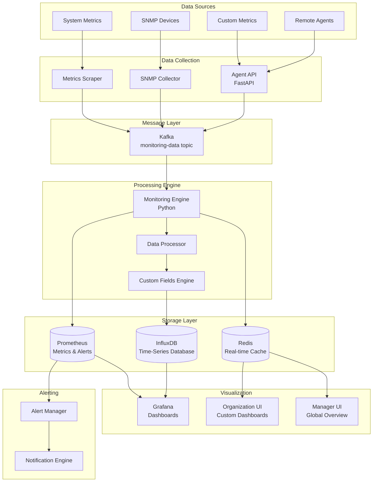

# Monitoring System

The RMAS monitoring system provides comprehensive device monitoring capabilities using InfluxDB for time-series data storage, Prometheus for metrics collection and alerting, and Grafana for visualization and dashboards.

## Monitoring Architecture

### Overview


## Data Storage Strategy

### InfluxDB Schema Design

#### Database Organization
```sql
-- Organization-specific databases
CREATE DATABASE "monitoring_org_1" WITH DURATION 90d REPLICATION 1 SHARD DURATION 1d NAME "default"
CREATE DATABASE "monitoring_org_2" WITH DURATION 90d REPLICATION 1 SHARD DURATION 1d NAME "default"

-- Global system metrics database
CREATE DATABASE "system_metrics" WITH DURATION 365d REPLICATION 1 SHARD DURATION 7d NAME "default"
```

#### Measurement Schema

##### Device Metrics Measurement
```sql
-- Standard device metrics
-- measurement: device_metrics
-- tags: device_id, organization_id, device_type, device_group, location
-- fields: cpu_usage, memory_usage, disk_usage, network_rx, network_tx
-- time: timestamp

SELECT cpu_usage, memory_usage, disk_usage 
FROM device_metrics 
WHERE device_id = 'device_123' 
AND time >= now() - 1h
```

##### Custom Metrics Measurement
```sql
-- Custom device type specific metrics
-- measurement: custom_metrics
-- tags: device_id, device_type, metric_name, metric_category
-- fields: numeric_value, string_value, boolean_value
-- time: timestamp

SELECT numeric_value as cpu_cores
FROM custom_metrics 
WHERE device_id = 'device_123' 
AND metric_name = 'cpu_cores' 
AND time >= now() - 1h
```

##### SNMP Metrics Measurement
```sql
-- SNMP device metrics
-- measurement: snmp_metrics
-- tags: device_ip, organization_id, snmp_version, oid_name
-- fields: oid_value, response_time_ms
-- time: timestamp

SELECT oid_value 
FROM snmp_metrics 
WHERE device_ip = '192.168.1.1' 
AND oid_name = 'sysUpTime' 
AND time >= now() - 24h
```

##### Application Metrics Measurement
```sql
-- Application-level metrics
-- measurement: application_metrics
-- tags: device_id, application_name, metric_type
-- fields: response_time, error_rate, throughput, active_connections
-- time: timestamp

SELECT mean(response_time) as avg_response_time
FROM application_metrics 
WHERE application_name = 'web_server' 
AND time >= now() - 1h 
GROUP BY time(5m)
```

### InfluxDB Retention Policies
```sql
-- Real-time data (high precision, short retention)
CREATE RETENTION POLICY "realtime" ON "monitoring_org_1" DURATION 7d REPLICATION 1 DEFAULT

-- Hourly aggregates (medium precision, medium retention)
CREATE RETENTION POLICY "hourly" ON "monitoring_org_1" DURATION 90d REPLICATION 1

-- Daily aggregates (low precision, long retention)
CREATE RETENTION POLICY "daily" ON "monitoring_org_1" DURATION 2y REPLICATION 1

-- Continuous queries for downsampling
CREATE CONTINUOUS QUERY "downsample_hourly" ON "monitoring_org_1"
BEGIN
  SELECT mean(cpu_usage) as cpu_usage_mean, 
         max(cpu_usage) as cpu_usage_max,
         mean(memory_usage) as memory_usage_mean,
         max(memory_usage) as memory_usage_max
  INTO "hourly"."device_metrics_hourly"
  FROM "realtime"."device_metrics"
  GROUP BY time(1h), device_id, device_type
END

CREATE CONTINUOUS QUERY "downsample_daily" ON "monitoring_org_1"
BEGIN
  SELECT mean(cpu_usage_mean) as cpu_usage_mean,
         max(cpu_usage_max) as cpu_usage_max,
         mean(memory_usage_mean) as memory_usage_mean,
         max(memory_usage_max) as memory_usage_max
  INTO "daily"."device_metrics_daily"
  FROM "hourly"."device_metrics_hourly"
  GROUP BY time(1d), device_id, device_type
END
```

## Custom Device Fields Processing

### Custom Field Engine
```python
from datetime import datetime
from typing import Dict, Any, List
import json

class CustomFieldsEngine:
    def __init__(self, influx_client, redis_client):
        self.influx_client = influx_client
        self.redis_client = redis_client
        
    def process_custom_metrics(self, device_id: str, org_id: str, 
                             device_type: str, custom_data: Dict[str, Any]):
        """Process custom metrics based on device type configuration"""
        
        # Get custom field definitions for device type
        field_definitions = self.get_custom_field_definitions(device_type, org_id)
        
        processed_metrics = []
        
        for field_name, field_value in custom_data.items():
            if field_name in field_definitions:
                field_config = field_definitions[field_name]
                
                # Validate and convert value based on field type
                processed_value = self.process_field_value(
                    field_value, field_config
                )
                
                if processed_value is not None:
                    # Create InfluxDB point
                    point = {
                        "measurement": "custom_metrics",
                        "tags": {
                            "device_id": device_id,
                            "organization_id": org_id,
                            "device_type": device_type,
                            "metric_name": field_name,
                            "metric_category": field_config.get("category", "custom"),
                            "metric_unit": field_config.get("unit", "")
                        },
                        "time": datetime.utcnow(),
                        "fields": {
                            "numeric_value": processed_value if field_config["type"] in ["integer", "float"] else None,
                            "string_value": processed_value if field_config["type"] == "string" else None,
                            "boolean_value": processed_value if field_config["type"] == "boolean" else None,
                            "raw_value": str(field_value)
                        }
                    }
                    
                    processed_metrics.append(point)
        
        # Write to InfluxDB
        if processed_metrics:
            self.influx_client.write_points(processed_metrics)
            
        # Update Redis cache for real-time access
        self.update_redis_custom_metrics(device_id, custom_data)
    
    def get_custom_field_definitions(self, device_type: str, org_id: str) -> Dict[str, Dict]:
        """Get custom field definitions for a device type"""
        cache_key = f"device_type:{device_type}:custom_fields"
        
        # Try Redis cache first
        cached_fields = self.redis_client.hget(cache_key, "definitions")
        if cached_fields:
            return json.loads(cached_fields)
        
        # Fallback to database query
        # This would query the device_type_custom_fields table
        field_definitions = self.query_custom_fields_from_db(device_type, org_id)
        
        # Cache for future use
        self.redis_client.hset(
            cache_key, 
            "definitions", 
            json.dumps(field_definitions)
        )
        self.redis_client.expire(cache_key, 3600)  # 1 hour cache
        
        return field_definitions
    
    def process_field_value(self, value: Any, field_config: Dict) -> Any:
        """Process and validate custom field value"""
        field_type = field_config["type"]
        
        try:
            if field_type == "integer":
                return int(value)
            elif field_type == "float":
                return float(value)
            elif field_type == "boolean":
                if isinstance(value, bool):
                    return value
                return str(value).lower() in ["true", "1", "yes", "on"]
            elif field_type == "string":
                return str(value)
            elif field_type == "enum":
                allowed_values = field_config.get("allowed_values", [])
                if str(value) in allowed_values:
                    return str(value)
                else:
                    return None
            else:
                return str(value)  # Default to string
                
        except (ValueError, TypeError):
            return None
    
    def update_redis_custom_metrics(self, device_id: str, custom_data: Dict[str, Any]):
        """Update Redis cache with latest custom metrics"""
        cache_key = f"device:{device_id}:custom_metrics"
        
        # Update all custom fields
        self.redis_client.hmset(cache_key, custom_data)
        self.redis_client.expire(cache_key, 300)  # 5 minute cache
```

### Device-Level Monitoring Data Parsing
```python
class DeviceDataParser:
    def __init__(self):
        self.standard_metrics = [
            "cpu_usage", "memory_usage", "disk_usage", 
            "network_rx_bytes", "network_tx_bytes",
            "cpu_load_1m", "cpu_load_5m", "cpu_load_15m",
            "memory_available", "memory_total",
            "disk_read_iops", "disk_write_iops"
        ]
    
    def parse_agent_heartbeat(self, heartbeat_data: Dict) -> Dict:
        """Parse agent heartbeat data into standardized metrics"""
        
        parsed_data = {
            "timestamp": datetime.utcnow(),
            "standard_metrics": {},
            "custom_metrics": {},
            "health_indicators": {},
            "performance_counters": {}
        }
        
        # Parse standard metrics
        if "metrics" in heartbeat_data:
            metrics = heartbeat_data["metrics"]
            
            # CPU metrics
            if "cpu" in metrics:
                cpu_data = metrics["cpu"]
                parsed_data["standard_metrics"].update({
                    "cpu_usage": cpu_data.get("usage_percent", 0),
                    "cpu_load_1m": cpu_data.get("load_average", [0, 0, 0])[0],
                    "cpu_load_5m": cpu_data.get("load_average", [0, 0, 0])[1],
                    "cpu_load_15m": cpu_data.get("load_average", [0, 0, 0])[2],
                    "cpu_process_count": cpu_data.get("process_count", 0)
                })
            
            # Memory metrics
            if "memory" in metrics:
                memory_data = metrics["memory"]
                parsed_data["standard_metrics"].update({
                    "memory_usage": memory_data.get("usage_percent", 0),
                    "memory_total": memory_data.get("total_bytes", 0),
                    "memory_used": memory_data.get("used_bytes", 0),
                    "memory_available": memory_data.get("available_bytes", 0)
                })
            
            # Disk metrics
            if "disk" in metrics:
                disk_data = metrics["disk"]
                if "drives" in disk_data and disk_data["drives"]:
                    # Aggregate disk metrics across all drives
                    total_disk_space = sum(d.get("total_bytes", 0) for d in disk_data["drives"])
                    used_disk_space = sum(d.get("used_bytes", 0) for d in disk_data["drives"])
                    
                    parsed_data["standard_metrics"].update({
                        "disk_usage": (used_disk_space / total_disk_space * 100) if total_disk_space > 0 else 0,
                        "disk_total": total_disk_space,
                        "disk_used": used_disk_space,
                        "disk_free": total_disk_space - used_disk_space
                    })
            
            # Network metrics
            if "network" in metrics:
                network_data = metrics["network"]
                if "interfaces" in network_data and network_data["interfaces"]:
                    # Aggregate network metrics across all interfaces
                    total_rx = sum(i.get("bytes_received", 0) for i in network_data["interfaces"])
                    total_tx = sum(i.get("bytes_sent", 0) for i in network_data["interfaces"])
                    
                    parsed_data["standard_metrics"].update({
                        "network_rx_bytes": total_rx,
                        "network_tx_bytes": total_tx,
                        "network_rx_packets": sum(i.get("packets_received", 0) for i in network_data["interfaces"]),
                        "network_tx_packets": sum(i.get("packets_sent", 0) for i in network_data["interfaces"]),
                        "network_errors": sum(i.get("errors", 0) for i in network_data["interfaces"])
                    })
        
        # Parse custom metrics
        if "custom_metrics" in heartbeat_data:
            parsed_data["custom_metrics"] = heartbeat_data["custom_metrics"]
        
        # Parse application metrics
        if "application_metrics" in heartbeat_data:
            app_metrics = heartbeat_data["application_metrics"]
            parsed_data["performance_counters"] = {
                "app_response_time": app_metrics.get("response_time_ms", 0),
                "app_error_rate": app_metrics.get("error_rate", 0),
                "app_throughput": app_metrics.get("requests_per_second", 0),
                "app_active_connections": app_metrics.get("active_connections", 0)
            }
        
        # Health indicators
        parsed_data["health_indicators"] = {
            "agent_status": heartbeat_data.get("status", "unknown"),
            "uptime_seconds": heartbeat_data.get("uptime_seconds", 0),
            "last_restart": heartbeat_data.get("last_restart"),
            "jobs_running": len(heartbeat_data.get("running_jobs", [])),
            "system_health_score": self.calculate_health_score(parsed_data["standard_metrics"])
        }
        
        return parsed_data
    
    def calculate_health_score(self, metrics: Dict) -> float:
        """Calculate overall system health score (0-100)"""
        score = 100.0
        
        # CPU health (subtract points for high CPU usage)
        cpu_usage = metrics.get("cpu_usage", 0)
        if cpu_usage > 80:
            score -= (cpu_usage - 80) * 2
        elif cpu_usage > 60:
            score -= (cpu_usage - 60) * 0.5
        
        # Memory health
        memory_usage = metrics.get("memory_usage", 0)
        if memory_usage > 90:
            score -= (memory_usage - 90) * 3
        elif memory_usage > 70:
            score -= (memory_usage - 70) * 1
        
        # Disk health
        disk_usage = metrics.get("disk_usage", 0)
        if disk_usage > 95:
            score -= (disk_usage - 95) * 5
        elif disk_usage > 80:
            score -= (disk_usage - 80) * 1
        
        return max(0, min(100, score))
```

## Prometheus Integration

### Prometheus Configuration
```yaml
# prometheus.yml
global:
  scrape_interval: 15s
  evaluation_interval: 15s

rule_files:
  - "alert_rules.yml"
  - "recording_rules.yml"

scrape_configs:
  # RMAS system metrics
  - job_name: 'rmas-system'
    static_configs:
      - targets: ['laravel-app:8080', 'fastapi-app:8000']
    metrics_path: '/metrics'
    scrape_interval: 30s
    
  # Agent metrics (via Agent API)
  - job_name: 'rmas-agents'
    http_sd_configs:
      - url: 'http://agent-api:8000/prometheus/targets'
        refresh_interval: 60s
    metrics_path: '/metrics'
    scrape_interval: 60s
    
  # SNMP device metrics
  - job_name: 'snmp-devices'
    static_configs:
      - targets: ['snmp-exporter:9116']
    params:
      module: [default]
      target: ['192.168.1.1', '192.168.1.2']
    relabel_configs:
      - source_labels: [__address__]
        target_label: __param_target
      - source_labels: [__param_target]
        target_label: instance
      - target_label: __address__
        replacement: snmp-exporter:9116

alertmanager:
  alertmanagers:
    - static_configs:
        - targets:
          - alertmanager:9093
```

### Custom Prometheus Metrics Export
```python
from prometheus_client import Gauge, Counter, Histogram, generate_latest
from flask import Flask, Response
import time

class PrometheusMetricsExporter:
    def __init__(self):
        # Device metrics
        self.device_cpu_usage = Gauge(
            'rmas_device_cpu_usage_percent',
            'Device CPU usage percentage',
            ['device_id', 'organization_id', 'device_type']
        )
        
        self.device_memory_usage = Gauge(
            'rmas_device_memory_usage_percent',
            'Device memory usage percentage',
            ['device_id', 'organization_id', 'device_type']
        )
        
        self.device_disk_usage = Gauge(
            'rmas_device_disk_usage_percent',
            'Device disk usage percentage',
            ['device_id', 'organization_id', 'device_type']
        )
        
        # Custom metrics (dynamic based on device type)
        self.custom_metrics = {}
        
        # System metrics
        self.devices_online = Gauge(
            'rmas_devices_online_total',
            'Total number of online devices',
            ['organization_id']
        )
        
        self.alert_count = Gauge(
            'rmas_active_alerts_total',
            'Total number of active alerts',
            ['organization_id', 'severity']
        )
        
        # Performance metrics
        self.api_request_duration = Histogram(
            'rmas_api_request_duration_seconds',
            'API request duration',
            ['method', 'endpoint', 'status_code']
        )
        
        self.agent_heartbeat_count = Counter(
            'rmas_agent_heartbeats_total',
            'Total number of agent heartbeats',
            ['organization_id', 'device_type']
        )
    
    def update_device_metrics(self, device_id: str, org_id: str, 
                            device_type: str, metrics: Dict):
        """Update Prometheus metrics for a device"""
        
        # Standard metrics
        if 'cpu_usage' in metrics:
            self.device_cpu_usage.labels(
                device_id=device_id,
                organization_id=org_id,
                device_type=device_type
            ).set(metrics['cpu_usage'])
        
        if 'memory_usage' in metrics:
            self.device_memory_usage.labels(
                device_id=device_id,
                organization_id=org_id,
                device_type=device_type
            ).set(metrics['memory_usage'])
        
        if 'disk_usage' in metrics:
            self.device_disk_usage.labels(
                device_id=device_id,
                organization_id=org_id,
                device_type=device_type
            ).set(metrics['disk_usage'])
    
    def update_custom_metrics(self, device_id: str, org_id: str,
                            device_type: str, custom_data: Dict):
        """Update custom Prometheus metrics"""
        
        for metric_name, value in custom_data.items():
            # Create metric if it doesn't exist
            if metric_name not in self.custom_metrics:
                self.custom_metrics[metric_name] = Gauge(
                    f'rmas_custom_{metric_name}',
                    f'Custom metric: {metric_name}',
                    ['device_id', 'organization_id', 'device_type']
                )
            
            # Update metric value
            try:
                self.custom_metrics[metric_name].labels(
                    device_id=device_id,
                    organization_id=org_id,
                    device_type=device_type
                ).set(float(value))
            except (ValueError, TypeError):
                # Skip non-numeric values
                pass
    
    def get_metrics(self) -> str:
        """Return Prometheus metrics in text format"""
        return generate_latest()

# Flask endpoint for Prometheus scraping
app = Flask(__name__)
metrics_exporter = PrometheusMetricsExporter()

@app.route('/metrics')
def metrics():
    return Response(
        metrics_exporter.get_metrics(),
        mimetype='text/plain'
    )
```

## Real-time Dashboard Integration

### Grafana Dashboard Configuration
```json
{
  "dashboard": {
    "title": "RMAS Device Monitoring",
    "tags": ["rmas", "monitoring"],
    "timezone": "browser",
    "panels": [
      {
        "title": "Device Overview",
        "type": "stat",
        "targets": [
          {
            "expr": "count by (organization_id) (rmas_devices_online_total)",
            "legendFormat": "Online Devices - {{organization_id}}"
          }
        ],
        "fieldConfig": {
          "defaults": {
            "color": {
              "mode": "thresholds"
            },
            "thresholds": {
              "steps": [
                {"color": "red", "value": 0},
                {"color": "yellow", "value": 50},
                {"color": "green", "value": 100}
              ]
            }
          }
        }
      },
      {
        "title": "CPU Usage by Device",
        "type": "graph",
        "targets": [
          {
            "expr": "rmas_device_cpu_usage_percent",
            "legendFormat": "{{device_id}} CPU"
          }
        ],
        "yAxes": [
          {
            "min": 0,
            "max": 100,
            "unit": "percent"
          }
        ],
        "thresholds": [
          {
            "value": 80,
            "colorMode": "critical",
            "op": "gt"
          }
        ]
      },
      {
        "title": "Custom Metrics Heatmap",
        "type": "heatmap",
        "targets": [
          {
            "expr": "rmas_custom_cpu_cores",
            "legendFormat": "CPU Cores"
          },
          {
            "expr": "rmas_custom_ram_gb",
            "legendFormat": "RAM (GB)"
          }
        ]
      },
      {
        "title": "Alert Summary",
        "type": "table",
        "targets": [
          {
            "expr": "sort_desc(rmas_active_alerts_total)",
            "format": "table",
            "instant": true
          }
        ],
        "transformations": [
          {
            "id": "organize",
            "options": {
              "columns": [
                {"text": "Organization", "value": "organization_id"},
                {"text": "Severity", "value": "severity"},
                {"text": "Count", "value": "Value"}
              ]
            }
          }
        ]
      }
    ],
    "time": {
      "from": "now-1h",
      "to": "now"
    },
    "refresh": "30s"
  }
}
```

### Real-time Data Streaming
```python
import asyncio
import websockets
import json
from datetime import datetime

class RealTimeDashboard:
    def __init__(self, redis_client, influx_client):
        self.redis_client = redis_client
        self.influx_client = influx_client
        self.connected_clients = set()
    
    async def websocket_handler(self, websocket, path):
        """Handle WebSocket connections for real-time data"""
        self.connected_clients.add(websocket)
        try:
            # Send initial data
            await self.send_initial_data(websocket)
            
            # Keep connection alive and handle client messages
            async for message in websocket:
                data = json.loads(message)
                await self.handle_client_message(websocket, data)
                
        except websockets.exceptions.ConnectionClosed:
            pass
        finally:
            self.connected_clients.remove(websocket)
    
    async def send_initial_data(self, websocket):
        """Send initial dashboard data to client"""
        # Get current device metrics from Redis
        device_metrics = self.get_current_device_metrics()
        
        initial_data = {
            "type": "initial_data",
            "timestamp": datetime.utcnow().isoformat(),
            "data": {
                "device_metrics": device_metrics,
                "alert_summary": self.get_alert_summary(),
                "organization_stats": self.get_organization_stats()
            }
        }
        
        await websocket.send(json.dumps(initial_data))
    
    async def broadcast_metric_update(self, device_id: str, metrics: Dict):
        """Broadcast metric updates to all connected clients"""
        if not self.connected_clients:
            return
        
        update_message = {
            "type": "metric_update",
            "timestamp": datetime.utcnow().isoformat(),
            "device_id": device_id,
            "metrics": metrics
        }
        
        # Send to all connected clients
        disconnected_clients = set()
        for client in self.connected_clients:
            try:
                await client.send(json.dumps(update_message))
            except websockets.exceptions.ConnectionClosed:
                disconnected_clients.add(client)
        
        # Remove disconnected clients
        self.connected_clients -= disconnected_clients
    
    def get_current_device_metrics(self) -> Dict:
        """Get current device metrics from Redis cache"""
        metrics = {}
        
        # Get all device status keys
        device_keys = self.redis_client.keys("device:*:status")
        
        for key in device_keys:
            device_id = key.split(':')[1]
            device_data = self.redis_client.hgetall(key)
            
            if device_data:
                metrics[device_id] = {
                    "status": device_data.get("status", "unknown"),
                    "last_seen": device_data.get("last_seen"),
                    "cpu_usage": float(device_data.get("cpu_usage", 0)),
                    "memory_usage": float(device_data.get("memory_usage", 0)),
                    "disk_usage": float(device_data.get("disk_usage", 0))
                }
        
        return metrics

# Start WebSocket server
async def start_realtime_server():
    dashboard = RealTimeDashboard(redis_client, influx_client)
    
    start_server = websockets.serve(
        dashboard.websocket_handler,
        "localhost",
        8765
    )
    
    await start_server
```

## Performance Optimization

### Data Retention and Aggregation
```python
class MonitoringDataOptimizer:
    def __init__(self, influx_client):
        self.influx_client = influx_client
    
    def setup_retention_policies(self, org_database: str):
        """Setup retention policies for monitoring data"""
        
        # High-frequency data (1 week retention)
        self.influx_client.create_retention_policy(
            name="realtime",
            duration="7d",
            replication="1",
            database=org_database,
            default=True
        )
        
        # Hourly aggregates (3 months retention)
        self.influx_client.create_retention_policy(
            name="hourly",
            duration="90d", 
            replication="1",
            database=org_database
        )
        
        # Daily aggregates (2 years retention)
        self.influx_client.create_retention_policy(
            name="daily",
            duration="730d",
            replication="1", 
            database=org_database
        )
    
    def create_continuous_queries(self, org_database: str):
        """Create continuous queries for data downsampling"""
        
        # Hourly aggregation
        hourly_cq = f"""
        CREATE CONTINUOUS QUERY "cq_hourly_device_metrics" ON "{org_database}"
        BEGIN
          SELECT mean(cpu_usage) as cpu_usage_mean,
                 max(cpu_usage) as cpu_usage_max,
                 min(cpu_usage) as cpu_usage_min,
                 mean(memory_usage) as memory_usage_mean,
                 max(memory_usage) as memory_usage_max,
                 mean(disk_usage) as disk_usage_mean,
                 max(disk_usage) as disk_usage_max
          INTO "hourly"."device_metrics_hourly"
          FROM "realtime"."device_metrics"
          GROUP BY time(1h), device_id, device_type, organization_id
        END
        """
        
        # Daily aggregation
        daily_cq = f"""
        CREATE CONTINUOUS QUERY "cq_daily_device_metrics" ON "{org_database}"
        BEGIN
          SELECT mean(cpu_usage_mean) as cpu_usage_mean,
                 max(cpu_usage_max) as cpu_usage_max,
                 mean(memory_usage_mean) as memory_usage_mean,
                 max(memory_usage_max) as memory_usage_max,
                 mean(disk_usage_mean) as disk_usage_mean,
                 max(disk_usage_max) as disk_usage_max
          INTO "daily"."device_metrics_daily"
          FROM "hourly"."device_metrics_hourly"
          GROUP BY time(1d), device_id, device_type, organization_id
        END
        """
        
        self.influx_client.query(hourly_cq)
        self.influx_client.query(daily_cq)
```
