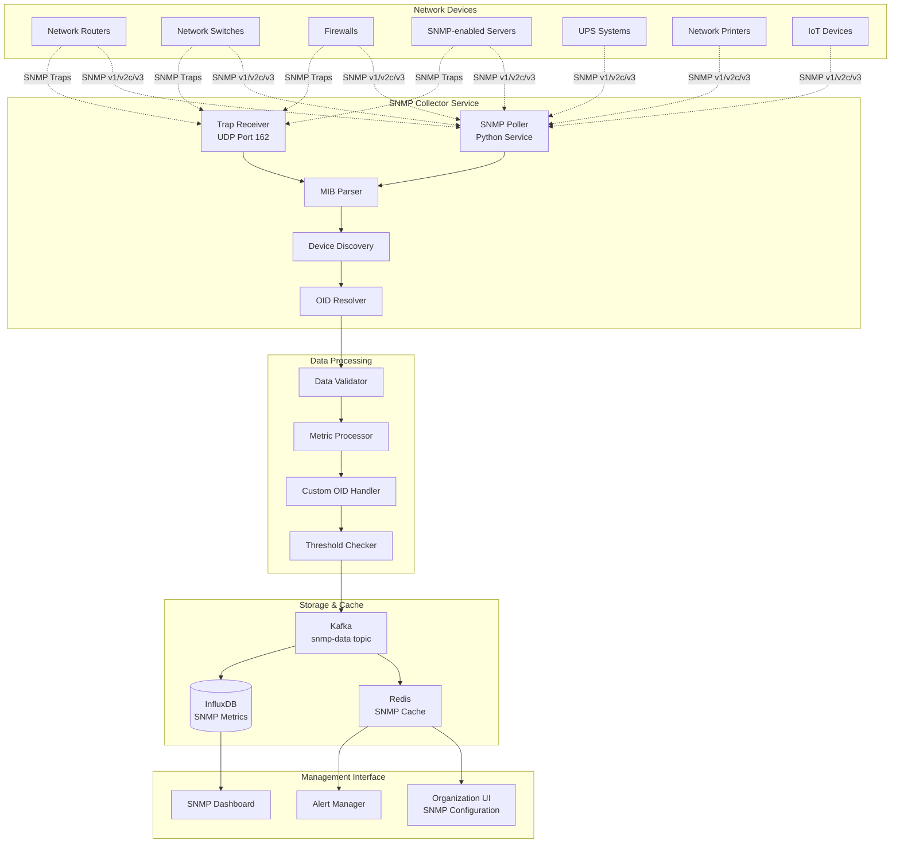

# Agentless SNMP Monitoring

The RMAS system provides comprehensive agentless monitoring capabilities through SNMP (Simple Network Management Protocol), enabling monitoring of network devices, servers, and equipment that cannot run agents.

## SNMP Architecture

### Overview


## SNMP Device Discovery

### Automatic Network Discovery
```python
import asyncio
import ipaddress
from pysnmp.hlapi.asyncio import *
from typing import List, Dict, Optional
import concurrent.futures

class SNMPDeviceDiscovery:
    def __init__(self, redis_client, kafka_producer):
        self.redis_client = redis_client
        self.kafka_producer = kafka_producer
        self.standard_communities = ['public', 'private', 'monitoring']
        self.discovery_oids = {
            'sysName': '1.3.6.1.2.1.1.5.0',
            'sysDescr': '1.3.6.1.2.1.1.1.0',
            'sysObjectID': '1.3.6.1.2.1.1.2.0',
            'sysUpTime': '1.3.6.1.2.1.1.3.0',
            'sysContact': '1.3.6.1.2.1.1.4.0',
            'sysLocation': '1.3.6.1.2.1.1.6.0'
        }
    
    async def discover_network_range(self, org_id: str, network_range: str, 
                                   communities: List[str] = None) -> List[Dict]:
        """Discover SNMP devices in a network range"""
        
        communities = communities or self.standard_communities
        discovered_devices = []
        
        # Parse network range
        try:
            network = ipaddress.ip_network(network_range, strict=False)
        except ValueError:
            raise ValueError(f"Invalid network range: {network_range}")
        
        # Create tasks for parallel discovery
        tasks = []
        for ip in network.hosts():
            for community in communities:
                task = self.discover_device(str(ip), community, org_id)
                tasks.append(task)
        
        # Execute discovery tasks with concurrency limit
        semaphore = asyncio.Semaphore(50)  # Limit concurrent requests
        
        async def bounded_discover(task):
            async with semaphore:
                return await task
        
        results = await asyncio.gather(
            *[bounded_discover(task) for task in tasks],
            return_exceptions=True
        )
        
        # Process results
        for result in results:
            if isinstance(result, dict) and result.get('discovered'):
                discovered_devices.append(result)
        
        # Cache discovery results
        await self.cache_discovery_results(org_id, discovered_devices)
        
        return discovered_devices
    
    async def discover_device(self, ip_address: str, community: str, 
                            org_id: str) -> Optional[Dict]:
        """Discover a single SNMP device"""
        
        try:
            device_info = {}
            
            # Try SNMP v2c first, then v1
            for version in [1, 0]:  # 1=v2c, 0=v1
                try:
                    device_info = await self.snmp_get_device_info(
                        ip_address, community, version
                    )
                    if device_info:
                        device_info['snmp_version'] = 'v2c' if version == 1 else 'v1'
                        break
                except Exception:
                    continue
            
            if not device_info:
                return None
            
            # Determine device type
            device_type = self.classify_device(device_info)
            
            # Get additional device-specific information
            additional_info = await self.get_device_specific_info(
                ip_address, community, device_type, device_info['snmp_version']
            )
            
            result = {
                'discovered': True,
                'ip_address': ip_address,
                'community': community,
                'organization_id': org_id,
                'device_type': device_type,
                'basic_info': device_info,
                'additional_info': additional_info,
                'discovery_timestamp': datetime.utcnow().isoformat(),
                'monitoring_capabilities': self.assess_monitoring_capabilities(device_info)
            }
            
            # Send discovery event to Kafka
            await self.kafka_producer.send('snmp-data', value={
                'event_type': 'device_discovered',
                'timestamp': datetime.utcnow().isoformat(),
                'organization_id': org_id,
                'data': result
            })
            
            return result
            
        except Exception as e:
            return None
    
    async def snmp_get_device_info(self, ip_address: str, community: str, 
                                 version: int) -> Dict:
        """Get basic device information via SNMP"""
        
        device_info = {}
        
        for name, oid in self.discovery_oids.items():
            try:
                result = await self.snmp_get_single_oid(
                    ip_address, community, oid, version
                )
                if result:
                    device_info[name] = result
            except Exception:
                continue
        
        return device_info if len(device_info) >= 2 else None
    
    async def snmp_get_single_oid(self, ip_address: str, community: str, 
                                oid: str, version: int) -> Optional[str]:
        """Get single OID value via SNMP"""
        
        try:
            for (errorIndication, errorStatus, errorIndex, varBinds) in await getCmd(
                SnmpEngine(),
                CommunityData(community, mpModel=version),
                UdpTransportTarget((ip_address, 161), timeout=2.0, retries=1),
                ContextData(),
                ObjectType(ObjectIdentity(oid))
            ):
                if errorIndication or errorStatus:
                    return None
                
                for varBind in varBinds:
                    return str(varBind[1])
            
        except Exception:
            return None
        
        return None
    
    def classify_device(self, device_info: Dict) -> str:
        """Classify device type based on SNMP information"""
        
        sys_descr = device_info.get('sysDescr', '').lower()
        sys_object_id = device_info.get('sysObjectID', '')
        
        # Network equipment classification
        if any(keyword in sys_descr for keyword in ['cisco', 'router', 'ios']):
            if 'router' in sys_descr:
                return 'router'
            elif 'switch' in sys_descr:
                return 'switch'
            else:
                return 'cisco_device'
        
        elif any(keyword in sys_descr for keyword in ['juniper', 'junos']):
            return 'juniper_device'
        
        elif any(keyword in sys_descr for keyword in ['hp', 'hewlett', 'procurve']):
            return 'hp_device'
        
        elif 'firewall' in sys_descr or 'pix' in sys_descr:
            return 'firewall'
        
        elif any(keyword in sys_descr for keyword in ['ups', 'power']):
            return 'ups'
        
        elif any(keyword in sys_descr for keyword in ['printer', 'print']):
            return 'printer'
        
        elif any(keyword in sys_descr for keyword in ['server', 'linux', 'windows']):
            return 'server'
        
        else:
            return 'unknown'
    
    async def get_device_specific_info(self, ip_address: str, community: str, 
                                     device_type: str, snmp_version: str) -> Dict:
        """Get device-type specific information"""
        
        specific_info = {}
        
        if device_type in ['router', 'switch', 'cisco_device']:
            specific_info = await self.get_cisco_specific_info(
                ip_address, community, snmp_version
            )
        elif device_type == 'server':
            specific_info = await self.get_server_specific_info(
                ip_address, community, snmp_version
            )
        elif device_type == 'ups':
            specific_info = await self.get_ups_specific_info(
                ip_address, community, snmp_version
            )
        
        return specific_info
    
    async def get_cisco_specific_info(self, ip_address: str, community: str, 
                                    snmp_version: str) -> Dict:
        """Get Cisco-specific SNMP information"""
        
        cisco_oids = {
            'interfaces': '1.3.6.1.2.1.2.2.1.2',  # ifDescr
            'cpu_usage': '1.3.6.1.4.1.9.2.1.56.0',  # avgBusy5
            'memory_used': '1.3.6.1.4.1.9.2.1.8.0',  # avgBusy1
            'chassis_serial': '1.3.6.1.4.1.9.3.6.3.0'  # chassisId
        }
        
        info = {}
        version_num = 1 if snmp_version == 'v2c' else 0
        
        for name, oid in cisco_oids.items():
            try:
                result = await self.snmp_get_single_oid(
                    ip_address, community, oid, version_num
                )
                if result:
                    info[name] = result
            except Exception:
                continue
        
        return info
```

## SNMP Polling Engine

### Active Monitoring
```python
class SNMPPollingEngine:
    def __init__(self, redis_client, kafka_producer, influx_client):
        self.redis_client = redis_client
        self.kafka_producer = kafka_producer
        self.influx_client = influx_client
        self.polling_tasks = {}
        
    async def start_polling_for_organization(self, org_id: str):
        """Start SNMP polling for all devices in an organization"""
        
        # Get SNMP devices for organization
        devices = await self.get_snmp_devices(org_id)
        
        # Create polling tasks for each device
        for device in devices:
            task_key = f"{org_id}:{device['ip_address']}"
            if task_key not in self.polling_tasks:
                task = asyncio.create_task(
                    self.poll_device_continuously(device)
                )
                self.polling_tasks[task_key] = task
    
    async def poll_device_continuously(self, device: Dict):
        """Continuously poll a single SNMP device"""
        
        ip_address = device['ip_address']
        community = device['community']
        org_id = device['organization_id']
        device_type = device['device_type']
        poll_interval = device.get('poll_interval', 300)  # 5 minutes default
        
        while True:
            try:
                # Poll standard metrics
                metrics = await self.poll_standard_metrics(
                    ip_address, community, device_type
                )
                
                # Poll custom OIDs if configured
                custom_metrics = await self.poll_custom_oids(
                    ip_address, community, device.get('custom_oids', {})
                )
                
                # Combine metrics
                all_metrics = {**metrics, **custom_metrics}
                
                if all_metrics:
                    # Send to Kafka
                    await self.send_metrics_to_kafka(
                        org_id, ip_address, device_type, all_metrics
                    )
                    
                    # Update Redis cache
                    await self.update_redis_cache(ip_address, all_metrics)
                
                await asyncio.sleep(poll_interval)
                
            except Exception as e:
                print(f"Error polling device {ip_address}: {e}")
                await asyncio.sleep(60)  # Wait before retry
    
    async def poll_standard_metrics(self, ip_address: str, community: str, 
                                  device_type: str) -> Dict:
        """Poll standard SNMP metrics based on device type"""
        
        standard_oids = self.get_standard_oids_for_device_type(device_type)
        metrics = {}
        
        for metric_name, oid_config in standard_oids.items():
            try:
                if isinstance(oid_config, str):
                    # Simple OID
                    value = await self.snmp_get_single_oid(
                        ip_address, community, oid_config
                    )
                    if value is not None:
                        metrics[metric_name] = self.convert_value(value, metric_name)
                
                elif isinstance(oid_config, dict):
                    # Complex OID with processing
                    if oid_config['type'] == 'table':
                        table_data = await self.snmp_walk_table(
                            ip_address, community, oid_config['base_oid']
                        )
                        processed_data = self.process_table_data(
                            table_data, oid_config
                        )
                        metrics.update(processed_data)
                    
                    elif oid_config['type'] == 'calculated':
                        # Calculate metric from multiple OIDs
                        calc_value = await self.calculate_metric(
                            ip_address, community, oid_config
                        )
                        if calc_value is not None:
                            metrics[metric_name] = calc_value
            
            except Exception as e:
                print(f"Error polling {metric_name} from {ip_address}: {e}")
                continue
        
        return metrics
    
    def get_standard_oids_for_device_type(self, device_type: str) -> Dict:
        """Get standard OIDs to poll for each device type"""
        
        common_oids = {
            'uptime': '1.3.6.1.2.1.1.3.0',  # sysUpTime
            'cpu_usage_1min': '1.3.6.1.4.1.2021.11.9.0',  # Load average 1 min
            'memory_total': '1.3.6.1.4.1.2021.4.5.0',  # Total memory
            'memory_used': '1.3.6.1.4.1.2021.4.6.0',  # Used memory
        }
        
        device_specific_oids = {
            'router': {
                **common_oids,
                'interfaces': {
                    'type': 'table',
                    'base_oid': '1.3.6.1.2.1.2.2.1',
                    'columns': {
                        'ifDescr': '1.3.6.1.2.1.2.2.1.2',
                        'ifOperStatus': '1.3.6.1.2.1.2.2.1.8',
                        'ifInOctets': '1.3.6.1.2.1.2.2.1.10',
                        'ifOutOctets': '1.3.6.1.2.1.2.2.1.16',
                        'ifSpeed': '1.3.6.1.2.1.2.2.1.5'
                    }
                },
                'cpu_usage_cisco': '1.3.6.1.4.1.9.2.1.56.0'  # avgBusy5
            },
            'switch': {
                **common_oids,
                'interfaces': {
                    'type': 'table',
                    'base_oid': '1.3.6.1.2.1.2.2.1',
                    'columns': {
                        'ifDescr': '1.3.6.1.2.1.2.2.1.2',
                        'ifOperStatus': '1.3.6.1.2.1.2.2.1.8',
                        'ifInOctets': '1.3.6.1.2.1.2.2.1.10',
                        'ifOutOctets': '1.3.6.1.2.1.2.2.1.16'
                    }
                }
            },
            'server': {
                **common_oids,
                'disk_usage': {
                    'type': 'table',
                    'base_oid': '1.3.6.1.4.1.2021.9.1',
                    'columns': {
                        'dskPath': '1.3.6.1.4.1.2021.9.1.2',
                        'dskTotal': '1.3.6.1.4.1.2021.9.1.6',
                        'dskUsed': '1.3.6.1.4.1.2021.9.1.8',
                        'dskPercent': '1.3.6.1.4.1.2021.9.1.9'
                    }
                }
            },
            'ups': {
                'battery_status': '1.3.6.1.2.1.33.1.2.1.0',
                'battery_charge': '1.3.6.1.2.1.33.1.2.4.0',
                'input_voltage': '1.3.6.1.2.1.33.1.3.3.1.3.1',
                'output_voltage': '1.3.6.1.2.1.33.1.4.4.1.2.1',
                'output_load': '1.3.6.1.2.1.33.1.4.4.1.5.1'
            }
        }
        
        return device_specific_oids.get(device_type, common_oids)
    
    async def snmp_walk_table(self, ip_address: str, community: str, 
                            base_oid: str) -> Dict:
        """Walk SNMP table and return all values"""
        
        table_data = {}
        
        try:
            for (errorIndication, errorStatus, errorIndex, varBinds) in await nextCmd(
                SnmpEngine(),
                CommunityData(community),
                UdpTransportTarget((ip_address, 161), timeout=3.0, retries=2),
                ContextData(),
                ObjectType(ObjectIdentity(base_oid)),
                lexicographicMode=False
            ):
                if errorIndication or errorStatus:
                    break
                
                for varBind in varBinds:
                    oid = str(varBind[0])
                    value = str(varBind[1])
                    
                    # Extract index from OID
                    if base_oid in oid:
                        index = oid.replace(base_oid + '.', '').split('.')[0]
                        column_oid = oid.replace('.' + index, '')
                        
                        if index not in table_data:
                            table_data[index] = {}
                        
                        table_data[index][column_oid] = value
        
        except Exception as e:
            print(f"Error walking table {base_oid} on {ip_address}: {e}")
        
        return table_data
    
    def process_table_data(self, table_data: Dict, oid_config: Dict) -> Dict:
        """Process SNMP table data into metrics"""
        
        processed_metrics = {}
        columns = oid_config.get('columns', {})
        
        for index, row_data in table_data.items():
            for column_name, column_oid in columns.items():
                if column_oid in row_data:
                    metric_key = f"{column_name}_{index}"
                    value = row_data[column_oid]
                    
                    # Convert value based on column type
                    converted_value = self.convert_snmp_value(value, column_name)
                    processed_metrics[metric_key] = converted_value
        
        return processed_metrics
    
    def convert_snmp_value(self, value: str, metric_name: str) -> any:
        """Convert SNMP value to appropriate type"""
        
        # Interface status mapping
        if 'status' in metric_name.lower():
            status_map = {'1': 'up', '2': 'down', '3': 'testing'}
            return status_map.get(value, 'unknown')
        
        # Numeric values
        if any(keyword in metric_name.lower() for keyword in 
               ['octets', 'bytes', 'usage', 'speed', 'count']):
            try:
                return int(value)
            except ValueError:
                return 0
        
        # Percentage values
        if 'percent' in metric_name.lower():
            try:
                return float(value)
            except ValueError:
                return 0.0
        
        # Default to string
        return value
```

## SNMP Trap Receiver

### Trap Processing Engine
```python
from pysnmp.entity import engine, config
from pysnmp.carrier.asyncio.dgram import udp
from pysnmp.entity.rfc3413 import ntfrcv
import asyncio

class SNMPTrapReceiver:
    def __init__(self, kafka_producer, redis_client):
        self.kafka_producer = kafka_producer
        self.redis_client = redis_client
        self.snmp_engine = engine.SnmpEngine()
        self.trap_handlers = {}
        self.setup_trap_receiver()
    
    def setup_trap_receiver(self):
        """Setup SNMP trap receiver"""
        
        # Setup transport
        config.addTransport(
            self.snmp_engine,
            udp.domainName + (1,),
            udp.UdpTransport().openServerMode(('0.0.0.0', 162))
        )
        
        # Setup community strings
        config.addV1System(self.snmp_engine, 'my-area', 'public')
        config.addV3User(
            self.snmp_engine, 'usr-none-none',
            config.usmNoAuthProtocol, config.usmNoPrivProtocol
        )
        
        # Register notification receiver
        ntfrcv.NotificationReceiver(self.snmp_engine, self.process_trap)
    
    def process_trap(self, snmpEngine, stateReference, contextEngineId, contextName,
                    varBinds, cbCtx):
        """Process received SNMP trap"""
        
        try:
            # Extract trap information
            trap_info = self.extract_trap_info(varBinds, cbCtx)
            
            # Determine source organization
            source_ip = trap_info.get('source_ip')
            org_id = self.determine_organization(source_ip)
            
            if org_id:
                # Process trap asynchronously
                asyncio.create_task(self.handle_trap_async(trap_info, org_id))
        
        except Exception as e:
            print(f"Error processing SNMP trap: {e}")
    
    def extract_trap_info(self, varBinds, cbCtx) -> Dict:
        """Extract information from SNMP trap"""
        
        trap_info = {
            'timestamp': datetime.utcnow().isoformat(),
            'source_ip': cbCtx.get('transportAddress', ['unknown', 0])[0],
            'variables': [],
            'trap_oid': None,
            'enterprise_oid': None
        }
        
        for varBind in varBinds:
            oid = str(varBind[0])
            value = str(varBind[1])
            
            # Standard trap OIDs
            if oid == '1.3.6.1.6.3.1.1.4.1.0':  # snmpTrapOID
                trap_info['trap_oid'] = value
            elif oid == '1.3.6.1.6.3.1.1.4.3.0':  # snmpTrapEnterprise
                trap_info['enterprise_oid'] = value
            else:
                trap_info['variables'].append({
                    'oid': oid,
                    'value': value,
                    'description': self.resolve_oid_description(oid)
                })
        
        # Classify trap type
        trap_info['trap_type'] = self.classify_trap(trap_info)
        trap_info['severity'] = self.determine_trap_severity(trap_info)
        
        return trap_info
    
    async def handle_trap_async(self, trap_info: Dict, org_id: str):
        """Handle trap processing asynchronously"""
        
        try:
            # Enrich trap with device information
            device_info = await self.get_device_info(trap_info['source_ip'], org_id)
            if device_info:
                trap_info['device_info'] = device_info
            
            # Send to Kafka
            kafka_message = {
                'event_type': 'snmp_trap',
                'timestamp': trap_info['timestamp'],
                'source_ip': trap_info['source_ip'],
                'organization_id': org_id,
                'data': trap_info
            }
            
            await self.kafka_producer.send('snmp-data', value=kafka_message)
            
            # Cache recent trap for dashboard
            await self.cache_trap_info(org_id, trap_info)
            
            # Process trap-specific actions
            await self.process_trap_actions(trap_info, org_id)
        
        except Exception as e:
            print(f"Error handling trap: {e}")
    
    def classify_trap(self, trap_info: Dict) -> str:
        """Classify trap type based on OID and content"""
        
        trap_oid = trap_info.get('trap_oid', '')
        enterprise_oid = trap_info.get('enterprise_oid', '')
        
        # Standard SNMP traps
        if '1.3.6.1.6.3.1.1.5' in trap_oid:
            if '1.3.6.1.6.3.1.1.5.3' in trap_oid:
                return 'link_down'
            elif '1.3.6.1.6.3.1.1.5.4' in trap_oid:
                return 'link_up'
            elif '1.3.6.1.6.3.1.1.5.1' in trap_oid:
                return 'cold_start'
            elif '1.3.6.1.6.3.1.1.5.2' in trap_oid:
                return 'warm_start'
        
        # Cisco-specific traps
        elif '1.3.6.1.4.1.9' in enterprise_oid:
            if 'cpu' in str(trap_info.get('variables', [])).lower():
                return 'cisco_cpu_alert'
            elif 'memory' in str(trap_info.get('variables', [])).lower():
                return 'cisco_memory_alert'
            else:
                return 'cisco_generic'
        
        # UPS traps
        elif '1.3.6.1.2.1.33' in trap_oid:
            return 'ups_event'
        
        return 'generic'
    
    def determine_trap_severity(self, trap_info: Dict) -> str:
        """Determine trap severity"""
        
        trap_type = trap_info.get('trap_type', '')
        
        critical_traps = ['link_down', 'cold_start', 'ups_battery_low']
        warning_traps = ['link_up', 'warm_start', 'cisco_cpu_alert']
        info_traps = ['cisco_generic', 'generic']
        
        if trap_type in critical_traps:
            return 'critical'
        elif trap_type in warning_traps:
            return 'warning'
        else:
            return 'info'
    
    async def process_trap_actions(self, trap_info: Dict, org_id: str):
        """Process trap-specific actions"""
        
        trap_type = trap_info.get('trap_type')
        severity = trap_info.get('severity')
        
        # Auto-create alerts for critical traps
        if severity == 'critical':
            await self.create_trap_alert(trap_info, org_id)
        
        # Update device status based on trap
        if trap_type == 'link_down':
            await self.update_interface_status(
                trap_info['source_ip'], 'down', org_id
            )
        elif trap_type == 'link_up':
            await self.update_interface_status(
                trap_info['source_ip'], 'up', org_id
            )
        
        # Log significant events
        if severity in ['critical', 'warning']:
            await self.log_trap_event(trap_info, org_id)
    
    async def create_trap_alert(self, trap_info: Dict, org_id: str):
        """Create alert from critical SNMP trap"""
        
        alert_data = {
            'event_type': 'alert_triggered',
            'timestamp': trap_info['timestamp'],
            'alert_id': f"trap_alert_{int(datetime.utcnow().timestamp())}",
            'organization_id': org_id,
            'device_id': trap_info['source_ip'],  # Use IP as device ID for SNMP
            'data': {
                'rule_id': 'snmp_trap_rule',
                'rule_name': f"SNMP Trap: {trap_info['trap_type']}",
                'metric': 'snmp_trap',
                'threshold': 0,
                'current_value': 1,
                'severity': trap_info['severity'],
                'message': f"SNMP trap received: {trap_info['trap_type']} from {trap_info['source_ip']}",
                'context': {
                    'source_ip': trap_info['source_ip'],
                    'trap_type': trap_info['trap_type'],
                    'trap_oid': trap_info.get('trap_oid'),
                    'variables': trap_info.get('variables', [])
                },
                'notification_settings': {
                    'email': {'enabled': True, 'recipients': []},
                    'webhook': {'enabled': False},
                    'snmp_trap': {'enabled': False}
                }
            }
        }
        
        # Send alert to Kafka
        await self.kafka_producer.send('alert-events', value=alert_data)
    
    def start_receiver(self):
        """Start the SNMP trap receiver"""
        print("Starting SNMP trap receiver on port 162...")
        self.snmp_engine.transportDispatcher.runDispatcher()
```

## Custom OID Management

### OID Configuration System
```python
class CustomOIDManager:
    def __init__(self, redis_client, database_client):
        self.redis_client = redis_client
        self.database_client = database_client
        self.mib_cache = {}
    
    async def configure_custom_oids(self, org_id: str, device_id: str, 
                                  custom_oids: Dict):
        """Configure custom OIDs for a device"""
        
        validated_oids = {}
        
        for oid_name, oid_config in custom_oids.items():
            # Validate OID format
            if self.validate_oid(oid_config['oid']):
                # Resolve OID description if possible
                description = await self.resolve_oid_description(oid_config['oid'])
                
                validated_oids[oid_name] = {
                    'oid': oid_config['oid'],
                    'data_type': oid_config.get('data_type', 'string'),
                    'unit': oid_config.get('unit', ''),
                    'description': description or oid_config.get('description', ''),
                    'polling_interval': oid_config.get('polling_interval', 300),
                    'threshold_config': oid_config.get('threshold_config', {}),
                    'enabled': oid_config.get('enabled', True)
                }
        
        # Store in database
        await self.store_custom_oids(org_id, device_id, validated_oids)
        
        # Update Redis cache
        cache_key = f"device:{device_id}:custom_oids"
        await self.redis_client.hset(
            cache_key, 
            "oids", 
            json.dumps(validated_oids)
        )
        await self.redis_client.expire(cache_key, 3600)
        
        return validated_oids
    
    def validate_oid(self, oid: str) -> bool:
        """Validate OID format"""
        try:
            # Check if OID starts with numbers and dots
            parts = oid.split('.')
            for part in parts:
                if not part.isdigit():
                    return False
            return len(parts) >= 3
        except:
            return False
    
    async def resolve_oid_description(self, oid: str) -> Optional[str]:
        """Resolve OID to human-readable description using MIB"""
        
        # Check cache first
        if oid in self.mib_cache:
            return self.mib_cache[oid]
        
        # Try to resolve using standard MIBs
        description = self.resolve_standard_oid(oid)
        
        if description:
            self.mib_cache[oid] = description
            return description
        
        return None
    
    def resolve_standard_oid(self, oid: str) -> Optional[str]:
        """Resolve OID using standard MIB definitions"""
        
        standard_oids = {
            '1.3.6.1.2.1.1.1.0': 'sysDescr',
            '1.3.6.1.2.1.1.2.0': 'sysObjectID',
            '1.3.6.1.2.1.1.3.0': 'sysUpTime',
            '1.3.6.1.2.1.1.4.0': 'sysContact',
            '1.3.6.1.2.1.1.5.0': 'sysName',
            '1.3.6.1.2.1.1.6.0': 'sysLocation',
            '1.3.6.1.2.1.2.1.0': 'ifNumber',
            '1.3.6.1.2.1.2.2.1.1': 'ifIndex',
            '1.3.6.1.2.1.2.2.1.2': 'ifDescr',
            '1.3.6.1.2.1.2.2.1.3': 'ifType',
            '1.3.6.1.2.1.2.2.1.5': 'ifSpeed',
            '1.3.6.1.2.1.2.2.1.6': 'ifPhysAddress',
            '1.3.6.1.2.1.2.2.1.7': 'ifAdminStatus',
            '1.3.6.1.2.1.2.2.1.8': 'ifOperStatus',
            '1.3.6.1.2.1.2.2.1.10': 'ifInOctets',
            '1.3.6.1.2.1.2.2.1.11': 'ifInUcastPkts',
            '1.3.6.1.2.1.2.2.1.16': 'ifOutOctets',
            '1.3.6.1.2.1.2.2.1.17': 'ifOutUcastPkts'
        }
        
        # Exact match
        if oid in standard_oids:
            return standard_oids[oid]
        
        # Partial match for table entries
        for standard_oid, description in standard_oids.items():
            if oid.startswith(standard_oid):
                index = oid.replace(standard_oid + '.', '')
                return f"{description}.{index}"
        
        return None
```
